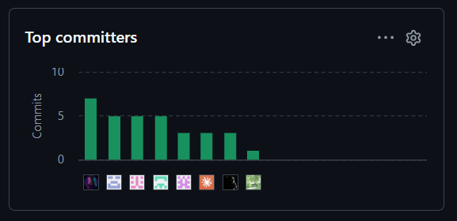

# Universidad Peruana de Ciencias Aplicadas

**Carrera de Ingeniería de Software**

**Periodo:** 202620

**Nombre del Curso:** Desarrollo de Soluciones IoT

**NRC:** 8721

**Nombre del docente:** Javier Antonio Prudencio Vidal

## "Informe de Trabajo Final"

**Nombre del Startup:** MachineGuard

**Nombre del Producto:** MachineGuard

**Integrantes:**

| Código | Apellidos y Nombres |
|---|---|
| u202210167 | Seijas Vasquez, Diego |
| u20221c769 | Medina Chocce, Karito Dianeth |
| u202214572 | Espinoza Vivas, Camilla Leonor |
| u202313419 | Dinklange Arevalo, Sandro |
| u202310949 | Bautista Rivera, Jose Diego |
| u202323319 | Janampa Gutierrez, Jhoan Darner |
| u202223293 | Lecca Villalobos, Pedro Omar |

### 2026

## Registro de Versiones del Informe

| Versión | Fecha | Autor | Descripción |
|---|---|---|---|
| 1.0 |18/09/2026|Jose Bautista| Avance Entrega AV1|

## Project Report Collaboration Insights

Repositorio del Project Report: https://github.com/MachineGuard/MachineGuard-Documentation

AV1 (Fecha de entrega): Reporte de la colaboración del proyecto

Respecto del primer avance del informe del proyecto, cada miembro del equipo realizó un aporte en el desarrollo de las actividades para completar este informe. Algunas actividades incluyen reuniones colaborativas entre los 7 integrantes para llegar a un acuerdo mutuo sobre secciones como el diseño de EventStorming (flujos de detección de desviaciones, alertas y trazabilidad), la identificación de Bounded Contexts (Diseño Estratégico y Táctico), el diagrama de arquitectura C4, los diagramas de clases y los diagramas de base de datos, entre otros. A continuación, se describen resumidamente los aportes realizados por cada integrante:

El integrante Karito Medina se encargó de redactar el Capítulo I completo: la descripción de MachineGuard, el Lean UX Problem Statement, las Lean UX Assumptions, los Hypothesis Statements, el Lean UX Canvas y la caracterización de los segmentos objetivo.

El integrante Sandro Dinklange se encargó de redactar el Capítulo II completo: el Competitive Analysis Landscape, el diseño y registro de entrevistas, el User Task Matrix, el As-Is Scenario Mapping, el Big Picture EventStorming y el Ubiquitous Language.

El integrante Pedro Lecca se encargó de redactar el Capítulo III completo: las User Stories y Technical Stories con sus criterios de aceptación en Gherkin, el Impact Mapping y el Product Backlog. Además, documentó el Bounded Context IAM (sección 4.2.1) en sus capas Domain, Interface, Application e Infrastructure, y elaboró sus diagramas de componentes y de código.

El integrante Diego Bautista participó en el proceso de diseño estratégico de Domain-Driven Design del Capítulo IV: dirigió el Design-Level EventStorming en Miro, redactó los Bounded Context Canvases, el Context Mapping y la Software Architecture (diagramas C4 en PlantUML, hasta la sección 4.1.3.4). Además, identificó la necesidad de incorporar el Bounded Context IAM al detectar que ningún contexto gestionaba la identidad multi-tenant.

El integrante Jhoan Janampa se encargó del diseño táctico del Bounded Context Customer Acquisition (sección 4.2.2): documentó sus capas Domain, Interface, Application e Infrastructure, y elaboró sus diagramas de componentes y de código.

El integrante Diego Seijas se encargó del diseño táctico de los Bounded Contexts Edge Processing y Traceability & Quality (secciones 4.2.3 y 4.2.4): documentó sus capas Domain, Interface, Application e Infrastructure, y elaboró los diagramas de componentes y de código de ambos contextos.

La integrante Camilla Espinoza se encargó del diseño táctico de los Bounded Contexts Alert & Incident Management y Environmental Monitoring (secciones 4.2.5 y 4.2.6): documentó sus capas Domain, Interface, Application e Infrastructure, y elaboró los diagramas de componentes y de código de ambos contextos.

**Commits por integrante en el repositorio (GitHub Insights):**



## Contenido

### Tabla de Contenidos
### Student Outcome

| Criterio Específico | Acciones Realizadas | Conclusiones |
|---|---|---|
| Comunica oralmente con efectividad a diferentes rangos de audiencia. | **Diego Seijas Vasquez**<br>AV1: Preparé y expuse las diapositivas correspondientes al diseño táctico de los Bounded Contexts Edge Processing y Traceability & Quality, apoyándome en los diagramas de componentes y de clases del dominio elaborados para cada uno. Ajusté el nivel de detalle técnico al tiempo asignado, priorizando las decisiones de diseño que diferencian a cada contexto por sobre la enumeración exhaustiva de sus clases.<br><br>**Pedro Omar Lecca Villalobos**<br>AV1: Preparé y expuse las diapositivas del Capítulo III —User Stories, Impact Mapping y Product Backlog— y las del diseño táctico del Bounded Context IAM. Estructuré cada bloque partiendo de la decisión de diseño y su justificación antes de describir el modelo, y ajusté la profundidad técnica al tiempo asignado, priorizando las reglas de negocio con consecuencias de diseño —el aislamiento multi-tenant y la protección del último administrador activo— por encima de la enumeración de clases y endpoints. Elaboré además el guion de la exposición para sostener la misma terminología del informe durante la presentación.<br><br> **Camilla Leonor Espinoza Vivas**<br>AV1:Preparé las diapositivas correspondientes al diseño táctico de los Bounded Contexts Alert & Incident Management y Environmental Monitoring, sintetizando su rol dentro de MachineGuard, integración con otros contextos, Domain Layer, capas de la solución, flujos principales y reglas de negocio. Organicé la exposición partiendo del problema que resuelve cada contexto y posteriormente expliqué sus decisiones de diseño, utilizando los diagramas de componentes, clases de dominio y base de datos como soporte visual para comunicar la arquitectura de forma clara y progresiva.<br><br>**Karito Dianeth Medina Chocce**<br>AV1: Preparé las diapositivas de la presentación ejecutiva del Capítulo I, sintetizando el modelo de negocio SaaS + Hardware de MachineGuard, el análisis de antecedentes bajo las 5 'W's y 2 'H's y la estrategia de Lean UX. Durante la exposición grabada y la sustentación síncrona, comuniqué la propuesta de valor diferenciando el lenguaje técnico (arquitectura IoT con ESP32+DHT22 y Edge API) para la evaluación docente, del lenguaje de impacto operacional (ahorro por mermas, alertas en tiempo real e integración con ERPs sin fricción) enfocado a perfiles gerenciales y de control de calidad.<br><br>**Sandro Ernesto Dinklange Arevalo**<br>AV1: Preparé y expuse las diapositivas del Capítulo II: estrategias y tácticas, User Personas, User Journey Mapping y Empathy Mapping, organizando la exposición desde el problema observado en campo hacia los artefactos que lo sintetizan. Diseñé además los guiones de entrevista de ambos segmentos y conduje las entrevistas a jefes de almacén, adaptando el lenguaje del monitoreo IoT a interlocutores sin formación técnica.<br><br>**Jose Diego Bautista Rivera**<br>AV1: Preparé y expuse las diapositivas del diseño estratégico de Domain-Driven Design del Capítulo IV, sintetizando las siete etapas del Design-Level EventStorming realizado en Miro, los seis Bounded Contexts resultantes —incluyendo la incorporación del contexto IAM, ausente en el diseño inicial—, el Context Mapping con sus patrones de integración y los cuatro diagramas de arquitectura C4. Prioricé explicar el porqué de cada decisión de diseño, en particular la necesidad de IAM para el aislamiento multi-tenant, por sobre la enumeración exhaustiva de eventos y comandos, ajustando el nivel de detalle técnico al tiempo asignado.<br><br>**Jhoan Darner Janampa Gutierrez**<br>AV1: Preparé la exposición del diseño táctico del Bounded Context Customer Acquisition, apoyándome en los diagramas de componentes, de clases del dominio y de base de datos elaborados para el contexto. Adapté el guion para justificar primero por qué, al ser un Generic Domain, no requiere las cuatro capas completas que sí aplican los demás contextos, priorizando explicar la relación Customer/Supplier con IAM por sobre el detalle exhaustivo del modelo. | **Diego Seijas Vasquez**<br>AV1: Verifiqué que una audiencia mixta —el docente y compañeros que trabajaron otros Bounded Contexts— sigue mejor la exposición cuando se plantea primero el problema que resuelve el contexto y recién después su modelo. Explicar el porqué antes que el cómo permitió transmitir las decisiones de arquitectura dentro del tiempo disponible.<br><br>**Pedro Omar Lecca Villalobos**<br>AV1: Comprobé que explicar el criterio de priorización del Product Backlog —situar el Landing Page por delante del monitoreo para validar el mercado antes de comprometer esfuerzo en hardware— resultó más convincente que exponer el listado ordenado de historias. Asimismo, declarar en voz alta las limitaciones asumidas en IAM, como la vigencia de un access token ya emitido frente a la revocación, aportó más credibilidad ante una audiencia técnica que presentar únicamente las capacidades del contexto.<br><br>**Camilla Leonor Espinoza Vivas**<br>AV1:Comprobé que una explicación técnica es más clara cuando se presenta primero la responsabilidad de cada Bounded Context y luego se profundiza progresivamente en sus capas, flujos y diagramas. Utilizar ejemplos como DeviationDetected, el ciclo de una alerta y la evaluación de Measurements permitió relacionar las decisiones de arquitectura con escenarios reales de MachineGuard y facilitar su comprensión ante una audiencia con distinto nivel técnico.<br><br>**Karito Dianeth Medina Chocce**<br>AV1: Comprobé que la efectividad de la comunicación oral en un proyecto de software depende de adaptar el nivel de detalle según el rol del oyente. Explicar cómo el hardware de bajo costo y las alertas automáticas responden directamente a los puntos de dolor de los Jefes de Almacén y Encargados de Calidad en PyMEs, permitió transmitir de forma clara el valor técnico y de negocio de MachineGuard tanto a una audiencia académica como a una con enfoque de gestión empresarial.<br><br>**Sandro Ernesto Dinklange Arevalo**<br>AV1: En las entrevistas verifiqué que la información surge al pedir al entrevistado que relate un caso concreto, y no al preguntarle por la solución, lo que permite revelar la necesidad real mejor que cualquier pregunta directa sobre alertas.<br><br>**Jose Diego Bautista Rivera**<br>AV1: Verifiqué que exponer primero el proceso de descubrimiento —cómo y por qué se identificó cada Bounded Context— genera más comprensión en la audiencia que presentar directamente el resultado final del diseño estratégico. Comprobé también que apoyarse en el tablero de EventStorming como evidencia visual, en vez de solo describirlo verbalmente, facilita que una audiencia con distinto nivel técnico siga la justificación detrás de decisiones como la introducción de IAM o la elección de los patrones de Context Mapping.<br><br>**Jhoan Darner Janampa Gutierrez**<br>AV1: Verifiqué que, al exponer un contexto simple como Customer Acquisition, es más efectivo justificar primero por qué no requiere el diseño táctico completo —al ser un Generic Domain— antes de mostrar su único agregado, ya que así la audiencia entiende la decisión de alcance sin percibirla como un desarrollo incompleto. |
| Comunica por escrito con efectividad a diferentes rangos de audiencia. | **Diego Seijas Vasquez**<br>AV1: Redacté las secciones 4.2.3 (Edge Processing) y 4.2.4 (Traceability & Quality) del Capítulo IV, documentando para cada Bounded Context sus cuatro capas, sus reglas de negocio, sus flujos principales y sus limitaciones. Elaboré además los diagramas de componentes, de clases del dominio y de diseño de base de datos de ambos contextos, versionando sus fuentes PlantUML en `assets/diagrams/chapter-4/` para que el equipo pueda regenerarlos. Completé también mi perfil de integrante en la sección 1.1.2.<br><br>**Pedro Omar Lecca Villalobos**<br>AV1: Redacté íntegramente el Capítulo III: las 15 User Stories y 5 Technical Stories organizadas en 6 épicas con criterios de aceptación en formato Gherkin, el Impact Mapping con sus cuatro Business Goals SMART y sus Impact Maps por objetivo, y el Product Backlog de 20 ítems y 93 Story Points, migrando además su gestión a Jira. En el Capítulo IV documenté la sección 4.2.1 (IAM) con sus cuatro capas, sus reglas de negocio, sus tres flujos principales y sus limitaciones de seguridad, acompañada de los diagramas de componentes, de clases del dominio y de diseño de base de datos alojados en `assets/img/chapter-4/BC IAM/`. Completé también mi perfil de integrante en la sección 1.1.2.<br><br> **Camilla Leonor Espinoza Vivas**<br>AV1:Redacté las secciones 4.2.5 (Alert & Incident Management) y 4.2.6 (Environmental Monitoring) del Capítulo IV, documentando para ambos Bounded Contexts sus capas Domain, Interface, Application e Infrastructure, agregados, entidades, Value Objects, servicios, repositorios, reglas de negocio y flujos principales. Elaboré además sus diagramas de componentes, clases del dominio y diseño de base de datos mediante PlantUML, manteniendo consistencia con la arquitectura general de MachineGuard, el Context Mapping y el Ubiquitous Language definido por el equipo.<br><br>**Karito Dianeth Medina Chocce**<br>AV1: Redacté las secciones del Capítulo I: Introducción en el informe técnico en Markdown, incluyendo la descripción de MachineGuard, el Lean UX Problem Statement (bajo la plantilla Brand new initiative), las Lean UX Assumptions en sus 5 categorías, las Lean UX Hypothesis Statements y la caracterización con sustento cuantitativo de los segmentos objetivo. Estructure la información empleando un lenguaje formal, sin ambigüedades y con scaffolding visual (tablas, bloques y diagramas SVG) para garantizar la legibilidad y trazabilidad entre los supuestos del negocio y los requerimientos del sistema.<br><br>**Sandro Ernesto Dinklange Arevalo**<br>AV1: Redacté el Capítulo II: Competitive Analysis Landscape frente a UbiBot, Monnit y Testo Saveris con su matriz de estrategias; el diseño y registro de entrevistas; el User Task Matrix; el As-Is Scenario Mapping; el Big Picture EventStorming y el Ubiquitous Language.<br><br>**Jose Diego Bautista Rivera**<br>AV1: Redacté las secciones 4.1.1 (Design-Level EventStorming), 4.1.1.2 (Domain Message Flows Modeling), 4.1.1.3 (Bounded Context Canvases), 4.1.2 (Context Mapping) y 4.1.3 (Software Architecture) del Capítulo IV. Identifiqué la necesidad de incorporar el Bounded Context IAM —ausente en el diseño inicial— al detectar que ningún contexto gestionaba la identidad multi-tenant de MachineGuard, y lo integré al resto del diseño estratégico manteniendo el Ubiquitous Language ya definido. Elaboré los cuatro diagramas C4 (System Landscape, Context, Container y Deployment) en PlantUML, y construí junto con el equipo el tablero de EventStorming en Miro siguiendo las siete etapas del método de Brandolini para los seis Bounded Contexts.<br><br>**Jhoan Darner Janampa Gutierrez**<br>AV1: Redacté la sección 4.2.2 (Customer Acquisition) del Capítulo IV, documentando su Domain Layer, Interface Layer, Application Layer e Infrastructure Layer, así como sus reglas de negocio y su flujo principal de onboarding hacia IAM. Elaboré además sus diagramas de componentes, de clases del dominio y de diseño de base de datos en PlantUML, versionando sus fuentes en `assets/diagrams/chapter-4/customer-acquisition/` para mantener la misma trazabilidad que el resto del equipo. Completé también mi perfil de integrante en la sección 1.1.2. | **Diego Seijas Vasquez**<br>AV1: Sostener el mismo Ubiquitous Language y la misma estructura de subsecciones que el resto del equipo resultó decisivo para que el Capítulo IV se lea como un documento único y no como aportes independientes. Documentar las limitaciones de cada contexto, y no solo sus capacidades, aportó más valor al lector técnico que extender la descripción del modelo.<br><br>**Pedro Omar Lecca Villalobos**<br>AV1: Verifiqué que escribir el escenario de borde dentro de cada User Story, y no solo el camino esperado, convierte el criterio de aceptación en una prueba verificable y reduce la ambigüedad para quien implemente la historia. En el Capítulo IV constaté que documentar la razón de cada decisión —por qué `User` referencia a `Organization` por identificador, o por qué `Role` es un Value Object sin tabla propia— hace que el diseño se sostenga ante la revisión, mientras que describir solo la estructura obliga al lector a reconstruir el porqué.<br><br>**Camilla Leonor Espinoza Vivas**<br>AV1:Verifiqué que documentar un Bounded Context exige mantener coherencia entre el diseño estratégico, las reglas de negocio, las capas de software y los diagramas técnicos. Desarrollar Alert & Incident Management y Environmental Monitoring con una estructura y terminología uniforme permitió que sus responsabilidades, integraciones y decisiones de diseño puedan entenderse y reconstruirse sin depender únicamente de los diagramas o del código.<br><br>**Karito Dianeth Medina Chocce**<br>AV1: Verifiqué que la documentación escrita en ingeniería de software exige precisión metodológica y coherencia entre la problemática detectada y las soluciones propuestas. Formalizar las hipótesis de Lean UX y los perfiles de usuario de forma estandarizada permitió que cualquier integrante del equipo, docente o interesado externo pueda comprender la justificación técnica del proyecto MachineGuard, su alcance arquitectónico y las métricas con las que se validará el éxito en el mercado.<br><br>**Sandro Ernesto Dinklange Arevalo**<br>AV1: Verifiqué que un artefacto de Needfinding solo resulta creíble si cada característica puede rastrearse hasta una entrevista concreta, y que declarar lo que aún falta validar aporta más solidez al capítulo que ampliar su volumen. Constaté además que describir el escenario actual sin la solución obliga a justificar cada funcionalidad desde un problema observado, y que mantener la misma nomenclatura entre el texto del informe y las imágenes de UXPressia es tan determinante para el lector como el contenido mismo.<br><br>**Jose Diego Bautista Rivera**<br>AV1: Verifiqué que un Bounded Context ausente en el diseño inicial —como IAM en este caso— se detecta revisando qué decisiones de negocio no tienen un dueño claro, más que revisando únicamente la lista de eventos de dominio. Comprobé también que construir el EventStorming de forma incremental, validando cada capa (comandos, actores, policies, read models) antes de pasar a la siguiente, evita tener que reordenar el tablero completo cuando se descubre una inconsistencia. Constaté además que documentar primero los Bounded Context Canvases como fuente de verdad evita que el tablero visual de Miro y el texto del informe diverjan en la nomenclatura de eventos y comandos.<br><br>**Jhoan Darner Janampa Gutierrez**<br>AV1: Verifiqué que documentar un Generic Domain exige ser explícito sobre lo que deliberadamente no se modela —como la ausencia de Value Objects adicionales o de las cuatro capas completas— y no solo sobre lo que sí contiene, para que el lector entienda que es una decisión de diseño y no una omisión. Comprobé también que mantener el mismo formato de diccionario de clases y de diagramas PlantUML que IAM permitió que Customer Acquisition se integre al Capítulo IV como una extensión coherente del resto del documento. |
### Objetivos SMART
---

## [Capítulo I: Introducción](https://github.com/MachineGuard/MachineGuard-Documentation/blob/main/docs/chapter1-introduccion.md#capítulo-i-introducción)

* [1.1. Startup Profile](https://github.com/MachineGuard/MachineGuard-Documentation/blob/main/docs/chapter1-introduccion.md#11-startup-profile)
  * [1.1.1. Descripción de la Startup](https://github.com/MachineGuard/MachineGuard-Documentation/blob/main/docs/chapter1-introduccion.md#111-descripción-de-la-startup)
  * [1.1.2. Perfiles de integrantes del equipo](https://github.com/MachineGuard/MachineGuard-Documentation/blob/main/docs/chapter1-introduccion.md#112-perfiles-de-integrantes-del-equipo)
* [1.2. Solution Profile](https://github.com/MachineGuard/MachineGuard-Documentation/blob/main/docs/chapter1-introduccion.md#12-solution-profile)
  * [1.2.1. Antecedentes y problemática](https://github.com/MachineGuard/MachineGuard-Documentation/blob/main/docs/chapter1-introduccion.md#121-antecedentes-y-problemática)
  * [1.2.2. Lean UX Process](https://github.com/MachineGuard/MachineGuard-Documentation/blob/main/docs/chapter1-introduccion.md#122-lean-ux-process)
    * [1.2.2.1. Lean UX Problem Statements](https://github.com/MachineGuard/MachineGuard-Documentation/blob/main/docs/chapter1-introduccion.md#1221-lean-ux-problem-statements)
    * [1.2.2.2. Lean UX Assumptions](https://github.com/MachineGuard/MachineGuard-Documentation/blob/main/docs/chapter1-introduccion.md#1222-lean-ux-assumptions)
    * [1.2.2.3. Lean UX Hypothesis Statements](https://github.com/MachineGuard/MachineGuard-Documentation/blob/main/docs/chapter1-introduccion.md#1223-lean-ux-hypothesis-statements)
    * [1.2.2.4. Lean UX Canvas](https://github.com/MachineGuard/MachineGuard-Documentation/blob/main/docs/chapter1-introduccion.md#1224-lean-ux-canvas)
* [1.3. Segmentos objetivo](https://github.com/MachineGuard/MachineGuard-Documentation/blob/main/docs/chapter1-introduccion.md#13-segmentos-objetivo)

---

## [Capítulo II: Requirements Elicitation & Analysis](https://github.com/MachineGuard/MachineGuard-Documentation/blob/main/docs/chapter2-requirements-elicitation-analysis.md#capítulo-ii-requirements-elicitation--analysis)

* [2.1. Competidores](https://github.com/MachineGuard/MachineGuard-Documentation/blob/main/docs/chapter2-requirements-elicitation-analysis.md#21-competidores)
  * [2.1.1. Análisis competitivo](https://github.com/MachineGuard/MachineGuard-Documentation/blob/main/docs/chapter2-requirements-elicitation-analysis.md#211-análisis-competitivo)
  * [2.1.2. Estrategias y tácticas frente a competidores](https://github.com/MachineGuard/MachineGuard-Documentation/blob/main/docs/chapter2-requirements-elicitation-analysis.md#212-estrategias-y-tácticas-frente-a-competidores)
* [2.2. Entrevistas](https://github.com/MachineGuard/MachineGuard-Documentation/blob/main/docs/chapter2-requirements-elicitation-analysis.md#22-entrevistas)
  * [2.2.1. Diseño de entrevistas](https://github.com/MachineGuard/MachineGuard-Documentation/blob/main/docs/chapter2-requirements-elicitation-analysis.md#221-diseño-de-entrevistas)
  * [2.2.2. Registro de entrevistas](https://github.com/MachineGuard/MachineGuard-Documentation/blob/main/docs/chapter2-requirements-elicitation-analysis.md#222-registro-de-entrevistas)
  * [2.2.3. Análisis de entrevistas](https://github.com/MachineGuard/MachineGuard-Documentation/blob/main/docs/chapter2-requirements-elicitation-analysis.md#223-análisis-de-entrevistas)
* [2.3. Needfinding](https://github.com/MachineGuard/MachineGuard-Documentation/blob/main/docs/chapter2-requirements-elicitation-analysis.md#23-needfinding)
  * [2.3.1. User Personas](https://github.com/MachineGuard/MachineGuard-Documentation/blob/main/docs/chapter2-requirements-elicitation-analysis.md#231-user-personas)
  * [2.3.2. User Task Matrix](https://github.com/MachineGuard/MachineGuard-Documentation/blob/main/docs/chapter2-requirements-elicitation-analysis.md#232-user-task-matrix)
  * [2.3.3. User Journey Mapping](https://github.com/MachineGuard/MachineGuard-Documentation/blob/main/docs/chapter2-requirements-elicitation-analysis.md#233-user-journey-mapping)
  * [2.3.4. Empathy Mapping](https://github.com/MachineGuard/MachineGuard-Documentation/blob/main/docs/chapter2-requirements-elicitation-analysis.md#234-empathy-mapping)
* [2.4. Big Picture EventStorming](https://github.com/MachineGuard/MachineGuard-Documentation/blob/main/docs/chapter2-requirements-elicitation-analysis.md#24-big-picture-eventstorming)
* [2.5. Ubiquitous Language](https://github.com/MachineGuard/MachineGuard-Documentation/blob/main/docs/chapter2-requirements-elicitation-analysis.md#25-ubiquitous-language)

---

## [Capítulo III: Requirements Specification](https://github.com/MachineGuard/MachineGuard-Documentation/blob/main/docs/chapter3-requirements-specification.md#capítulo-iii-requirements-specification)

* [3.1. User Stories](https://github.com/MachineGuard/MachineGuard-Documentation/blob/main/docs/chapter3-requirements-specification.md#31-user-stories)
* [3.2. Impact Mapping](https://github.com/MachineGuard/MachineGuard-Documentation/blob/main/docs/chapter3-requirements-specification.md#32-impact-mapping)
* [3.3. Product Backlog](https://github.com/MachineGuard/MachineGuard-Documentation/blob/main/docs/chapter3-requirements-specification.md#33-product-backlog)

---

## [Capítulo IV: Solution Software Design](https://github.com/MachineGuard/MachineGuard-Documentation/blob/main/docs/chapter4-solution-software-design.md#capítulo-iv-solution-software-design)

* [4.1. Strategic-Level Domain-Driven Design](https://github.com/MachineGuard/MachineGuard-Documentation/blob/main/docs/chapter4-solution-software-design.md#41-strategic-level-domain-driven-design)
  * [4.1.1. Design-Level EventStorming](https://github.com/MachineGuard/MachineGuard-Documentation/blob/main/docs/chapter4-solution-software-design.md#411-design-level-eventstorming)
    * [4.1.1.1. Candidate Context Discovery](https://github.com/MachineGuard/MachineGuard-Documentation/blob/main/docs/chapter4-solution-software-design.md#4111-candidate-context-discovery)
    * [4.1.1.2. Domain Message Flows Modeling](https://github.com/MachineGuard/MachineGuard-Documentation/blob/main/docs/chapter4-solution-software-design.md#4112-domain-message-flows-modeling)
    * [4.1.1.3. Bounded Context Canvases](https://github.com/MachineGuard/MachineGuard-Documentation/blob/main/docs/chapter4-solution-software-design.md#4113-bounded-context-canvases)
  * [4.1.2. Context Mapping](https://github.com/MachineGuard/MachineGuard-Documentation/blob/main/docs/chapter4-solution-software-design.md#412-context-mapping)
  * [4.1.3. Software Architecture](https://github.com/MachineGuard/MachineGuard-Documentation/blob/main/docs/chapter4-solution-software-design.md#413-software-architecture)
    * [4.1.3.1. Software Architecture System Landscape Diagram](https://github.com/MachineGuard/MachineGuard-Documentation/blob/main/docs/chapter4-solution-software-design.md#4131-software-architecture-system-landscape-diagram)
    * [4.1.3.2. Software Architecture Context Level Diagrams](https://github.com/MachineGuard/MachineGuard-Documentation/blob/main/docs/chapter4-solution-software-design.md#4132-software-architecture-context-level-diagrams)
    * [4.1.3.3. Software Architecture Container Level Diagrams](https://github.com/MachineGuard/MachineGuard-Documentation/blob/main/docs/chapter4-solution-software-design.md#4133-software-architecture-container-level-diagrams)
    * [4.1.3.4. Software Architecture Deployment Diagrams](https://github.com/MachineGuard/MachineGuard-Documentation/blob/main/docs/chapter4-solution-software-design.md#4134-software-architecture-deployment-diagrams)
* [4.2. Tactical-Level Domain-Driven Design](https://github.com/MachineGuard/MachineGuard-Documentation/blob/main/docs/chapter4-solution-software-design.md#42-tactical-level-domain-driven-design)
  * [4.2.X. Bounded Context: `<Nombre del Bounded Context>`](https://github.com/MachineGuard/MachineGuard-Documentation/blob/main/docs/chapter4-solution-software-design.md#42x-bounded-context-nombre-del-bounded-context)
    * [4.2.X.1. Domain Layer](https://github.com/MachineGuard/MachineGuard-Documentation/blob/main/docs/chapter4-solution-software-design.md#42x1-domain-layer)
    * [4.2.X.2. Interface Layer](https://github.com/MachineGuard/MachineGuard-Documentation/blob/main/docs/chapter4-solution-software-design.md#42x2-interface-layer)
    * [4.2.X.3. Application Layer](https://github.com/MachineGuard/MachineGuard-Documentation/blob/main/docs/chapter4-solution-software-design.md#42x3-application-layer)
    * [4.2.X.4. Infrastructure Layer](https://github.com/MachineGuard/MachineGuard-Documentation/blob/main/docs/chapter4-solution-software-design.md#42x4-infrastructure-layer)
    * [4.2.X.5. Bounded Context Software Architecture Component Level Diagrams](https://github.com/MachineGuard/MachineGuard-Documentation/blob/main/docs/chapter4-solution-software-design.md#42x5-bounded-context-software-architecture-component-level-diagrams)
    * [4.2.X.6. Bounded Context Software Architecture Code Level Diagrams](https://github.com/MachineGuard/MachineGuard-Documentation/blob/main/docs/chapter4-solution-software-design.md#42x6-bounded-context-software-architecture-code-level-diagrams)
      * [4.2.X.6.1. Bounded Context Domain Layer Class Diagrams](https://github.com/MachineGuard/MachineGuard-Documentation/blob/main/docs/chapter4-solution-software-design.md#42x61-bounded-context-domain-layer-class-diagrams)
      * [4.2.X.6.2. Bounded Context Database Design Diagram](https://github.com/MachineGuard/MachineGuard-Documentation/blob/main/docs/chapter4-solution-software-design.md#42x62-bounded-context-database-design-diagram)

---

## [Capítulo V: Solution UI/UX Design](https://github.com/MachineGuard/MachineGuard-Documentation/blob/main/docs/chapter5-solution-ui-ux-design.md#capítulo-v-solution-uiux-design)

* [5.1. Style Guidelines](https://github.com/MachineGuard/MachineGuard-Documentation/blob/main/docs/chapter5-solution-ui-ux-design.md#51-style-guidelines)
  * [5.1.1. General Style Guidelines](https://github.com/MachineGuard/MachineGuard-Documentation/blob/main/docs/chapter5-solution-ui-ux-design.md#511-general-style-guidelines)
  * [5.1.2. Web, Mobile and IoT Style Guidelines](https://github.com/MachineGuard/MachineGuard-Documentation/blob/main/docs/chapter5-solution-ui-ux-design.md#512-web-mobile-and-iot-style-guidelines)
* [5.2. Information Architecture](https://github.com/MachineGuard/MachineGuard-Documentation/blob/main/docs/chapter5-solution-ui-ux-design.md#52-information-architecture)
  * [5.2.1. Organization Systems](https://github.com/MachineGuard/MachineGuard-Documentation/blob/main/docs/chapter5-solution-ui-ux-design.md#521-organization-systems)
  * [5.2.2. Labeling Systems](https://github.com/MachineGuard/MachineGuard-Documentation/blob/main/docs/chapter5-solution-ui-ux-design.md#522-labeling-systems)
  * [5.2.3. SEO Tags and Meta Tags](https://github.com/MachineGuard/MachineGuard-Documentation/blob/main/docs/chapter5-solution-ui-ux-design.md#523-seo-tags-and-meta-tags)
  * [5.2.4. Searching Systems](https://github.com/MachineGuard/MachineGuard-Documentation/blob/main/docs/chapter5-solution-ui-ux-design.md#524-searching-systems)
  * [5.2.5. Navigation Systems](https://github.com/MachineGuard/MachineGuard-Documentation/blob/main/docs/chapter5-solution-ui-ux-design.md#525-navigation-systems)
* [5.3. Landing Page UI Design](https://github.com/MachineGuard/MachineGuard-Documentation/blob/main/docs/chapter5-solution-ui-ux-design.md#53-landing-page-ui-design)
  * [5.3.1. Landing Page Wireframe](https://github.com/MachineGuard/MachineGuard-Documentation/blob/main/docs/chapter5-solution-ui-ux-design.md#531-landing-page-wireframe)
  * [5.3.2. Landing Page Mock-up](https://github.com/MachineGuard/MachineGuard-Documentation/blob/main/docs/chapter5-solution-ui-ux-design.md#532-landing-page-mock-up)
* [5.4. Applications UX/UI Design](https://github.com/MachineGuard/MachineGuard-Documentation/blob/main/docs/chapter5-solution-ui-ux-design.md#54-applications-uxui-design)
  * [5.4.1. Applications Wireframes](https://github.com/MachineGuard/MachineGuard-Documentation/blob/main/docs/chapter5-solution-ui-ux-design.md#541-applications-wireframes)
  * [5.4.2. Applications Wireflow Diagrams](https://github.com/MachineGuard/MachineGuard-Documentation/blob/main/docs/chapter5-solution-ui-ux-design.md#542-applications-wireflow-diagrams)
  * [5.4.3. Applications Mock-ups](https://github.com/MachineGuard/MachineGuard-Documentation/blob/main/docs/chapter5-solution-ui-ux-design.md#543-applications-mock-ups)
  * [5.4.4. Applications User Flow Diagrams](https://github.com/MachineGuard/MachineGuard-Documentation/blob/main/docs/chapter5-solution-ui-ux-design.md#544-applications-user-flow-diagrams)
* [5.5. Applications Prototyping](https://github.com/MachineGuard/MachineGuard-Documentation/blob/main/docs/chapter5-solution-ui-ux-design.md#55-applications-prototyping)
* [5.6. IoT Device Design](https://github.com/MachineGuard/MachineGuard-Documentation/blob/main/docs/chapter5-solution-ui-ux-design.md#56-iot-device-design)

---

## [Capítulo VI: Product Implementation, Validation & Deployment](https://github.com/MachineGuard/MachineGuard-Documentation/blob/main/docs/chapter6-product-implementation-validation-deployment.md#capítulo-vi-product-implementation-validation--deployment)

* [6.1. Software Configuration Management](https://github.com/MachineGuard/MachineGuard-Documentation/blob/main/docs/chapter6-product-implementation-validation-deployment.md#61-software-configuration-management)
  * [6.1.1. Software Development Environment Configuration](https://github.com/MachineGuard/MachineGuard-Documentation/blob/main/docs/chapter6-product-implementation-validation-deployment.md#611-software-development-environment-configuration)
  * [6.1.2. Source Code Management](https://github.com/MachineGuard/MachineGuard-Documentation/blob/main/docs/chapter6-product-implementation-validation-deployment.md#612-source-code-management)
  * [6.1.3. Source Code Style Guide & Conventions](https://github.com/MachineGuard/MachineGuard-Documentation/blob/main/docs/chapter6-product-implementation-validation-deployment.md#613-source-code-style-guide--conventions)
  * [6.1.4. Software Deployment Configuration](https://github.com/MachineGuard/MachineGuard-Documentation/blob/main/docs/chapter6-product-implementation-validation-deployment.md#614-software-deployment-configuration)
* [6.2. Landing Page, Services & Applications Implementation](https://github.com/MachineGuard/MachineGuard-Documentation/blob/main/docs/chapter6-product-implementation-validation-deployment.md#62-landing-page-services--applications-implementation)
  * [6.2.X. Sprint n](https://github.com/MachineGuard/MachineGuard-Documentation/blob/main/docs/chapter6-product-implementation-validation-deployment.md#62x-sprint-n)
    * [6.2.X.1. Sprint Planning n](https://github.com/MachineGuard/MachineGuard-Documentation/blob/main/docs/chapter6-product-implementation-validation-deployment.md#62x1-sprint-planning-n)
    * [6.2.X.2. Aspect Leaders and Collaborators](https://github.com/MachineGuard/MachineGuard-Documentation/blob/main/docs/chapter6-product-implementation-validation-deployment.md#62x2-aspect-leaders-and-collaborators)
    * [6.2.X.3. Sprint Backlog n](https://github.com/MachineGuard/MachineGuard-Documentation/blob/main/docs/chapter6-product-implementation-validation-deployment.md#62x3-sprint-backlog-n)
    * [6.2.X.4. Development Evidence for Sprint Review](https://github.com/MachineGuard/MachineGuard-Documentation/blob/main/docs/chapter6-product-implementation-validation-deployment.md#62x4-development-evidence-for-sprint-review)
    * [6.2.X.5. Testing Suite Evidence for Sprint Review](https://github.com/MachineGuard/MachineGuard-Documentation/blob/main/docs/chapter6-product-implementation-validation-deployment.md#62x5-testing-suite-evidence-for-sprint-review)
    * [6.2.X.6. Execution Evidence for Sprint Review](https://github.com/MachineGuard/MachineGuard-Documentation/blob/main/docs/chapter6-product-implementation-validation-deployment.md#62x6-execution-evidence-for-sprint-review)
    * [6.2.X.7. Services Documentation Evidence for Sprint Review](https://github.com/MachineGuard/MachineGuard-Documentation/blob/main/docs/chapter6-product-implementation-validation-deployment.md#62x7-services-documentation-evidence-for-sprint-review)
    * [6.2.X.8. Software Deployment Evidence for Sprint Review](https://github.com/MachineGuard/MachineGuard-Documentation/blob/main/docs/chapter6-product-implementation-validation-deployment.md#62x8-software-deployment-evidence-for-sprint-review)
    * [6.2.X.9. Team Collaboration Insights during Sprint](https://github.com/MachineGuard/MachineGuard-Documentation/blob/main/docs/chapter6-product-implementation-validation-deployment.md#62x9-team-collaboration-insights-during-sprint)
* [6.3. Validation Interviews](https://github.com/MachineGuard/MachineGuard-Documentation/blob/main/docs/chapter6-product-implementation-validation-deployment.md#63-validation-interviews)
  * [6.3.1. Diseño de Entrevistas](https://github.com/MachineGuard/MachineGuard-Documentation/blob/main/docs/chapter6-product-implementation-validation-deployment.md#631-diseño-de-entrevistas)
  * [6.3.2. Registro de Entrevistas](https://github.com/MachineGuard/MachineGuard-Documentation/blob/main/docs/chapter6-product-implementation-validation-deployment.md#632-registro-de-entrevistas)
  * [6.3.3. Evaluaciones según heurísticas](https://github.com/MachineGuard/MachineGuard-Documentation/blob/main/docs/chapter6-product-implementation-validation-deployment.md#633-evaluaciones-según-heurísticas)
* [6.4. Video About-the-Product](https://github.com/MachineGuard/MachineGuard-Documentation/blob/main/docs/chapter6-product-implementation-validation-deployment.md#64-video-about-the-product)

---

## Conclusiones

* [Conclusiones y recomendaciones](https://github.com/MachineGuard/MachineGuard-Documentation/blob/main/docs/conclusiones.md#conclusiones-y-recomendaciones)
* [Video About-the-Team](https://github.com/MachineGuard/MachineGuard-Documentation/blob/main/docs/conclusiones.md#video-about-the-team)

---

## [Bibliografía y Anexos](https://github.com/MachineGuard/MachineGuard-Documentation/blob/main/docs/bibliografia-anexos.md)

---

## Estructura del repositorio

```
docs/
├── 00-portada.md
├── chapter1-introduccion.md
├── chapter2-requirements-elicitation-analysis.md
├── chapter3-requirements-specification.md
├── chapter4-solution-software-design.md
├── chapter5-solution-ui-ux-design.md
├── chapter6-product-implementation-validation-deployment.md
├── conclusiones.md
└── bibliografia-anexos.md
assets/
└── img/
    ├── introduction/   # logo UPC y capturas de la portada
    ├── chapter-1/
    ├── chapter-2/
    ├── chapter-3/
    ├── chapter-4/
    ├── chapter-5/
    └── chapter-6/
```

Cada imagen o diagrama que agregues a una sección va en `assets/img/chapter-N/` correspondiente, y se enlaza desde el `.md` del capítulo con ruta relativa, por ejemplo:

```markdown

```

## Flujo de trabajo con ramas

Ver [CONTRIBUTING.md](CONTRIBUTING.md).

