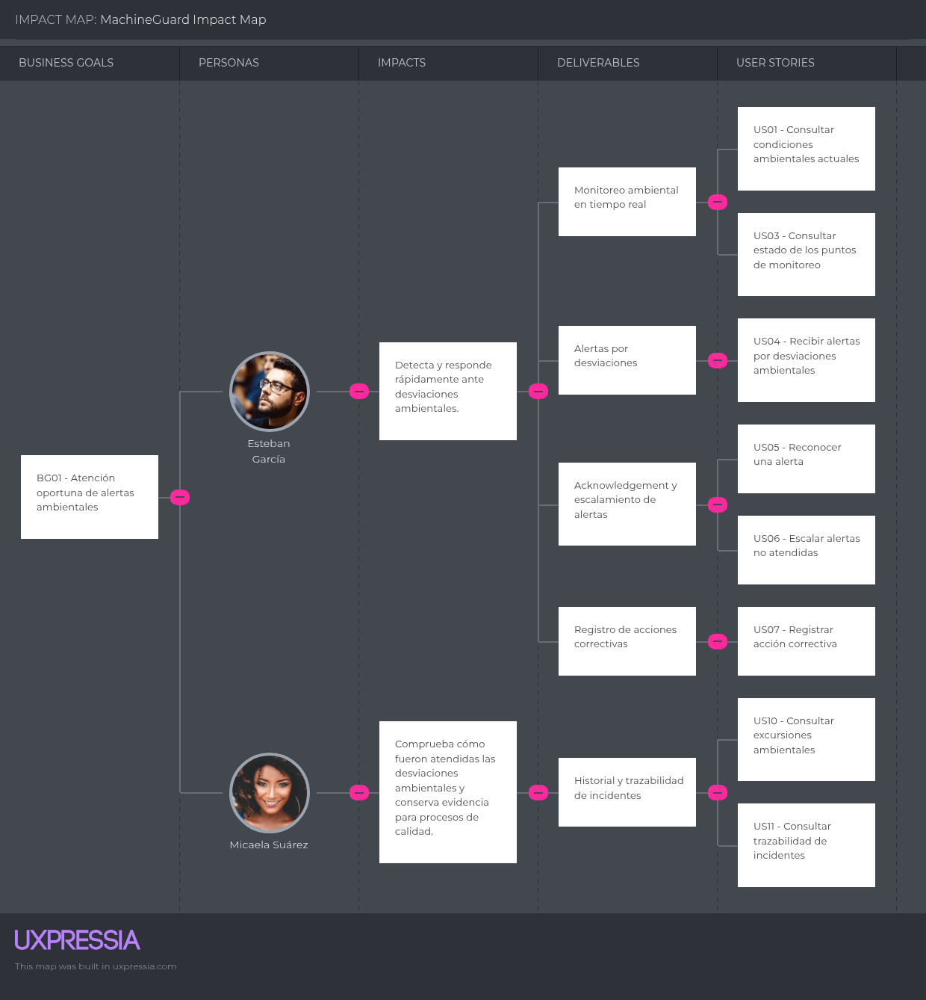
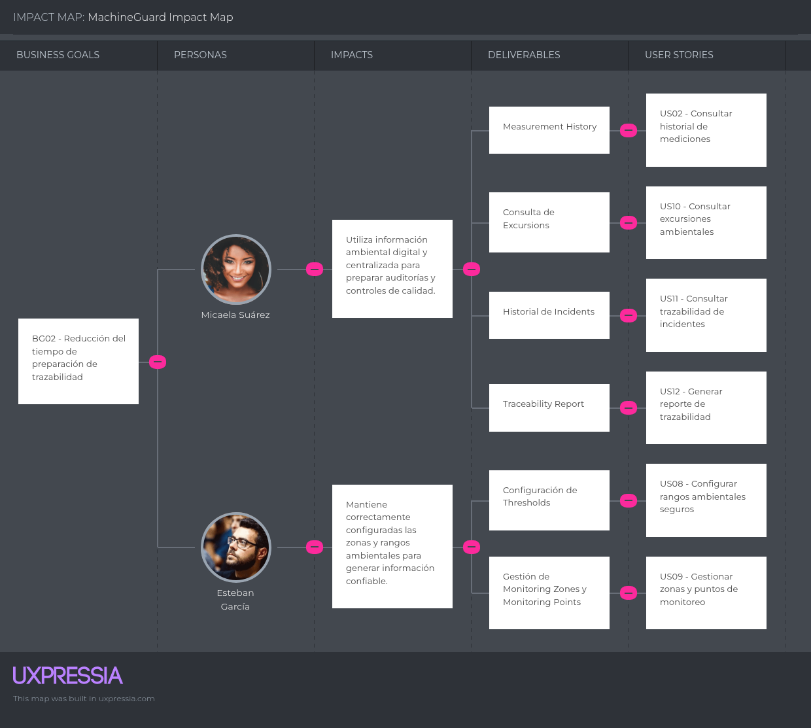
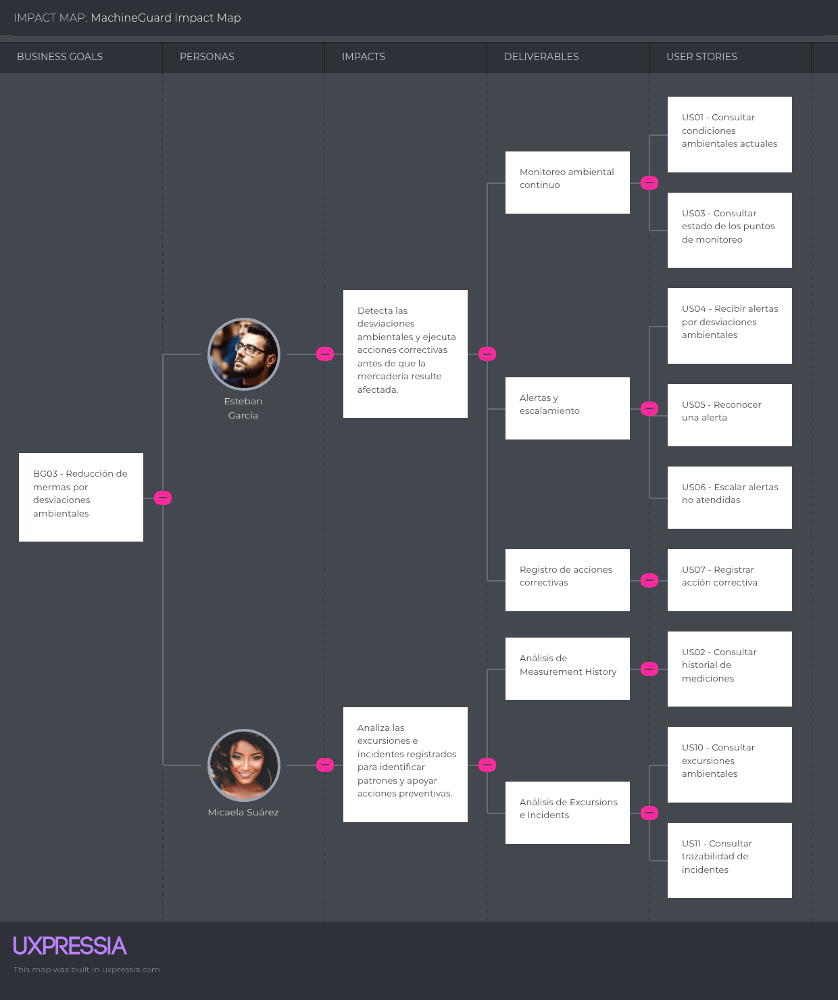
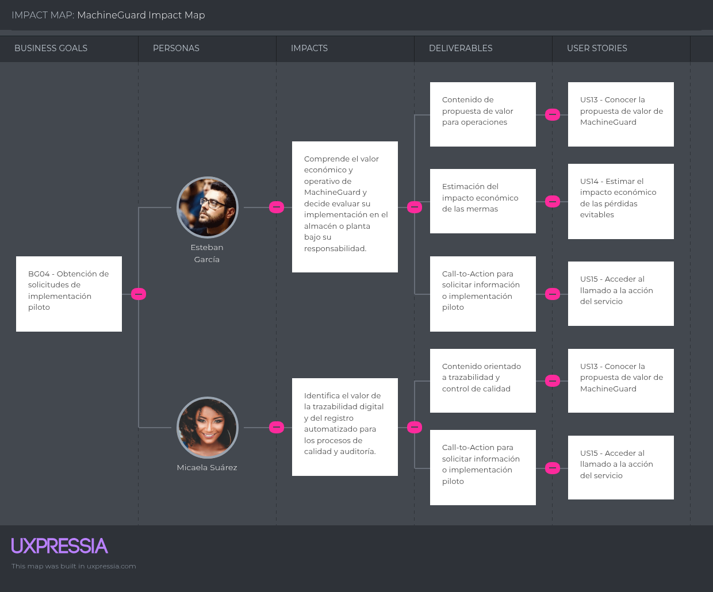
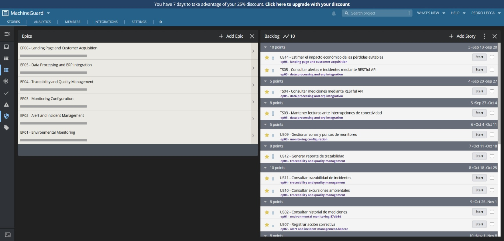
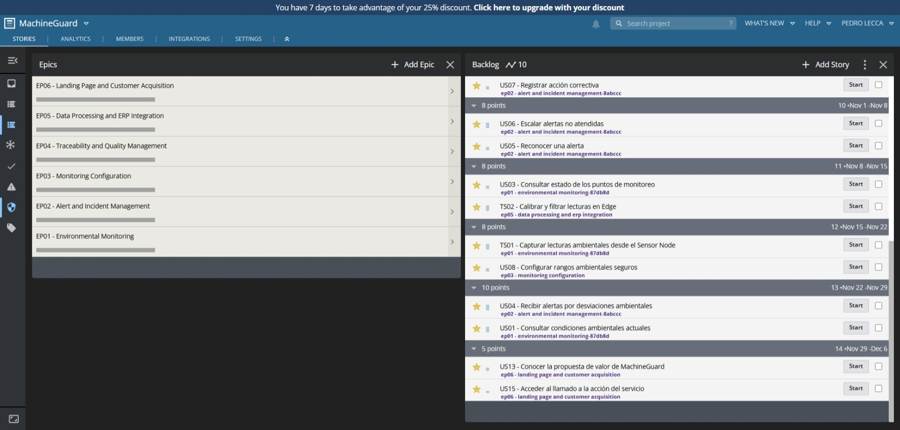

# Capítulo III: Requirements Specification

## 3.1. User Stories

A partir de los resultados obtenidos durante el proceso de Requirements Elicitation & Analysis, se identificaron los requisitos funcionales y técnicos necesarios para MachineGuard. Estos requisitos responden principalmente a las necesidades de los Jefes de Almacén, Gerentes de Operaciones y Encargados de Control de Calidad identificados durante el proceso de Needfinding.

Las User Stories se han organizado en Epics que representan capacidades principales del negocio. Asimismo, se incluyen Technical Stories para los componentes de la solución que no requieren interacción directa con los usuarios finales, como la adquisición de datos desde los dispositivos IoT, el procesamiento en Edge y la integración mediante RESTful APIs.

| Epic / Story ID | Título | Descripción | Criterios de Aceptación | Relacionado con (Epic ID) |
|---|---|---|---|---|
| **EP01** | Environmental Monitoring | Permite realizar el monitoreo continuo de las condiciones ambientales de las instalaciones, zonas y puntos de monitoreo mediante dispositivos IoT. | — | — |
| **US01** | Consultar condiciones ambientales actuales | Como Jefe de Almacén, deseo consultar las mediciones actuales de temperatura y humedad de cada Monitoring Zone para conocer las condiciones ambientales de las áreas bajo mi responsabilidad. | **Scenario 1:** Given que una Monitoring Zone cuenta con Monitoring Points activos, When existen Measurements válidas registradas, Then el sistema proporciona la medición más reciente de temperatura y humedad asociada a cada Monitoring Point.  **Scenario 2:** Given que una Measurement se encuentra fuera del Safe Range definido, When el responsable consulta las condiciones de la Monitoring Zone, Then el sistema identifica la existencia de una Deviation. | EP01 |
| **US02** | Consultar historial de mediciones | Como Jefe de Almacén, deseo consultar el Measurement History de una Monitoring Zone dentro de un período determinado para analizar la evolución de sus condiciones ambientales. | **Scenario 1:** Given que existen Measurements almacenadas para una Monitoring Zone, When el responsable define un período de consulta válido, Then el sistema proporciona las Measurements correspondientes al período solicitado.  **Scenario 2:** Given que no existen Measurements dentro del período solicitado, When se realiza la consulta, Then el sistema informa que no existen datos registrados para dicho período. | EP01 |
| **US03** | Consultar estado de los puntos de monitoreo | Como Jefe de Almacén, deseo conocer el estado de conectividad de cada Sensor Node para identificar puntos de monitoreo que hayan dejado de reportar información. | **Scenario 1:** Given que un Sensor Node reporta Measurements dentro del Sampling Interval esperado, When se evalúa su estado, Then el sistema lo considera activo.  **Scenario 2:** Given que un Sensor Node deja de reportar dentro del intervalo esperado, When se evalúa su estado, Then el sistema lo identifica como Offline Node. | EP01 |
| **TS01** | Capturar lecturas ambientales desde el Sensor Node | Como Developer, deseo que cada Sensor Node capture periódicamente temperatura y humedad para disponer de datos ambientales continuos desde cada Monitoring Point. | **Scenario 1:** Given que el Sensor Node se encuentra operativo, When se cumple el Sampling Interval configurado, Then el dispositivo genera una Reading de temperatura y humedad con su correspondiente marca temporal.  **Scenario 2:** Given que una Reading ha sido obtenida correctamente, When el dispositivo dispone de conectividad con el Edge Service, Then la Reading es enviada para su procesamiento. | EP01 |
| **EP02** | Alert and Incident Management | Permite detectar desviaciones de las condiciones ambientales, generar alertas y mantener trazabilidad sobre su atención y las acciones correctivas realizadas. | — | — |
| **US04** | Recibir alertas por desviaciones ambientales | Como Jefe de Almacén, deseo recibir una Alert cuando una Measurement salga del Safe Range para poder reaccionar antes de que la mercadería resulte afectada. | **Scenario 1:** Given que una Monitoring Zone tiene Thresholds definidos, When una Measurement supera el Threshold superior o inferior, Then el sistema registra una Deviation y genera una Alert asociada.  **Scenario 2:** Given que se genera una Alert, When esta es procesada por el sistema, Then la notificación es dirigida a los responsables definidos para la Monitoring Zone. | EP02 |
| **US05** | Reconocer una alerta | Como Jefe de Almacén, deseo registrar el Acknowledgement de una Alert para dejar constancia de que la condición anómala ha sido identificada y está siendo atendida. | **Scenario 1:** Given que existe una Alert pendiente, When un responsable registra su Acknowledgement, Then el sistema almacena la identidad del responsable y la fecha y hora del reconocimiento.  **Scenario 2:** Given que una Alert ya fue reconocida, When otro responsable consulta su estado, Then el sistema conserva la información del Acknowledgement realizado. | EP02 |
| **US06** | Escalar alertas no atendidas | Como Gerente de Operaciones, deseo que las Alerts no reconocidas sean escaladas a otro responsable para reducir el riesgo de que una desviación permanezca sin atención. | **Scenario 1:** Given que existe una Alert sin Acknowledgement, When transcurre el tiempo definido para su atención, Then el sistema ejecuta el Escalation hacia el responsable correspondiente.  **Scenario 2:** Given que una Alert ha sido reconocida antes del tiempo de escalamiento, When se verifica su estado, Then el sistema no genera un nuevo Escalation por falta de reconocimiento. | EP02 |
| **US07** | Registrar acción correctiva | Como Jefe de Almacén, deseo registrar la Corrective Action aplicada ante una desviación para conservar evidencia de cómo se atendió el incidente. | **Scenario 1:** Given que existe una Alert asociada a una Deviation, When el responsable registra una Corrective Action, Then el sistema la relaciona con el Incident correspondiente.  **Scenario 2:** Given que la condición ambiental retorna al Safe Range, When existe una Corrective Action registrada, Then el Incident conserva la Deviation, Alert, Acknowledgement y Corrective Action asociadas. | EP02 |
| **EP03** | Monitoring Configuration | Permite definir la estructura de las instalaciones monitoreadas y configurar los rangos ambientales requeridos para cada zona. | — | — |
| **US08** | Configurar rangos ambientales seguros | Como Jefe de Almacén, deseo definir Thresholds de temperatura y humedad para cada Monitoring Zone para que las desviaciones sean evaluadas según las necesidades del producto almacenado. | **Scenario 1:** Given que existe una Monitoring Zone, When el responsable establece un Threshold inferior y superior válido para una Environmental Variable, Then el sistema registra el Safe Range correspondiente.  **Scenario 2:** Given que los Thresholds de una Monitoring Zone han sido modificados, When se reciben nuevas Measurements, Then el sistema las evalúa utilizando los Thresholds vigentes. | EP03 |
| **US09** | Gestionar zonas y puntos de monitoreo | Como Jefe de Almacén, deseo organizar una Monitored Facility en Monitoring Zones y Monitoring Points para representar los lugares donde se realizarán las mediciones ambientales. | **Scenario 1:** Given que existe una Monitored Facility, When el responsable registra una nueva Monitoring Zone, Then esta queda asociada a la instalación correspondiente.  **Scenario 2:** Given que existe una Monitoring Zone, When se registra un Monitoring Point, Then este queda asociado a la zona y puede vincularse con un Sensor Node. | EP03 |
| **EP04** | Traceability and Quality Management | Permite conservar evidencia histórica de las condiciones ambientales y facilitar la preparación de información para procesos de control y auditoría. | — | — |
| **US10** | Consultar excursiones ambientales | Como Encargado de Control de Calidad, deseo consultar las Excursions ocurridas durante un período determinado para identificar situaciones en las que los productos estuvieron expuestos a condiciones fuera del rango establecido. | **Scenario 1:** Given que existen Measurements fuera del Safe Range, When el sistema identifica el inicio y retorno de la variable al rango permitido, Then registra la Excursion correspondiente.  **Scenario 2:** Given que existen Excursions registradas, When el responsable consulta un período determinado, Then el sistema proporciona las Excursions pertenecientes a dicho período. | EP04 |
| **US11** | Consultar trazabilidad de incidentes | Como Encargado de Control de Calidad, deseo consultar el historial de Incidents para disponer de evidencia de las desviaciones y acciones tomadas durante un período de almacenamiento. | **Scenario 1:** Given que existen Incidents registrados, When el responsable consulta uno de ellos, Then el sistema proporciona la Deviation, Alert, Acknowledgement y Corrective Action relacionadas.  **Scenario 2:** Given que se selecciona un período determinado, When se realiza la consulta, Then el sistema proporciona los Incidents registrados dentro de ese período. | EP04 |
| **US12** | Generar reporte de trazabilidad | Como Encargado de Control de Calidad, deseo generar un Traceability Report para sustentar las condiciones ambientales registradas durante una auditoría interna o externa. | **Scenario 1:** Given que existen Measurements e Incidents dentro de un período seleccionado, When el responsable solicita un Traceability Report, Then el sistema genera un reporte que resume las condiciones ambientales y Excursions registradas.  **Scenario 2:** Given que el período solicitado no contiene Incidents, When se genera el Traceability Report, Then el sistema conserva las Measurements disponibles e indica que no se registraron Incidents durante dicho período. | EP04 |
| **EP05** | Data Processing and ERP Integration | Permite procesar las lecturas provenientes de los dispositivos IoT y poner a disposición de sistemas externos información confiable de MachineGuard. | — | — |
| **TS02** | Calibrar y filtrar lecturas en Edge | Como Developer, deseo que el Edge Service calibre y filtre las Readings obtenidas por los Sensor Nodes para enviar al servicio central Measurements consistentes y confiables. | **Scenario 1:** Given que el Edge Service recibe una Reading válida, When se encuentra definido un Calibration Offset para el Sensor Node, Then el servicio aplica el ajuste correspondiente antes de generar la Measurement.  **Scenario 2:** Given que una Reading no supera las validaciones definidas, When el Edge Service la procesa, Then la Reading no es incorporada como una Measurement válida. | EP05 |
| **TS03** | Mantener lecturas ante interrupciones de conectividad | Como Developer, deseo que el Edge Service conserve temporalmente las Measurements cuando no exista comunicación con el servicio central para evitar vacíos en el Measurement History. | **Scenario 1:** Given que el servicio central no se encuentra disponible, When el Edge Service procesa nuevas Measurements, Then estas son conservadas localmente hasta recuperar la comunicación.  **Scenario 2:** Given que existen Measurements pendientes de sincronización, When se restablece la comunicación con el servicio central, Then el Edge Service transmite las Measurements conservando su marca temporal original. | EP05 |
| **TS04** | Consultar mediciones mediante RESTful API | Como Developer, deseo disponer de un endpoint RESTful para consultar Measurements e historial desde un ERP externo para integrar MachineGuard con los sistemas existentes del cliente. | **Scenario 1:** Given que un cliente autorizado realiza una request válida indicando el recurso y período solicitado, When el RESTful API procesa la solicitud, Then responde con las Measurements correspondientes y un código de respuesta exitoso.  **Scenario 2:** Given que una request contiene parámetros inválidos, When el RESTful API procesa la solicitud, Then responde indicando el error correspondiente sin retornar información inconsistente. | EP05 |
| **TS05** | Consultar alertas e incidentes mediante RESTful API | Como Developer, deseo disponer de recursos RESTful para consultar Alerts e Incidents desde sistemas externos para facilitar la integración de la información operativa con el ERP del cliente. | **Scenario 1:** Given que un cliente autorizado realiza una request válida para consultar Alerts o Incidents, When el RESTful API procesa la solicitud, Then responde con los registros correspondientes al criterio solicitado.  **Scenario 2:** Given que no existen registros que coincidan con el criterio de consulta, When se procesa la request, Then el RESTful API responde correctamente con un conjunto de resultados vacío. | EP05 |
| **EP06** | Landing Page and Customer Acquisition | Permite comunicar la propuesta de valor de MachineGuard y orientar a los visitantes de los segmentos objetivo hacia la adopción de la solución. | — | — |
| **US13** | Conocer la propuesta de valor de MachineGuard | Como visitante perteneciente al segmento de Jefes de Almacén o Gerentes de Operaciones, deseo conocer cómo MachineGuard monitorea continuamente temperatura y humedad para evaluar si la solución responde a las necesidades de mi almacén. | **Scenario 1:** Given que un visitante accede al Landing Page, When consulta la información de la solución, Then encuentra la descripción del monitoreo continuo, las alertas remotas y la trazabilidad ofrecida por MachineGuard.  **Scenario 2:** Given que el visitante pertenece al segmento objetivo, When revisa la propuesta de valor, Then puede identificar los principales beneficios asociados a su problemática. | EP06 |
| **US14** | Estimar el impacto económico de las pérdidas evitables | Como visitante de una PyME industrial, deseo estimar el impacto económico asociado a las mermas por condiciones ambientales para evaluar el beneficio potencial de implementar MachineGuard. | **Scenario 1:** Given que el visitante proporciona valores válidos para realizar la estimación, When solicita el cálculo, Then el sistema obtiene un resultado cuantitativo a partir de los datos proporcionados.  **Scenario 2:** Given que los valores proporcionados no son válidos, When se intenta realizar la estimación, Then el sistema solicita la corrección de la información antes de efectuar el cálculo. | EP06 |
| **US15** | Acceder al llamado a la acción del servicio | Como visitante interesado en MachineGuard, deseo acceder a una opción de contacto o adopción del servicio para continuar con el proceso de evaluación o contratación de la solución. | **Scenario 1:** Given que el visitante ha revisado la propuesta de valor, When decide continuar con el proceso de adopción, Then dispone de un Call-to-Action que lo dirige al punto de acceso definido para el servicio.  **Scenario 2:** Given que existen contenidos dirigidos a diferentes segmentos objetivo, When el visitante selecciona un Call-to-Action asociado a su segmento, Then es dirigido al recurso correspondiente. | EP06 |

## 3.2. Impact Mapping

El Impact Mapping de MachineGuard permite relacionar los objetivos de negocio de la startup con los comportamientos esperados de los User Personas, los entregables necesarios para generar dichos comportamientos y las User Stories definidas previamente.

Para la construcción del Impact Map se consideran como actores principales los User Personas identificados durante el proceso de Needfinding: Esteban García, representante del segmento de Jefes de Almacén y Gerentes de Operaciones, y Micaela Suárez, representante del segmento de Encargados de Control de Calidad.

Los Business Goals propuestos se han definido siguiendo el enfoque SMART, de forma que sean específicos, medibles, alcanzables, relevantes y delimitados en el tiempo.

### Business Goals

| ID | Business Goal |
|---|---|
| **BG01** | Lograr que, durante los primeros tres meses de operación piloto de MachineGuard, al menos el 80% de las alertas ambientales reconocidas sean atendidas mediante una acción correctiva en un tiempo menor a cinco minutos desde su generación. |
| **BG02** | Reducir en al menos 70% el tiempo requerido para preparar información de trazabilidad ambiental durante los primeros dos meses de uso de MachineGuard, en comparación con el procedimiento manual utilizado previamente. |
| **BG03** | Reducir en al menos 20% las mermas atribuibles a desviaciones de temperatura o humedad en las instalaciones piloto durante los primeros tres meses de utilización de MachineGuard, respecto al período previo de referencia. |
| **BG04** | Obtener al menos cinco solicitudes de implementación piloto de PyMEs pertenecientes a los segmentos objetivo durante las primeras ocho semanas posteriores a la publicación del Landing Page de MachineGuard. |

### Relación entre Goals, Actors, Impacts y Deliverables

| Business Goal | Actor / Persona | Impact | Deliverables | User Stories relacionadas |
|---|---|---|---|---|
| **BG01** | Esteban García | Detecta rápidamente una desviación ambiental y actúa antes de que la mercadería resulte afectada. | Monitoreo en tiempo real, detección de desviaciones, alertas remotas, acknowledgement, escalation y registro de corrective actions. | US01, US03, US04, US05, US06, US07 |
| **BG01** | Micaela Suárez | Puede comprobar posteriormente cómo fue atendida una desviación ambiental. | Historial de incidentes con alerta, acknowledgement y acción correctiva. | US10, US11 |
| **BG02** | Micaela Suárez | Sustituye la recopilación manual de planillas por información digital disponible para auditorías. | Measurement History, consulta de Excursions, historial de Incidents y Traceability Report. | US02, US10, US11, US12 |
| **BG02** | Esteban García | Mantiene correctamente configuradas las zonas y rangos ambientales para generar información confiable. | Gestión de Monitoring Zones, Monitoring Points y Thresholds. | US08, US09 |
| **BG03** | Esteban García | Supervisa continuamente las condiciones ambientales y responde oportunamente ante situaciones fuera del Safe Range. | Monitoreo continuo, alertas, escalamiento y acciones correctivas. | US01, US03, US04, US06, US07 |
| **BG03** | Micaela Suárez | Identifica patrones de Excursions e Incidents para apoyar acciones preventivas y de mejora. | Historial de mediciones, Excursions y Traceability Reports. | US02, US10, US11, US12 |
| **BG04** | Esteban García | Comprende el valor del monitoreo continuo y evalúa la adopción de MachineGuard para su operación. | Landing Page, explicación de beneficios, estimación económica y Call-to-Action. | US13, US14, US15 |
| **BG04** | Micaela Suárez | Identifica los beneficios de la trazabilidad digital para procesos de calidad y auditoría. | Contenido orientado a trazabilidad, control de calidad y acceso al servicio. | US13, US15 |

El Impact Map consolida estas relaciones y permite visualizar cómo las funcionalidades definidas para MachineGuard contribuyen a producir cambios concretos en el comportamiento de los segmentos objetivo y, en consecuencia, al cumplimiento de los objetivos de negocio.

### BG01 - Atención oportuna de alertas ambientales

*Figura 1. Impact Map del Business Goal BG01.*

### BG02 - Reducción del tiempo de preparación de trazabilidad

*Figura 2. Impact Map del Business Goal BG02.*

### BG03 - Reducción de mermas por desviaciones ambientales

*Figura 3. Impact Map del Business Goal BG03.*

### BG04 - Obtención de solicitudes de implementación piloto

*Figura 4. Impact Map del Business Goal BG04.*

## 3.3. Product Backlog

El Product Backlog de MachineGuard consolida las User Stories y Technical Stories identificadas previamente, asignándoles una estimación mediante Story Points y un orden de prioridad basado principalmente en el valor que cada historia aporta al negocio y a los usuarios.

Para la estimación se utiliza la escala de Story Points 1, 2, 3, 5 y 8. La priorización considera la necesidad de validar tempranamente la propuesta de valor de MachineGuard mediante el Landing Page, así como implementar progresivamente las capacidades principales de monitoreo ambiental, gestión de alertas, trazabilidad e integración tecnológica.

| # Orden | User Story Id | Título | Descripción | Story Points |
|---:|---|---|---|---:|
| 1 | US13 | Conocer la propuesta de valor de MachineGuard | Como visitante perteneciente al segmento de Jefes de Almacén o Gerentes de Operaciones, deseo conocer cómo MachineGuard monitorea continuamente temperatura y humedad para evaluar si la solución responde a las necesidades de mi almacén. | 3 |
| 2 | US15 | Acceder al llamado a la acción del servicio | Como visitante interesado en MachineGuard, deseo acceder a una opción de contacto o adopción del servicio para continuar con el proceso de evaluación o contratación de la solución. | 2 |
| 3 | US01 | Consultar condiciones ambientales actuales | Como Jefe de Almacén, deseo consultar las mediciones actuales de temperatura y humedad de cada Monitoring Zone para conocer las condiciones ambientales de las áreas bajo mi responsabilidad. | 5 |
| 4 | US04 | Recibir alertas por desviaciones ambientales | Como Jefe de Almacén, deseo recibir una Alert cuando una Measurement salga del Safe Range para poder reaccionar antes de que la mercadería resulte afectada. | 5 |
| 5 | US08 | Configurar rangos ambientales seguros | Como Jefe de Almacén, deseo definir Thresholds de temperatura y humedad para cada Monitoring Zone para que las desviaciones sean evaluadas según las necesidades del producto almacenado. | 3 |
| 6 | TS01 | Capturar lecturas ambientales desde el Sensor Node | Como Developer, deseo que cada Sensor Node capture periódicamente temperatura y humedad para disponer de datos ambientales continuos desde cada Monitoring Point. | 5 |
| 7 | TS02 | Calibrar y filtrar lecturas en Edge | Como Developer, deseo que el Edge Service calibre y filtre las Readings obtenidas por los Sensor Nodes para enviar al servicio central Measurements consistentes y confiables. | 5 |
| 8 | US03 | Consultar estado de los puntos de monitoreo | Como Jefe de Almacén, deseo conocer el estado de conectividad de cada Sensor Node para identificar puntos de monitoreo que hayan dejado de reportar información. | 3 |
| 9 | US05 | Reconocer una alerta | Como Jefe de Almacén, deseo registrar el Acknowledgement de una Alert para dejar constancia de que la condición anómala ha sido identificada y está siendo atendida. | 3 |
| 10 | US06 | Escalar alertas no atendidas | Como Gerente de Operaciones, deseo que las Alerts no reconocidas sean escaladas a otro responsable para reducir el riesgo de que una desviación permanezca sin atención. | 5 |
| 11 | US07 | Registrar acción correctiva | Como Jefe de Almacén, deseo registrar la Corrective Action aplicada ante una desviación para conservar evidencia de cómo se atendió el incidente. | 3 |
| 12 | US02 | Consultar historial de mediciones | Como Jefe de Almacén, deseo consultar el Measurement History de una Monitoring Zone dentro de un período determinado para analizar la evolución de sus condiciones ambientales. | 5 |
| 13 | US10 | Consultar excursiones ambientales | Como Encargado de Control de Calidad, deseo consultar las Excursions ocurridas durante un período determinado para identificar situaciones en las que los productos estuvieron expuestos a condiciones fuera del rango establecido. | 5 |
| 14 | US11 | Consultar trazabilidad de incidentes | Como Encargado de Control de Calidad, deseo consultar el historial de Incidents para disponer de evidencia de las desviaciones y acciones tomadas durante un período de almacenamiento. | 5 |
| 15 | US12 | Generar reporte de trazabilidad | Como Encargado de Control de Calidad, deseo generar un Traceability Report para sustentar las condiciones ambientales registradas durante una auditoría interna o externa. | 8 |
| 16 | US09 | Gestionar zonas y puntos de monitoreo | Como Jefe de Almacén, deseo organizar una Monitored Facility en Monitoring Zones y Monitoring Points para representar los lugares donde se realizarán las mediciones ambientales. | 5 |
| 17 | TS03 | Mantener lecturas ante interrupciones de conectividad | Como Developer, deseo que el Edge Service conserve temporalmente las Measurements cuando no exista comunicación con el servicio central para evitar vacíos en el Measurement History. | 8 |
| 18 | TS04 | Consultar mediciones mediante RESTful API | Como Developer, deseo disponer de un endpoint RESTful para consultar Measurements e historial desde un ERP externo para integrar MachineGuard con los sistemas existentes del cliente. | 5 |
| 19 | TS05 | Consultar alertas e incidentes mediante RESTful API | Como Developer, deseo disponer de recursos RESTful para consultar Alerts e Incidents desde sistemas externos para facilitar la integración de la información operativa con el ERP del cliente. | 5 |
| 20 | US14 | Estimar el impacto económico de las pérdidas evitables | Como visitante de una PyME industrial, deseo estimar el impacto económico asociado a las mermas por condiciones ambientales para evaluar el beneficio potencial de implementar MachineGuard. | 5 |

El Product Backlog comprende 20 elementos, conformados por 15 User Stories y 5 Technical Stories, con un total estimado de 93 Story Points.

### Product Backlog en LiteTracker

El Product Backlog fue registrado en LiteTracker, donde se encuentran representadas las User Stories y Technical Stories, sus estimaciones mediante Story Points y su asociación con los Epics definidos para MachineGuard.

*Figura 5. Product Backlog de MachineGuard en LiteTracker - Parte 1.*

*Figura 6. Product Backlog de MachineGuard en LiteTracker - Parte 3.*

**Enlace del Product Backlog:** [MachineGuard - Product Backlog](https://app.litetracker.com/n/projects/59f921)
