# Capítulo V: Solution UI/UX Design

Este capítulo traduce los resultados del Needfinding (Capítulo II), los User Stories y el Impact Map (Capítulo III) en la propuesta de experiencia de usuario de MachineGuard. El diseño busca que Esteban García (Jefe de Almacén) detecte y atienda una desviación en menos de cinco minutos, y que Micaela Suárez (Encargada de Control de Calidad) prepare evidencia de trazabilidad sin transcribir planillas.

Los principios que guían todas las decisiones son:

* **Claridad bajo presión:** ante una alerta, el usuario debe entender en segundos qué zona, qué variable y qué tan grave es.
* **Estado antes que dato:** primero se muestra si todo está bien, en alerta o sin conexión; el detalle numérico viene después.
* **Consistencia entre productos:** Landing Page, Web Application y Mobile Application comparten el mismo Design System basado en Material Design 3.
* **Diseño inclusivo:** ningún estado se comunica solo con color; contraste mínimo WCAG 2.1 AA; soporte de ARIA, navegación por teclado e internacionalización (en_US por defecto, es_419).

---

## 5.1. Style Guidelines

### 5.1.1. General Style Guidelines

#### Branding

MachineGuard transmite **confianza técnica y calma operativa**. El nombre evoca un guardián que vigila de forma continua; el isotipo propuesto es un escudo con una línea de pulso (señal de sensor) en su interior.

| Elemento | Decisión |
|---|---|
| Nombre | MachineGuard |
| Isotipo | Escudo con línea de pulso; versión monocromática para fondos oscuros |
| Eslogan (en_US) | *"Know before it spoils."* |
| Eslogan (es_419) | *"Anticípese a la merma."* |
| Zona de respeto | Alto de la letra "M" alrededor del logo |
| Tamaño mínimo | 24 px de alto (digital) |

#### Colors

La paleta combina un azul petróleo profundo (seriedad industrial) con un verde menta (estado saludable) y reserva el ámbar y el rojo exclusivamente para estados de alerta, de modo que el color siempre tenga significado.

| Rol | Nombre | HEX | Uso |
|---|---|---|---|
| Primary | Deep Teal | `#0F4C5C` | Encabezados, botones principales, navegación |
| Primary Container | Mist Teal | `#D6EEF2` | Fondos de tarjetas destacadas, chips activos |
| Secondary | Sensor Green | `#2A9D8F` | Estado "Normal", acentos positivos |
| Tertiary | Signal Amber | `#E9A23B` | Advertencia (cerca del umbral), CTA secundario |
| Error | Alert Red | `#D62839` | Desviación activa, acciones destructivas |
| Neutral 900 | Night Navy | `#0B1F2A` | Texto principal, secciones oscuras del Landing Page |
| Neutral 600 | Slate | `#52667A` | Texto secundario |
| Neutral 100 | Cloud | `#F4F8FA` | Fondo de la aplicación |
| Surface | White | `#FFFFFF` | Tarjetas y paneles |
| Offline | Gray Signal | `#8A97A3` | Nodo sin conexión |

**Contraste verificado (referencia WCAG 2.1 AA, mínimo 4.5:1 en texto normal):** blanco sobre `#0F4C5C` ≈ 9:1; `#0B1F2A` sobre `#F4F8FA` ≈ 15:1; blanco sobre `#D62839` ≈ 4.9:1. El ámbar `#E9A23B` se usa con texto `#0B1F2A` (nunca con blanco).

**Estados de Environmental Variable (siempre color + icono + texto):**

| Estado | Color | Icono (Material Symbols) | Etiqueta |
|---|---|---|---|
| Normal | Sensor Green | `check_circle` | Normal |
| Warning | Signal Amber | `warning` | Near limit |
| Deviation | Alert Red | `error` | Out of range |
| Offline Node | Gray Signal | `sensors_off` | Offline |

#### Typography

| Uso | Fuente | Peso | Tamaño (desktop / mobile) |
|---|---|---|---|
| Display / H1 | Inter | 700 | 48 / 32 px |
| H2 | Inter | 600 | 32 / 24 px |
| H3 | Inter | 600 | 22 / 20 px |
| Body | Inter | 400 | 16 / 16 px |
| Caption / Labels | Inter | 500 | 13 / 13 px |
| Valores de sensor y códigos (`deviceCode`) | JetBrains Mono | 500 | 14–32 px |

Inter es una fuente abierta de alta legibilidad en pantalla; JetBrains Mono se reserva para cifras de mediciones, de modo que los dígitos se alineen y se lean de forma inequívoca. Ambas se cargan desde Google Fonts con *fallback* `system-ui, sans-serif` y `monospace`.

#### Spacing, Shape y Elevation

* **Sistema de espaciado base 8 px:** 4 · 8 · 16 · 24 · 32 · 48 · 64.
* **Radio de esquinas:** 12 px en tarjetas, 999 px (píldora) en botones y chips, 8 px en campos de formulario.
* **Elevación:** sombra suave de un solo nivel (`0 2px 8px rgba(11,31,42,.08)`) en tarjetas; las alertas activas usan borde izquierdo de 4 px en lugar de sombra más fuerte.
* **Grilla:** 12 columnas en desktop (máx. 1200 px), 8 en tablet, 4 en mobile; márgenes de 24 / 16 px.
* **Breakpoints:** 600 px (mobile), 960 px (tablet), 1280 px (desktop).

#### Tono de comunicación

| Dimensión | Decisión | Justificación |
|---|---|---|
| Divertido / Serio | **Serio** | Se protege inventario y se responde a auditorías |
| Formal / Casual | **Casual profesional** | Cercano para PyMEs sin lenguaje corporativo rígido |
| Respetuoso / Irreverente | **Respetuoso** | Los usuarios asumen responsabilidad ante gerencia |
| Entusiasta / Sereno | **Sereno** | En una alerta, el mensaje debe calmar y orientar, no alarmar |

Ejemplo de mensaje de alerta: *"Zone Cold Room A is above 8 °C since 02:14. Acknowledge to take ownership."*

#### Principios de diseño aplicados

| Principio | Aplicación en MachineGuard |
|---|---|
| Jerarquía visual | Estado global de la planta en la parte superior; detalle por zona debajo |
| Proximidad y agrupación | Cada Monitoring Zone es una tarjeta; sus Monitoring Points se agrupan dentro |
| Consistencia | Mismos componentes Material, iconos y colores de estado en Web y Mobile |
| Retroalimentación | Snackbar al reconocer una alerta; indicador de "última sincronización" por nodo |
| Prevención de errores | Los Thresholds validan que el mínimo sea menor que el máximo antes de guardar |
| Reconocimiento antes que recuerdo | Umbrales sugeridos por tipo de producto (cadena de frío, almacén seco) |

#### Design System y tema de Angular Material

Se adapta Material Design 3 mediante un tema personalizado, lo que reduce el código de estilos a un solo archivo.

```scss
// styles/_machineguard-theme.scss
@use '@angular/material' as mat;

$machineguard-theme: mat.define-theme((
  color: (
    theme-type: light,
    primary: mat.$cyan-palette,
    tertiary: mat.$orange-palette,
  ),
  typography: (
    brand-family: 'Inter, system-ui, sans-serif',
    plain-family: 'Inter, system-ui, sans-serif',
  ),
  density: (scale: 0),
));

:root {
  @include mat.all-component-themes($machineguard-theme);

  --mg-primary: #0F4C5C;
  --mg-primary-container: #D6EEF2;
  --mg-ok: #2A9D8F;
  --mg-warn: #E9A23B;
  --mg-error: #D62839;
  --mg-offline: #8A97A3;
  --mg-bg: #F4F8FA;
  --mg-text: #0B1F2A;
  --mg-radius: 12px;
}
```

### 5.1.2. Web, Mobile and IoT Style Guidelines

#### Web (Landing Page y Web Application)

* **Layout responsivo:** Landing Page de una columna con secciones a ancho completo; Web Application con *navigation rail* lateral (desktop) que colapsa en *bottom navigation* (mobile).
* **Componentes Angular Material utilizados:** `mat-toolbar`, `mat-sidenav`, `mat-card`, `mat-chip`, `mat-table`, `mat-paginator`, `mat-form-field`, `mat-select`, `mat-datepicker`, `mat-slider`, `mat-snack-bar`, `mat-dialog`, `mat-badge`, `mat-tab-group`.
* **Botones:** primario relleno (`Deep Teal`), secundario contorneado, terciario de texto. Un solo botón primario por vista.
* **Gráficos de mediciones:** línea de temperatura y humedad con banda sombreada del Safe Range; los tramos fuera del rango se dibujan en rojo con patrón de línea discontinua (no depende solo del color).
* **Estados vacíos y de error:** ilustración simple, mensaje en una frase y una acción (por ejemplo, "Register your first Sensor Node").
* **Accesibilidad (a11y):** `aria-label` en botones solo-icono, `aria-live="assertive"` para nuevas alertas, `role="status"` en indicadores de conectividad, orden de tabulación lógico, foco visible de 2 px en `Deep Teal`, objetivos táctiles de 44 px mínimo.
* **Internacionalización (i18n):** archivos de traducción `en_US` (por defecto) y `es_419` con `@angular/localize`; selector de idioma en el encabezado y en el pie de página. Fechas, números y unidades (°C, %RH) se formatean según la configuración regional.
* **Pie de página:** enlaces a *Terms and Conditions*, *Privacy Policy* y contacto, tanto en el Landing Page como en la Web Application.

#### Mobile Application

* **Material Design 3** con la misma paleta; navegación inferior con tres destinos: *Dashboard*, *Alerts*, *Settings*.
* Las notificaciones push usan un canal de alta prioridad para alertas con severidad `HIGH` o `CRITICAL`; el título incluye zona y variable, y la acción rápida es *Acknowledge*.
* Gestos mínimos: deslizar hacia abajo para actualizar; no se usan gestos ocultos para acciones críticas.
* Modo oscuro soportado mediante tokens (`Night Navy` como superficie) para uso en almacenes con poca luz.

#### IoT Device (interfaz física)

El nodo no tiene pantalla; se comunica mediante LEDs de estado y un botón.

| Elemento | Patrón | Significado |
|---|---|---|
| LED verde | Parpadeo breve cada intervalo de muestreo | Lectura enviada correctamente |
| LED verde | Fijo | Conectado, en reposo |
| LED ámbar | Parpadeo lento | Sin conexión con el Edge Gateway (reintentando) |
| LED rojo | Fijo | Error de sensor (lectura implausible o DHT22 sin respuesta) |
| LED azul | Parpadeo rápido | Modo de vinculación (*pairing*) |
| Botón | Pulsación corta | Fuerza una lectura inmediata |
| Botón | Pulsación larga (5 s) | Entra al modo de vinculación |

Los patrones se diferencian por **frecuencia y color**, para que una persona con dificultad para distinguir colores pueda interpretarlos por ritmo. El nodo lleva grabado el `deviceCode` y un código QR para vincularlo desde la Mobile Application.

---

## 5.2. Information Architecture

### 5.2.1. Organization Systems

| Producto | Esquema de organización visual | Esquema de categorización |
|---|---|---|
| Landing Page | Jerárquico (de propuesta de valor a CTA), con una sección por mensaje | Por tópicos (problema, solución, cómo funciona, precios) y por audiencia (Jefes de Almacén vs. Control de Calidad) |
| Web App: Dashboard | Matricial (tarjetas por zona) con jerarquía por estado (primero las zonas en alerta) | Por ubicación física: Facility → Zone → Point |
| Web App: Alerts | Lista cronológica inversa | Cronológico y por severidad |
| Web App: Traceability | Secuencial (selección de zona y período → vista previa → generar) | Cronológico (Excursions) y por tópicos (Incidents, Reports) |
| Web App: Configuration | Secuencial (*step-by-step*) para el alta de zona, punto y nodo | Por jerarquía del dominio |
| Mobile App | Jerárquico con tres destinos | Por prioridad: lo urgente primero |

### 5.2.2. Labeling Systems

Etiquetas cortas, en inglés (idioma por defecto), coherentes con el Ubiquitous Language.

| Etiqueta (en_US) | es_419 | Representa |
|---|---|---|
| Dashboard | Panel | Estado actual de todas las zonas |
| Zones | Zonas | Monitoring Zones y Monitoring Points |
| Alerts | Alertas | Alertas activas y pendientes de reconocimiento |
| Incidents | Incidentes | Historial de incidentes con acción correctiva |
| Excursions | Excursiones | Períodos fuera del Safe Range |
| Reports | Reportes | Traceability Reports |
| Devices | Dispositivos | Sensor Nodes y su conectividad |
| Thresholds | Umbrales | Safe Range por variable |
| Acknowledge | Reconocer | Acknowledgement de una alerta |
| Settings | Ajustes | Cuenta, organización, idioma, notificaciones |

Botones de acción con verbo + objeto: *Add zone*, *Set threshold*, *Generate report*, *Request pilot*.

### 5.2.3. SEO Tags and Meta Tags

#### Landing Page

| Página | Title | Meta Description | Keywords | Author |
|---|---|---|---|---|
| Home | MachineGuard – Low-cost temperature & humidity monitoring for warehouses | Continuous IoT monitoring with real-time alerts and audit-ready traceability. Starts at S/ 35 per sensor point. | environmental monitoring, warehouse, IoT, temperature, humidity, alerts, traceability, Peru | MachineGuard Team |
| Pricing | Pricing – MachineGuard | Transparent per-point pricing plus a monthly subscription. Free 30-day pilot. | IoT pricing, sensor monitoring cost, SaaS | MachineGuard Team |
| Loss Calculator | Avoided Loss Calculator – MachineGuard | Estimate how much shrinkage you can avoid by monitoring humidity and temperature. | shrinkage calculator, inventory loss | MachineGuard Team |
| Pilot Request | Request a free pilot – MachineGuard | Try MachineGuard for 30 days in your warehouse with assisted installation. | free pilot, IoT demo | MachineGuard Team |

Etiquetas adicionales: `<html lang="en">`, `<meta name="viewport" content="width=device-width, initial-scale=1">`, Open Graph (`og:title`, `og:description`, `og:image`), `<link rel="alternate" hreflang="es-419">` y datos estructurados JSON-LD de tipo `SoftwareApplication`.

#### Web Application

| Vista | Title | Meta Description |
|---|---|---|
| Sign in | Sign in – MachineGuard | Access your monitoring dashboard. |
| Dashboard | Dashboard – MachineGuard | Live status of your zones and sensor nodes. |
| Alerts | Alerts – MachineGuard | Review, acknowledge and resolve environmental alerts. |
| Reports | Traceability Reports – MachineGuard | Generate audit-ready environmental evidence. |

Las vistas autenticadas incluyen `<meta name="robots" content="noindex">`.

#### ASO (App Store Optimization) – Mobile Application

| Elemento | Valor |
|---|---|
| App Title | MachineGuard – Warehouse Alerts |
| App Subtitle | Real-time temperature & humidity |
| App Keywords | warehouse, monitoring, IoT, alerts, temperature, humidity, cold chain, quality |
| App Description | Receive instant push alerts when temperature or humidity leave the safe range. Acknowledge incidents, log corrective actions and check every zone from your phone. Works with MachineGuard sensor nodes. |

### 5.2.4. Searching Systems

| Producto / vista | Búsqueda | Filtros | Presentación del resultado |
|---|---|---|---|
| Web App: Zones | Campo de texto por nombre de zona, punto o `deviceCode` | Facility, estado (Normal / Warning / Deviation / Offline) | Tarjetas ordenadas por estado, con el término resaltado |
| Web App: Alerts | Búsqueda por zona o por responsable | Severidad, estado (Pending / Acknowledged / Escalated / Closed), rango de fechas | Tabla paginada con chips de severidad |
| Web App: History | Selector de zona | Variable (temperatura / humedad), período (*datepicker*), solo excursiones | Gráfico de línea más tabla; sin datos: mensaje "No data recorded for this period" |
| Web App: Reports | Selector de zona y período | Estado del reporte (Draft / Sealed) | Lista cronológica con acción *Download* |
| Mobile App: Alerts | Chips de filtro rápido | Active, Acknowledged, All | Lista con indicador de severidad e hora |

### 5.2.5. Navigation Systems

* **Landing Page:** encabezado fijo con anclas a *Problem*, *How it works*, *Pricing*, *Calculator*; botón primario *Request pilot* siempre visible; en mobile se colapsa en menú de hamburguesa accesible (`aria-expanded`).
* **Web Application:** *navigation rail* a la izquierda (Dashboard, Zones, Alerts, Incidents, Reports, Devices) y barra superior con selector de Facility, idioma, campana de alertas con *badge* y menú de perfil. Se incluye *breadcrumb* en vistas de detalle (Zones › Cold Room A › Point 2).
* **Mobile Application:** *bottom navigation* con tres destinos; el toque en una notificación push abre directamente el detalle de la alerta (*deep link*).
* **Coherencia entre productos:** los CTA del Landing Page redirigen a *Sign in / Request pilot* de la Web Application o a la tienda de la Mobile Application según el segmento.
* **Prevención de pérdida:** el usuario siempre puede volver mediante *breadcrumb* o botón de retroceso; las acciones destructivas piden confirmación.

---

## 5.3. Landing Page UI Design

El Landing Page responde a los User Stories US13, US14 y US15 y al Business Goal BG04. Su estructura sigue el recorrido del visitante: *reconoce el problema → entiende la solución → estima su ahorro → actúa*.

### 5.3.1. Landing Page Wireframe

#### Desktop

```
┌──────────────────────────────────────────────────────────────────────┐
│ [Logo] MachineGuard    Problem  How it works  Pricing  Calc   EN|ES  [Request pilot] │
├──────────────────────────────────────────────────────────────────────┤
│  HERO                                                                │
│  "Know before it spoils."                    ┌─────────────────────┐ │
│  Low-cost temperature & humidity             │  Dashboard preview  │ │
│  monitoring with real-time alerts.           │  (zone cards)       │ │
│  [Request free pilot]  [See how it works]    └─────────────────────┘ │
├──────────────────────────────────────────────────────────────────────┤
│  PROBLEM  – 3 cards: Manual rounds · No history · Late detection     │
├──────────────────────────────────────────────────────────────────────┤
│  HOW IT WORKS – 4 steps: Sensor → Edge → Cloud → Alert (iconos)      │
├──────────────────────────────────────────────────────────────────────┤
│  FEATURES (2 tabs by segment)                                        │
│  [Warehouse Managers] [Quality Control]                              │
│   • Real-time alerts      • Traceability Reports                     │
│   • Mobile app            • ERP public API                           │
├──────────────────────────────────────────────────────────────────────┤
│  AVOIDED LOSS CALCULATOR                                             │
│  [Monthly inventory value] [% shrinkage] ─► Estimated savings        │
├──────────────────────────────────────────────────────────────────────┤
│  PRICING  – S/ 35–50 per point + monthly plan   [Starter kit: 2 pts] │
├──────────────────────────────────────────────────────────────────────┤
│  VIDEO About-the-Product  |  TESTIMONIALS (1 por segmento)           │
├──────────────────────────────────────────────────────────────────────┤
│  TEAM (fotos, nombre, carrera)  | About-the-Team video               │
├──────────────────────────────────────────────────────────────────────┤
│  CTA FINAL: [Request free pilot]                                     │
│  Footer: Terms · Privacy · Contact · Language                        │
└──────────────────────────────────────────────────────────────────────┘
```

#### Mobile

```
┌────────────────────┐
│ ☰  MachineGuard  EN│
├────────────────────┤
│ Know before it     │
│ spoils.            │
│ [Request pilot]    │
│ (dashboard image)  │
├────────────────────┤
│ Problem (carrusel) │
│ How it works (list)│
│ Features (tabs)    │
│ Calculator         │
│ Pricing (cards)    │
│ Video · Testimonial│
│ Team (grid 2 col.) │
│ [Request pilot]    │
│ Footer             │
└────────────────────┘
```

**Aplicación de principios:** jerarquía visual (hero grande, secciones con un mensaje cada una); inclusión (contenido segmentado por audiencia, textos alternativos, jerarquía de encabezados H1–H3 correcta); arquitectura de información (anclas coherentes con las etiquetas definidas en 5.2.2).

> 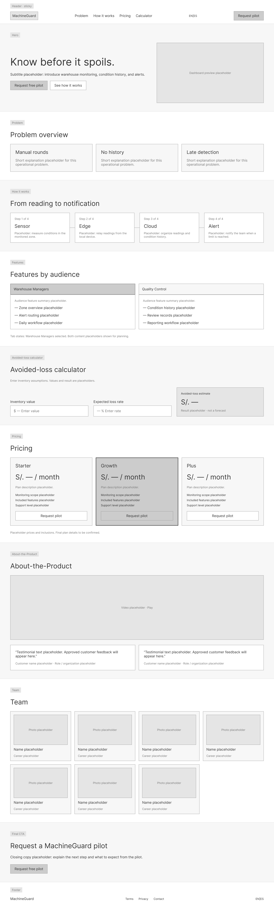
> 

### 5.3.2. Landing Page Mock-up

El mock-up de alta fidelidad aplica el Design System definido en 5.1 sobre la estructura del wireframe, manteniendo el mismo orden de secciones para que el recorrido del visitante (*reconoce el problema → entiende la solución → estima su ahorro → actúa*) sea idéntico en ambos artefactos. Se elaboró una versión Desktop (1280 px) y una Mobile (390 px).

| Sección | Decisión visual | Principio aplicado |
|---|---|---|
| Header | Barra fija con logo, enlaces de anclaje (Problem, How it works, Pricing, Calculator), selector EN \| ES y botón primario *Request pilot* | Navegación persistente y llamada a la acción siempre visible |
| Hero | Fondo con degradado de `#0B1F2A` a `#0F4C5C`; titular "Know before it spoils." en Inter Bold; botones *Request free pilot* y *See how it works*; a la derecha, tarjeta *Dashboard preview* con las zonas Cold Room A (Out of range, en rojo) y Dry Store (Normal, en verde) y un gráfico de tendencia con su Safe Range | Jerarquía visual y demostración inmediata del producto |
| Problem overview | Tres tarjetas blancas (*Manual rounds*, *No history*, *Late detection*) sobre fondo `#F4F8FA`, con icono lineal, y un banner ámbar destacando "8%–15% shrinkage" | Agrupación por proximidad y énfasis en la cifra de sustento |
| From reading to notification | Cuatro pasos numerados (Sensor, Edge, Cloud, Alert) conectados horizontalmente; en Mobile se presentan como carrusel con indicador de página | Organización secuencial (*step-by-step*) |
| Features by audience | Pestañas por segmento (*Warehouse Managers*, *Quality Control*) con lista de beneficios y tarjetas de zona de ejemplo | Categorización por audiencia (sección 5.2.1) |
| Avoided-loss calculator | Bloque oscuro (`#0B1F2A`) con dos campos (*Inventory value*, *Expected loss rate*) y una caja de resultado *Avoided-loss estimate* | Contraste que enfoca la atención en la interacción; responde a US14 |
| Pricing | Tres tarjetas (Starter, Growth, Plus); *Growth* resaltada con borde y botón primario relleno | Jerarquía por énfasis en el plan recomendado |
| About-the-Product | Espacio para el video y dos testimonios (uno por segmento) | Prueba social |
| Team | Siete tarjetas con foto, nombre y carrera | Transparencia del equipo, requisito del enunciado |
| Final CTA y footer | Banda `#0F4C5C` con botón ámbar *Request free pilot*; pie con *Terms*, *Privacy*, *Contact* y selector de idioma | Cierre con acción clara; enlace a Terms and Conditions exigido por el enunciado |

**Inclusión y accesibilidad:** el contraste de texto respeta WCAG 2.1 AA, los estados de las zonas combinan color, icono y texto, y los botones mantienen un tamaño táctil mínimo de 44 px.

**Nota de contenido:** los precios, la cifra de la calculadora y los textos de testimonios son marcadores de posición (*placeholders*) hasta definir el contenido final; los importes se expresarán en soles (S/).

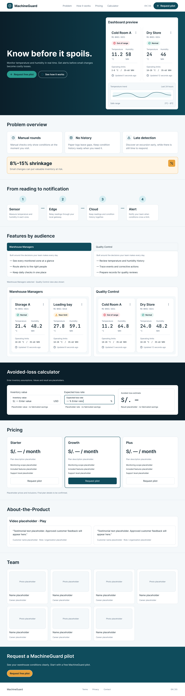

*Figura. Mock-up del Landing Page, versión Desktop.*


*Figura. Mock-up del Landing Page, versión Mobile.*

---

## 5.4. Applications UX/UI Design

Las aplicaciones diseñadas son la **Web Application** (dashboard para ambos segmentos) y la **Mobile Application** (alertas y monitoreo remoto). Las vistas se derivan de los User Stories US01–US12.

| Vista | Aplicación | User Stories | User Persona |
|---|---|---|---|
| Sign in | Web / Mobile | (IAM) | Ambos |
| Dashboard | Web / Mobile | US01, US03 | Esteban |
| Zone detail & history | Web | US02 | Esteban |
| Alerts list & detail | Web / Mobile | US04, US05, US06 | Esteban |
| Register corrective action | Web / Mobile | US07 | Esteban |
| Zones & Points management | Web | US09 | Esteban |
| Thresholds | Web | US08 | Esteban |
| Excursions | Web | US10 | Micaela |
| Incidents | Web | US11 | Micaela |
| Traceability Report | Web | US12 | Micaela |

### 5.4.1. Applications Wireframes

#### Web Application – Dashboard (US01, US03)

```
┌────┬─────────────────────────────────────────────────────────────┐
│ ▣  │ Facility: Main Warehouse ▾            🔔(2)  EN ▾   👤       │
│Dash├─────────────────────────────────────────────────────────────┤
│Zone│  Overview:  ● 4 Normal   ▲ 1 Near limit   ■ 1 Out of range  │
│Alrt│              ○ 1 Offline node                               │
│Inc │ ┌───────────────┐ ┌───────────────┐ ┌───────────────┐       │
│Rep │ │ Cold Room A ■ │ │ Dry Store  ●  │ │ Zone C   ▲    │       │
│Dev │ │ 11.2 °C  58%  │ │ 24 °C   46%   │ │ 27 °C   71%   │       │
│    │ │ Out of range  │ │ Normal        │ │ Near limit    │       │
│    │ │ [Acknowledge] │ │ synced 10 s   │ │ synced 8 s    │       │
│    │ └───────────────┘ └───────────────┘ └───────────────┘       │
│    │  Latest alerts                                              │
│    │  ■ Cold Room A · Temp > 8 °C · 02:14 · Pending     [Open]   │
└────┴─────────────────────────────────────────────────────────────┘
```

#### Web Application – Alert detail (US04, US05, US07)

```
┌────────────────────────────────────────────────────────────────┐
│ ← Alerts / Alert #482                          Severity: HIGH  │
├────────────────────────────────────────────────────────────────┤
│ Cold Room A · Temperature 11.2 °C (limit 8 °C) · since 02:14   │
│ [ line chart with Safe Range band ]                            │
│ Timeline:  Raised 02:14 → Acknowledged — → Corrective action — │
│ [Acknowledge]   [Register corrective action]   [Resolve]       │
└────────────────────────────────────────────────────────────────┘
```

#### Web Application – Traceability Report (US10–US12)

```
┌────────────────────────────────────────────────────────────────┐
│ Reports  ›  New report                                         │
│ 1 Zone [Cold Room A ▾]  2 Period [01/09 – 30/09]  3 Preview    │
│ Summary: 43,200 measurements · 2 excursions · 2 incidents      │
│ Excursions table (start · end · duration · peak · action)      │
│                          [Generate & seal report]  [Download]  │
└────────────────────────────────────────────────────────────────┘
```

#### Web Application – Thresholds (US08) y Zones (US09)

```
Zones › Cold Room A › Thresholds
 Variable: [Temperature ▾]   Min [ 2 ] °C   Max [ 8 ] °C
 Suggested: [Cold chain 2–8 °C] [Dry store 15–28 °C]
 ⚠ Min must be lower than Max
                                   [Cancel]  [Save thresholds]
```

#### Mobile Application

```
Dashboard                 Alerts                  Alert detail
┌──────────────────┐ ┌──────────────────┐ ┌──────────────────┐
│ Main Warehouse ▾ │ │ [Active][Ack][All]│ │ ← Cold Room A    │
│ ■ 1 out of range │ │ ■ Cold Room A    │ │ ■ HIGH · 11.2 °C │
│ ┌──────────────┐ │ │   Temp · 02:14   │ │ [mini chart]     │
│ │Cold Room A ■ │ │ │ ▲ Zone C         │ │ [Acknowledge]    │
│ │11.2°C  58%   │ │ │   Humidity · 01:50│ │ [Add action]     │
│ └──────────────┘ │ │                  │ │                  │
│ ● Dry Store      │ │                  │ │                  │
├──────────────────┤ ├──────────────────┤ └──────────────────┘
│Dash  Alerts  Set │ │Dash  Alerts  Set │
└──────────────────┘ └──────────────────┘
```
<br></br>

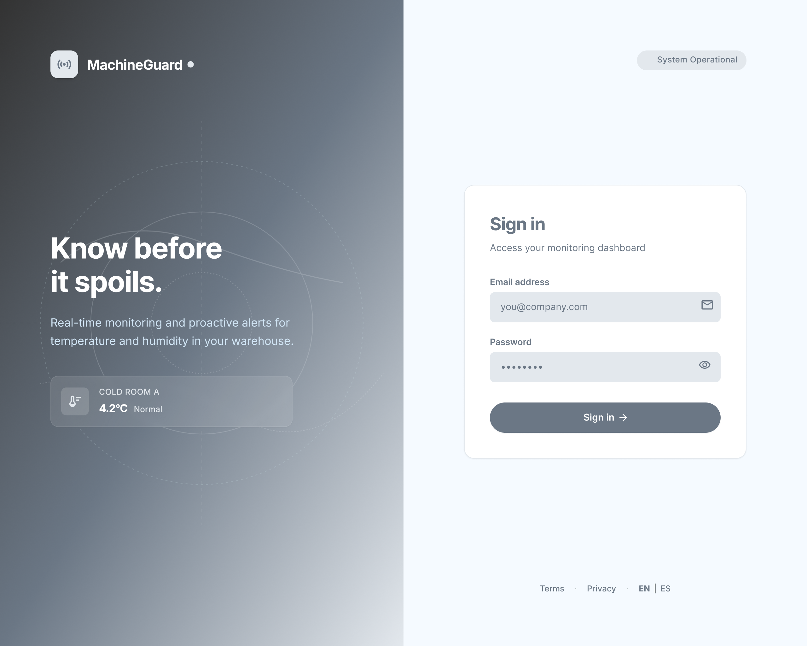

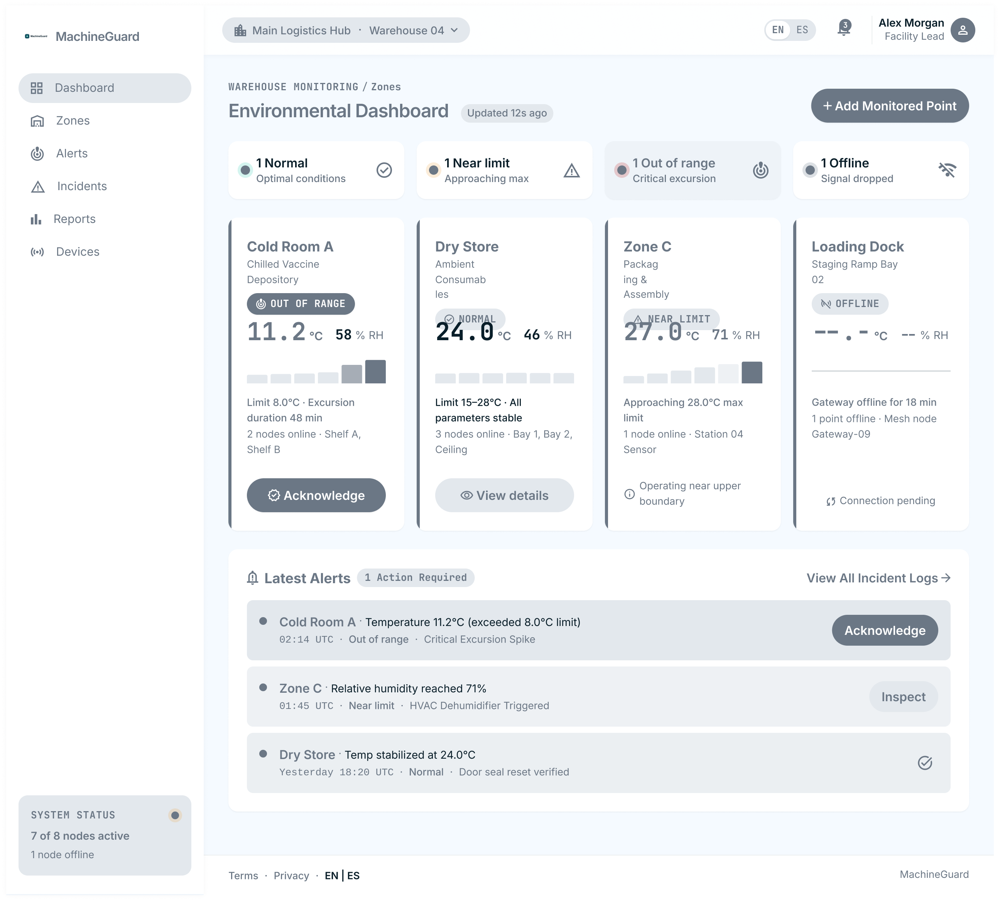

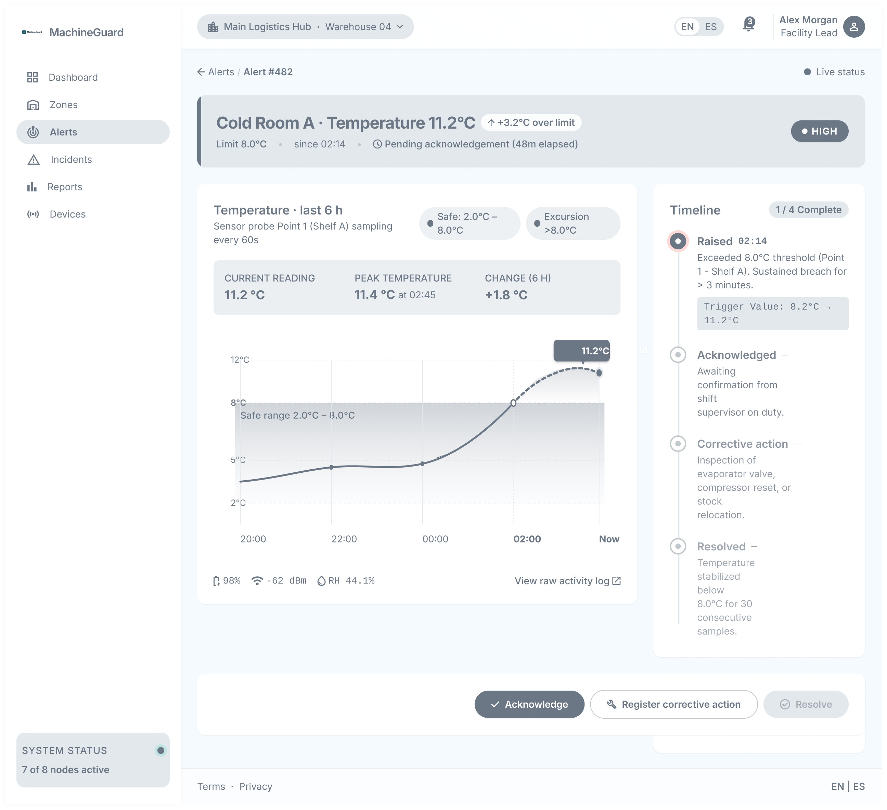

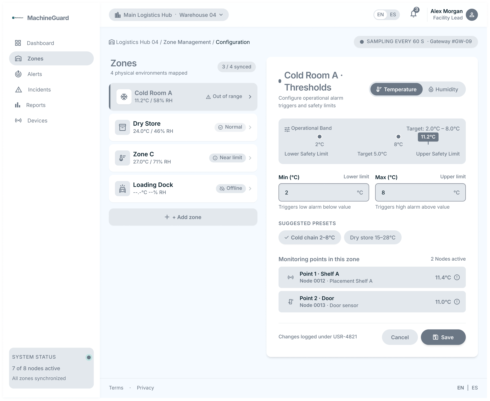

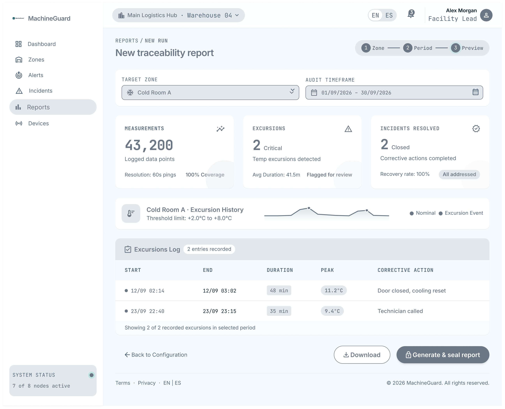


### 5.4.2. Applications Wireflow Diagrams

Cada wireflow corresponde a un User goal. En Figma/FigJam cada nodo del flujo es un wireframe; a continuación se documentan los goals y su ruta típica (*Task Flow*).

**Goal 1 (Esteban): "Atender una alerta fuera de rango"**

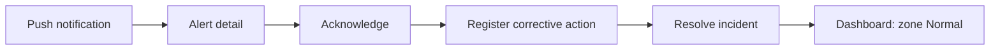
```mermaid
flowchart LR
  A[Push notification] --> B[Alert detail]
  B --> C[Acknowledge]
  C --> D[Register corrective action]
  D --> E[Resolve incident]
  E --> F[Dashboard: zone Normal]
```

**Goal 2 (Esteban): "Configurar una zona y sus umbrales"**

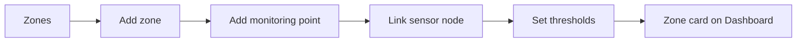
```mermaid
flowchart LR
  A[Zones] --> B[Add zone]
  B --> C[Add monitoring point]
  C --> D[Link sensor node]
  D --> E[Set thresholds]
  E --> F[Zone card on Dashboard]
```

**Goal 3 (Micaela): "Generar un reporte de trazabilidad para una auditoría"**

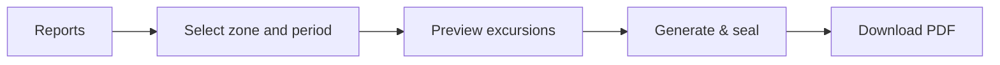
```mermaid
flowchart LR
  A[Reports] --> B[Select zone and period]
  B --> C[Preview excursions]
  C --> D[Generate & seal]
  D --> E[Download PDF]
```

**Goal 4 (Visitante): "Estimar pérdidas y solicitar un piloto"**

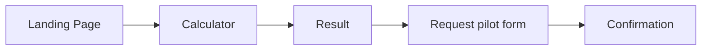
```mermaid
flowchart LR
  A[Landing Page] --> B[Calculator]
  B --> C[Result]
  C --> D[Request pilot form]
  D --> E[Confirmation]
```

<br></br>


### 5.4.3. Applications Mock-ups

Los mock-ups de la Web Application se elaboraron a 1280 × 720 px aplicando el Design System de la sección 5.1 sobre los wireframes de 5.4.1. Todas las vistas autenticadas comparten la barra lateral de navegación, la barra superior (selector de instalación, idioma EN | ES, campana con *badge* de alertas y menú de usuario) y un pie de página con los enlaces *Terms* y *Privacy*, además del indicador de estado del sistema (por ejemplo, "7 of 8 nodes active").

**Sign in.** Pantalla dividida en dos paneles. El panel izquierdo, con degradado de `#0B1F2A` a `#0F4C5C`, presenta la marca, el mensaje "Know before it spoils." y una tarjeta de ejemplo con el estado de Cold Room A. El panel derecho contiene la tarjeta de acceso con los campos de correo y contraseña y un botón primario. Mantiene la misma identidad visual que el Landing Page, por lo que la transición entre ambos productos es continua.

**Dashboard (US01, US03).** En la parte superior, cuatro chips resumen (1 Normal, 1 Near limit, 1 Out of range, 1 Offline) permiten leer el estado global antes del detalle. Debajo, una tarjeta por Monitoring Zone con borde izquierdo del color de estado, nombre de la zona, chip de estado con icono, temperatura y humedad en JetBrains Mono, un minigráfico de tendencia y una acción contextual (*Acknowledge* en la zona fuera de rango, *View details* en las demás). La lista *Latest Alerts* ordena los eventos del más reciente al más antiguo, y la fila que requiere acción lleva el botón *Acknowledge*.

**Alert detail (US04, US05, US06, US07).** Una cabecera en rojo suave muestra la zona, la variable, el valor actual, el exceso sobre el límite, la severidad (*HIGH*) y el tiempo transcurrido sin reconocimiento. Un gráfico de las últimas 6 horas dibuja el tramo dentro del Safe Range en `#0F4C5C` y el tramo fuera de rango en rojo discontinuo, con una banda verde claro para el rango permitido. Tres indicadores resumen la lectura actual, el pico y el cambio en 6 horas. A la derecha, una línea de tiempo vertical (*Raised*, *Acknowledged*, *Corrective action*, *Resolved*) y una tarjeta de escalamiento muestran la trazabilidad del incidente. Las acciones *Acknowledge* (primaria), *Register corrective action* (secundaria) y *Resolve* (deshabilitada hasta registrar la acción) respetan la regla de negocio de que un incidente no se resuelve sin acción correctiva.

**Zones and Thresholds (US08, US09).** A la izquierda, la lista de zonas con su estado y valores actuales, el contador de sincronización ("3 / 4 synced") y el botón *Add zone*. A la derecha, el panel de umbrales de la zona seleccionada, con pestañas *Temperature* y *Humidity*, un control visual del rango operativo con el valor actual marcado, los campos *Min* y *Max*, presets sugeridos (*Cold chain 2–8°C*, *Dry store 15–28°C*) y la lista de Monitoring Points con su nodo y lectura actual. El pie del panel incluye *Cancel* y *Save*. Los presets cumplen el compromiso de que el cliente no parta de una configuración en blanco.

**Traceability report (US10, US11, US12).** Un encabezado de tres pasos (*Zone*, *Period*, *Preview*) guía el flujo secuencial. Tres tarjetas resumen el período (*Measurements*, *Excursions*, *Incidents resolved*), seguidas de un gráfico del historial de excursiones y la tabla *Excursions Log* con inicio, fin, duración, pico y acción correctiva. Los botones *Generate & seal report* (primario) y *Download* (secundario) cierran el flujo. El vocabulario de las tarjetas y de la tabla corresponde al Ubiquitous Language del Capítulo II.

**Criterios transversales aplicados:**

* **Estados no dependientes del color:** cada estado combina color, icono y texto (Normal, Near limit, Out of range, Offline).
* **Una acción primaria por vista**, con botones secundarios de menor jerarquía visual.
* **Coherencia de datos entre pantallas:** una misma zona muestra la misma lectura y el mismo estado en el Dashboard, en Zones y en el Alert detail.
* **Internacionalización:** selector EN | ES visible en la barra superior y en el pie de página.

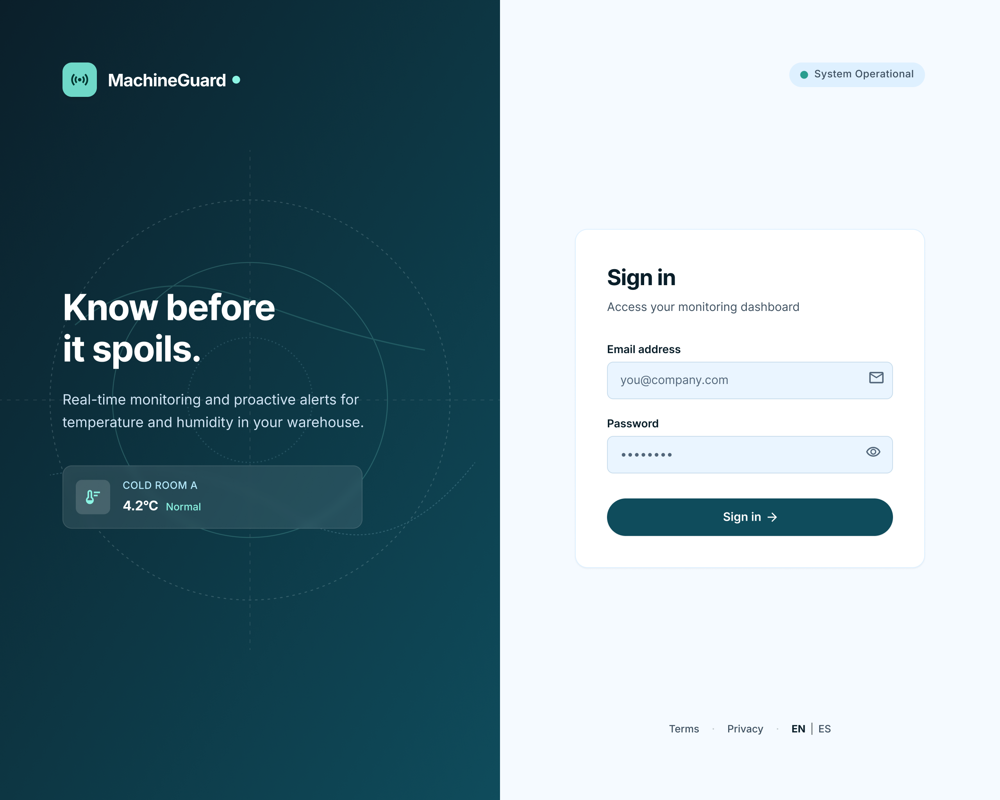

*Figura. Mock-up de Sign in.*

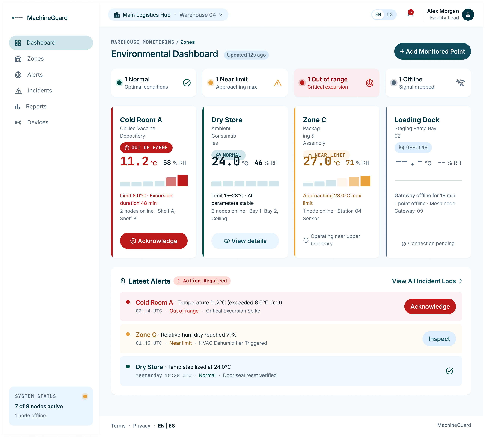

*Figura. Mock-up del Dashboard.*

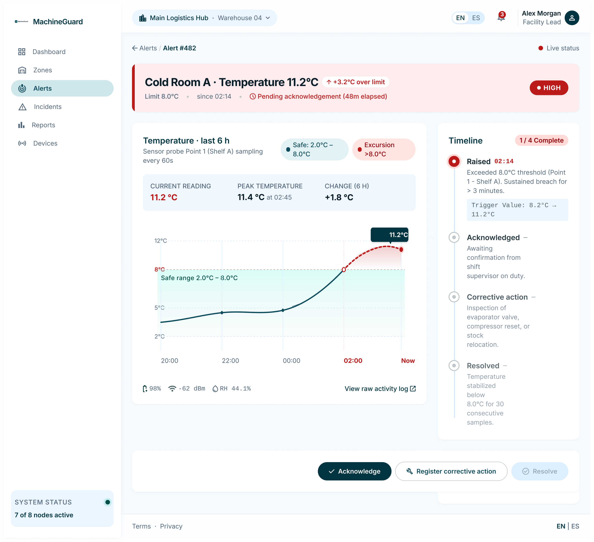

*Figura. Mock-up de Alert detail.*

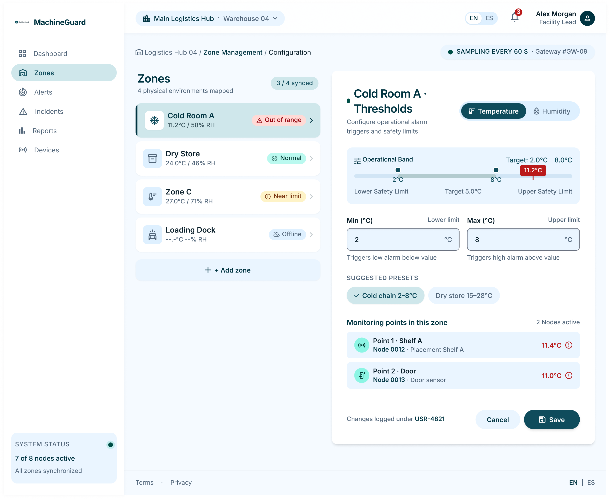

*Figura. Mock-up de Zones and Thresholds.*

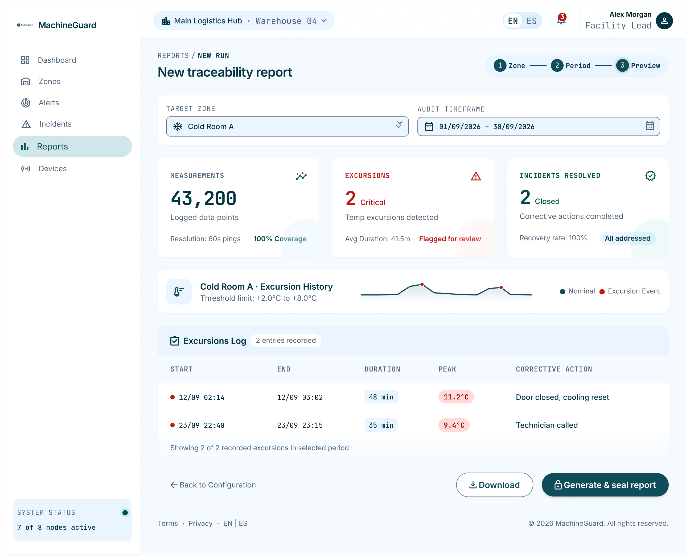

*Figura. Mock-up de Traceability report.*

> **Mobile Application:** los mock-ups de la aplicación móvil se incluirán al completar sus wireframes (ver 5.4.1).

### 5.4.4. Applications User Flow Diagrams

Los User Flows incluyen el *happy path* y las rutas alternativas (*unhappy paths*); son consistentes con los wireflows de 5.4.2.

**User Flow 1 – Atender una alerta (Esteban)**

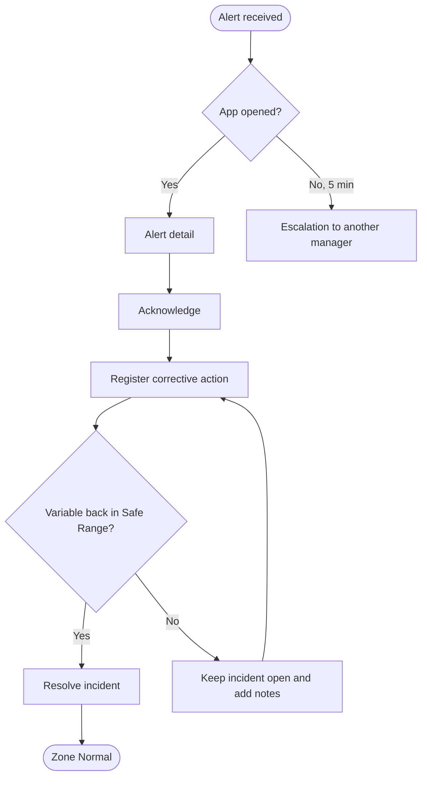
```mermaid
flowchart TD
  S([Alert received]) --> A{App opened?}
  A -- Yes --> B[Alert detail]
  A -- No, 5 min --> X[Escalation to another manager]
  B --> C[Acknowledge]
  C --> D[Register corrective action]
  D --> E{Variable back in Safe Range?}
  E -- Yes --> F[Resolve incident]
  E -- No --> G[Keep incident open and add notes]
  G --> D
  F --> Z([Zone Normal])
```

**User Flow 2 – Generar reporte (Micaela)**

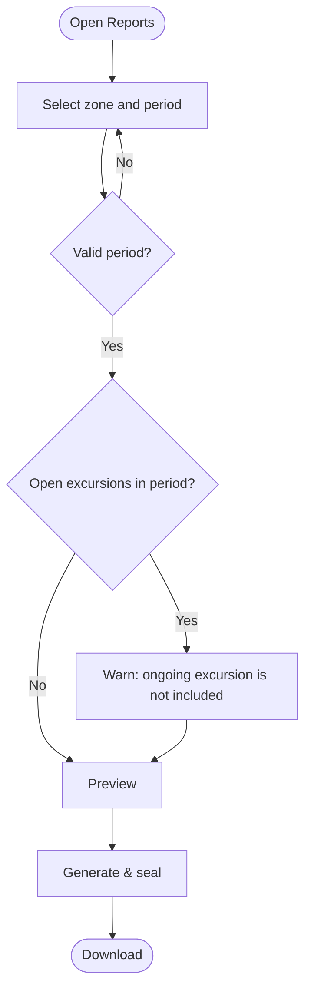
```mermaid
flowchart TD
  S([Open Reports]) --> A[Select zone and period]
  A --> B{Valid period?}
  B -- No --> A
  B -- Yes --> C{Open excursions in period?}
  C -- Yes --> D[Warn: ongoing excursion is not included]
  C -- No --> E[Preview]
  D --> E
  E --> F[Generate & seal]
  F --> G([Download])
```

**User Flow 3 – Solicitar un piloto (Visitante)**

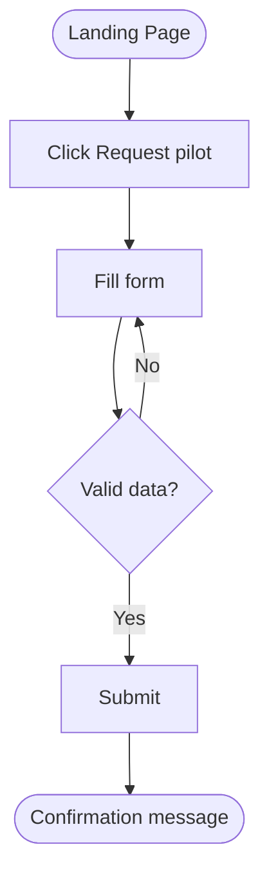
```mermaid
flowchart TD
  S([Landing Page]) --> A[Click Request pilot]
  A --> B[Fill form]
  B --> C{Valid data?}
  C -- No --> B
  C -- Yes --> D[Submit]
  D --> E([Confirmation message])
```

> **Figma:** insertar las capturas con los mock-ups dentro de cada flujo.

---

## 5.5. Applications Prototyping

Los prototipos interactivos se elaboran en Figma para Desktop y Mobile Web Browser, con *Smart Animate* en transiciones y componentes con variantes (estado Normal / Warning / Deviation / Offline).

**Criterios de interacción:**

* **Navegación coherente con 5.2.5:** *navigation rail* en desktop y *bottom navigation* en mobile; el prototipo reproduce los destinos reales.
* **Retroalimentación inmediata:** al presionar *Acknowledge*, el chip cambia de *Pending* a *Acknowledged* y aparece un *snackbar* de confirmación.
* **Rutas alternativas:** el prototipo incluye el estado de error (umbral inválido) y el estado vacío (sin mediciones en el período).
* **Cobertura de flujos:** los cuatro User Flows de 5.4.4.

| Prototipo | Dispositivo | Flujos cubiertos | Enlace Figma | Video de navegación |
|---|---|---|---|---|
| Landing Page | Desktop / Mobile | UF3 | *(pegar URL)* | *(URL Clipchamp)* |
| Web Application | Desktop | UF1, UF2 | *(pegar URL)* | *(URL Clipchamp)* |
| Mobile Application | Mobile | UF1 | *(pegar URL)* | *(URL Clipchamp)* |

> Incluir 1 captura de pantalla del video por aplicación. Nomenclatura del video: `upc-pre-202620-1asi0572-<NRC>-machineguard-prototype-navigation-sprint-<n>.mp4`.

---

## 5.6. IoT Device Design

### Criterios de diseño

El Sensor Node es un prototipo físico de **bajo costo** (objetivo S/ 35–50 por punto), de **instalación simple** por el propio personal del cliente y **robusto** para ambientes de almacén. Se prioriza la fidelidad de la medición (DHT22 sobre DHT11) y la retroalimentación sin pantalla, según lo definido en 5.1.2.

### Diseño de circuito

Componentes: ESP32 DevKit, sensor DHT22, resistencia pull-up de 10 kΩ, LED verde, LED ámbar, LED rojo (con resistencias de 220 Ω), pulsador.

| Componente | Pin ESP32 | Nota |
|---|---|---|
| DHT22 – VCC | 3V3 | Alimentación a 3.3 V |
| DHT22 – DATA | GPIO 4 | Con pull-up de 10 kΩ hacia 3V3 |
| DHT22 – GND | GND | |
| LED verde (+220 Ω) | GPIO 25 | Estado normal / envío |
| LED ámbar (+220 Ω) | GPIO 26 | Sin conexión |
| LED rojo (+220 Ω) | GPIO 27 | Error de sensor |
| Pulsador | GPIO 14 | `INPUT_PULLUP`, otro extremo a GND |

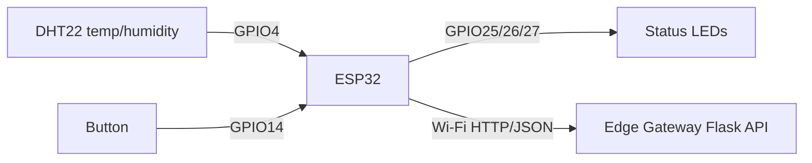
```mermaid
flowchart LR
  DHT22[DHT22 temp/humidity] -- GPIO4 --> ESP[ESP32]
  BTN[Button] -- GPIO14 --> ESP
  ESP -- GPIO25/26/27 --> LEDS[Status LEDs]
  ESP -- Wi-Fi HTTP/JSON --> EDGE[Edge Gateway Flask API]
```

> **Wokwi / Cirkit Designer:** insertar el diagrama del circuito y el enlace al proyecto.
> ``

### Diseño físico

| Aspecto | Decisión |
|---|---|
| Carcasa | Caja de ABS impresa en 3D o comercial, 70 × 50 × 28 mm, con rejillas laterales para el flujo de aire sobre el DHT22 |
| Ubicación del sensor | Sobresale en el extremo inferior, alejado del calor del ESP32 para no sesgar la lectura |
| Montaje | Imán trasero y orificio para tornillo, instalable en estantes y muros metálicos |
| Alimentación | USB 5 V (cargador estándar); opcional batería de respaldo en una versión futura |
| Identificación | Etiqueta con `deviceCode` y código QR para vincular desde la Mobile Application |
| Interfaz | Tres LEDs en la cara frontal y un botón empotrado, según 5.1.2 |

> **Figma:** insertar render o boceto de la carcasa (vista frontal, lateral y posterior).

### Flujo de interacción del dispositivo

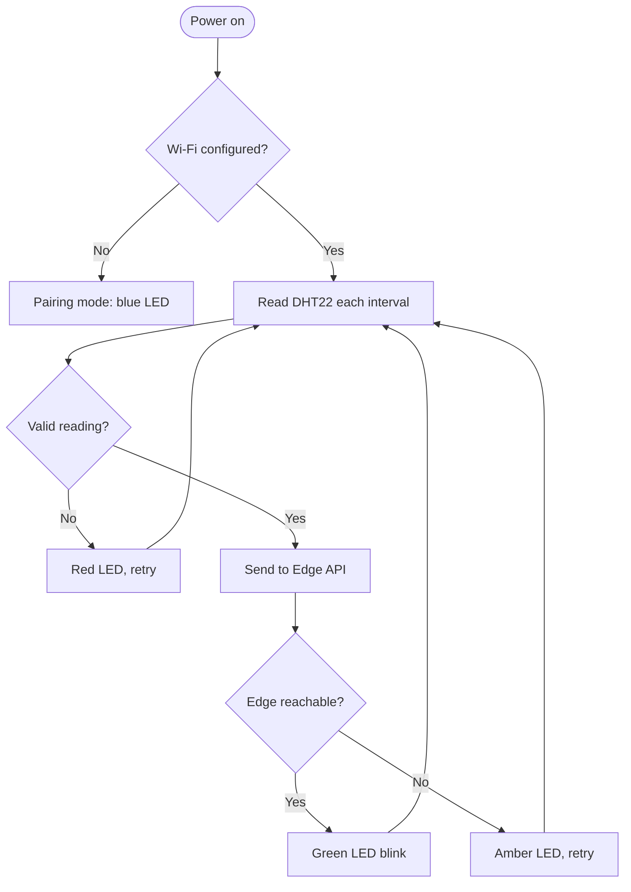
```mermaid
flowchart TD
  P([Power on]) --> W{Wi-Fi configured?}
  W -- No --> PAIR[Pairing mode: blue LED]
  W -- Yes --> R[Read DHT22 each interval]
  R --> V{Valid reading?}
  V -- No --> ERR[Red LED, retry]
  V -- Yes --> S[Send to Edge API]
  S --> OK{Edge reachable?}
  OK -- Yes --> G[Green LED blink]
  OK -- No --> AMB[Amber LED, retry]
  G --> R
  AMB --> R
  ERR --> R
```

---

## Referencias del capítulo

* Material Design 3. https://m3.material.io/
* Angular Material. https://material.angular.io/
* W3C. *Web Content Accessibility Guidelines (WCAG) 2.1*. https://www.w3.org/TR/WCAG21/
* Nielsen Norman Group. *Design Systems 101*. https://www.nngroup.com/articles/design-systems-101/
* Nielsen Norman Group. *The Four Dimensions of Tone of Voice*. https://www.nngroup.com/articles/tone-of-voice-dimensions/
