# Capítulo VI: Product Implementation, Validation & Deployment

## 6.1. Software Configuration Management

### 6.1.1. Software Development Environment Configuration

El servicio central se desarrolla con Java 21, Spring Boot 3.5 y Maven. PostgreSQL 16 persiste los datos; Spring Data JPA y Flyway gestionan el acceso y las migraciones. Spring Security valida JWT en las rutas protegidas y Springdoc OpenAPI publica Swagger UI.

### 6.1.2. Source Code Management

El repositorio del servicio es [MachineGuard/machineguard-core-api](https://github.com/MachineGuard/machineguard-core-api). Para el incremento IAM se utilizó la rama `develop`, integrada con `main` como rama estable. La convención GitFlow define ramas `feature/<contexto>-<tarea>`, `release/<versión>` y `hotfix/<versión>-<incidencia>`. Los mensajes siguen Conventional Commits (`feat(iam):`, `fix(iam):`, `test(iam):`, `docs(iam):`) y las versiones de publicación siguen Semantic Versioning (`MAJOR.MINOR.PATCH`).

El Landing Page se mantiene en un repositorio propio, [MachineGuard/MachineGuard-LandingPage](https://github.com/MachineGuard/MachineGuard-LandingPage), con las ramas `main` (versión estable publicada), `develop` (integración) y `feature/landing-page` (trabajo del Sprint 1), siguiendo la misma convención GitFlow y los mismos Conventional Commits (`feat(landing):`, `docs(landing):`, `ci:`, `chore:`).

La Frontend Web Application se mantiene en [MachineGuard/machineguard-web](https://github.com/MachineGuard/machineguard-web), con las ramas `main` y `develop` y la misma convención de ramas y mensajes.

El 7 de octubre de 2026 se integraron en `develop` de `machineguard-core-api` las ramas `feature/environmental-monitoring` y `feature/testing-bdd-acceptance`, que permanecían sin fusionar, mediante merges `--no-ff`. Tras comprobar que todas las ramas de funcionalidad estaban contenidas en `develop`, se eliminaron del repositorio remoto. Desde entonces cada incremento se desarrolla en una rama `feature/*` que se fusiona en `develop` y se elimina al terminar.

### 6.1.3. Source Code Style Guide & Conventions

El código Java mantiene los identificadores en inglés, paquetes en minúsculas, tipos en `PascalCase` y métodos y atributos en `camelCase`. La implementación separa dominio, aplicación, interfaces REST e infraestructura. Los controladores validan los DTO de entrada; `IamService` coordina los casos de uso y los adaptadores de infraestructura implementan persistencia, hashing BCrypt y firma JWT.

### 6.1.4. Software Deployment Configuration

**Landing Page**

El Landing Page es un sitio estático (HTML5, CSS3 y JavaScript sin dependencias de compilación), por lo que su despliegue consiste en publicar los archivos tal como están en el repositorio. Se publica en GitHub Pages mediante GitHub Actions con el workflow `.github/workflows/deploy-pages.yml`, que se ejecuta con cada `push` a `main` y de forma manual (`workflow_dispatch`).

| Elemento | Configuración |
|---|---|
| Hosting | GitHub Pages, publicado por el workflow de GitHub Actions |
| Disparador | `push` a `main` o ejecución manual |
| Artefacto | Carpeta `_site` con `index.html`, `404.html`, `terms.html`, `privacy.html`, `robots.txt`, `sitemap.xml` y `assets/` |
| Acciones utilizadas | `actions/checkout@v4`, `actions/configure-pages@v5`, `actions/upload-pages-artifact@v3`, `actions/deploy-pages@v4` |
| Permisos del workflow | `contents: read`, `pages: write`, `id-token: write` |
| Integración continua | Workflow `.github/workflows/ci.yml`: ejecuta `node --test` en `develop`, ramas `feature/**` y pull requests hacia `develop` y `main` |
| Configuración de ejecución | `assets/js/config.js` (`apiBaseUrl` vacío = modo demostración) |

**RESTful API y Web Application**

La RESTful API central y la Web Application se despliegan juntas, detrás de un mismo origen, para la demostración del Sprint. La Web Application llama a la API con rutas relativas (`/api/v1`), por lo que un reverse proxy sirve los archivos estáticos y redirige `/api` hacia la API sin necesidad de configurar CORS.

| Elemento | Configuración |
|---|---|
| URL pública | `https://iot.fpm.it.com` |
| Exposición | Cloudflare Tunnel (`cloudflared`) hacia el reverse proxy local; Cloudflare termina TLS |
| Reverse proxy | Caddy en HTTP local: `/api/*` hacia la API y el resto como archivos estáticos con retorno a `index.html` para las rutas de la SPA |
| Rama desplegada | `develop` de `machineguard-core-api` y de `machineguard-web` |
| Base de datos | PostgreSQL, base `machineguard` vacía en el primer arranque; Flyway aplica `V1`, `V2`, `V4` y `V5` al iniciar la API |
| RESTful API | `mvn -B -DskipTests package` y `java -jar target/core-api-0.1.0-SNAPSHOT.jar`, con Java 21 |
| Variables de la API | `DB_URL`, `DB_USERNAME`, `DB_PASSWORD`, `IAM_JWT_SECRET`, `SERVER_PORT` y, solo en el primer arranque, `IAM_BOOTSTRAP_*` para crear la organización y su administrador |
| Web Application | `npm ci` y `npm run build`; se publica `dist/machineguard-web/browser` |
| Datos de demostración | `python3 scripts/demo_data.py seed` y `python3 scripts/demo_data.py live` |
| Secretos | Solo en el archivo `.env` del servidor, excluido de Git; el secreto JWT y la contraseña de la base se generan en el servidor |
| Disponibilidad | El entorno se enciende únicamente durante la sesión de demostración |

Para el desarrollo local, `compose.yml` de `machineguard-core-api` levanta PostgreSQL 16 y la API con Docker Compose, y `ng serve` redirige `/api` a `http://localhost:8080` mediante `proxy.conf.json`.

## 6.2. Landing Page, Services & Applications Implementation

### 6.2.1. Sprint 1

#### 6.2.1.1. Sprint Planning 1

El Sprint 1 figura en [Jira](https://leccapedro8.atlassian.net/jira/software/projects/SCRUM/boards/1/backlog) del 2 al 16 de octubre de 2026. La asignación de trabajo se comunicó el 2 de octubre; no se realizó una reunión formal de Sprint Planning.

| Campo | Registro |
|---|---|
| Sprint | Sprint 1 |
| Fecha de asignación | 2026-10-02 |
| Hora y lugar | No aplica; no se celebró reunión formal. |
| Preparado por | Pedro Omar Lecca Villalobos |
| Asistentes | No aplica; no se celebró reunión formal. |
| Revisión del Sprint anterior | Sin fecha ni acuerdos documentados. |
| Retrospectiva del Sprint anterior | Sin fecha ni acuerdos documentados. |
| Objetivo registrado en Jira | Entregar el primer incremento verificable de MachineGuard: procesamiento Edge, trazabilidad e identidad para la API central, con contratos documentados y ejecución local. |
| Capacidad planificada | 70 Story Points |
| Suma de Story Points | 70 |

El alcance del Sprint comprende doce historias: siete de Edge Processing y Traceability, dos de Environmental Monitoring y tres de IAM. Al 7 de octubre de 2026 las doce están implementadas y cuentan con pruebas automatizadas (secciones 6.2.1.4 y 6.2.1.5). El tablero de Jira todavía muestra diez de ellas como “Por hacer”; su actualización queda pendiente y no modifica el estado que registra este informe.

#### 6.2.1.2. Aspect Leaders and Collaborators

| Aspecto | Responsable | Usuario GitHub | Rol | Trabajo registrado |
|---|---|---|---|---|
| Backend Edge Processing y Traceability & Quality | Diego Seijas Vasquez | No documentado | Colaborador | Implementación y documentación técnica de ambos contextos. |
| Backend IAM/Auth | Pedro Omar Lecca Villalobos | `leccapedro` | Líder de aspecto | IAM, seguridad de Traceability y Swagger. |
| Sprint Backlog 1 y documentación de servicios IAM | Pedro Omar Lecca Villalobos | `leccapedro` | Líder de aspecto | Backlog en Jira y documentación IAM. |
| Frontend Core / Dashboard y Environmental Monitoring | Camilla Espinoza | `c7leo`  | Líder de aspecto | Implementación del Environmental Monitoring en Core API, publicación de eventos de dominio, desarrollo del Environmental Dashboard e integración con servicios REST. |
| Landing Page | Jhoan Darner Janampa Gutierrez | No documentado | Líder de aspecto | Repositorio con GitFlow, implementación del Landing Page, calculadora de pérdidas evitadas, formulario de solicitud de piloto y workflow de despliegue en GitHub Pages. |

#### 6.2.1.3. Sprint Backlog 1

| Historia | Alcance del Sprint | Responsable técnico | Puntos | Estado |
|---|---|---|---:|---|
| [SCRUM-11 (US01)](https://leccapedro8.atlassian.net/browse/SCRUM-11) | Consultar condiciones ambientales actuales | Camilla Espinoza Vivas | 5 | Finalizado |
| [SCRUM-12 (US02)](https://leccapedro8.atlassian.net/browse/SCRUM-12) | Consultar historial de mediciones | Diego Seijas | 5 | Finalizado |
| [SCRUM-13 (US03)](https://leccapedro8.atlassian.net/browse/SCRUM-13) | Consultar estado de los puntos de monitoreo | Diego Seijas | 3 | Finalizado |
| [SCRUM-20 (US10)](https://leccapedro8.atlassian.net/browse/SCRUM-20) | Consultar excursiones ambientales | Diego Seijas | 5 | Finalizado |
| [SCRUM-21 (US11)](https://leccapedro8.atlassian.net/browse/SCRUM-21) | Consultar trazabilidad de incidentes | Diego Seijas | 5 | Finalizado |
| [SCRUM-22 (US12)](https://leccapedro8.atlassian.net/browse/SCRUM-22) | Generar reporte de trazabilidad | Diego Seijas | 8 | Finalizado |
| [SCRUM-24 (TS02)](https://leccapedro8.atlassian.net/browse/SCRUM-24) | Calibrar y filtrar lecturas en Edge | Diego Seijas | 5 | Finalizado |
| [SCRUM-25 (TS03)](https://leccapedro8.atlassian.net/browse/SCRUM-25) | Mantener lecturas ante interrupciones de conectividad | Diego Seijas | 8 | Finalizado |
| [SCRUM-26 (TS04)](https://leccapedro8.atlassian.net/browse/SCRUM-26) | Consultar mediciones mediante RESTful API | Camilla Espinoza Vivas | 5 | Finalizado |
| [SCRUM-32 (TS06)](https://leccapedro8.atlassian.net/browse/SCRUM-32) | Gestionar organizaciones, usuarios y roles IAM | Pedro Omar Lecca Villalobos | 8 | Finalizado |
| [SCRUM-33 (TS07)](https://leccapedro8.atlassian.net/browse/SCRUM-33) | Autenticar usuarios y gestionar sesiones JWT | Pedro Omar Lecca Villalobos | 8 | Finalizado |
| [SCRUM-34 (TS08)](https://leccapedro8.atlassian.net/browse/SCRUM-34) | Proteger la API con JWT y documentar IAM | Pedro Omar Lecca Villalobos | 5 | Finalizado |
| **Total** | **12 historias** | | **70** | |

La columna Estado refleja la implementación integrada al 7 de octubre de 2026: las historias de la RESTful API central y de la Web Application están en `develop` de `machineguard-core-api` y `machineguard-web`, y las de Edge Processing (TS02, TS03 y US03) en `machineguard-edge-api`, con los escenarios BDD de la sección 6.2.1.5.

Las historias IAM pertenecen a la [épica SCRUM-31](https://leccapedro8.atlassian.net/browse/SCRUM-31). La atribución técnica de Edge Processing y Traceability se basa en los commits de Diego Seijas; esas historias no tienen una persona asignada en Jira.

Las historias del Landing Page (US13, US14 y US15, épica EP06) no forman parte de las doce historias ni de los 70 Story Points registrados para el Sprint 1 en Jira; su implementación se documenta como un incremento adicional del Sprint.

La siguiente descomposición y sus horas son propuestas de planificación para las historias IAM. Las tareas no están creadas en Jira; el identificador y el estado del registro se indican como tales.

| Historia | ID de tarea Jira | Tarea propuesta | Descripción | Horas estimadas | Responsable | Estado del registro |
|---|---|---|---|---:|---|---|
| SCRUM-32 | No creado | Modelar entidades IAM y persistencia | Definir organizaciones, usuarios, sesiones, invitaciones, repositorios y restricciones de base de datos. | 5 | Pedro Omar Lecca Villalobos | No registrada |
| SCRUM-32 | No creado | Administrar usuarios y roles por tenant | Implementar operaciones de alta, consulta, cambio de rol y estado, limitadas a la organización autenticada. | 5 | Pedro Omar Lecca Villalobos | No registrada |
| SCRUM-32 | No creado | Validar aislamiento y administración | Verificar aislamiento entre organizaciones, unicidad de correo y protección del último administrador activo. | 3 | Pedro Omar Lecca Villalobos | No registrada |
| SCRUM-33 | No creado | Implementar inicio de sesión | Validar credenciales con BCrypt y emitir JWT y refresh token. | 4 | Pedro Omar Lecca Villalobos | No registrada |
| SCRUM-33 | No creado | Gestionar sesiones y credenciales | Implementar rotación y revocación de refresh tokens, detección de reutilización, cierre de sesión y cambio de contraseña. | 5 | Pedro Omar Lecca Villalobos | No registrada |
| SCRUM-33 | No creado | Implementar invitación y bootstrap inicial | Crear el flujo de invitación de administrador y el bootstrap local de un solo uso. | 4 | Pedro Omar Lecca Villalobos | No registrada |
| SCRUM-34 | No creado | Proteger endpoints con identidad JWT | Validar el token y aplicar límites de organización y rol, incluidos los endpoints de Traceability. | 4 | Pedro Omar Lecca Villalobos | No registrada |
| SCRUM-34 | No creado | Documentar contratos OpenAPI | Publicar operaciones IAM, esquemas, respuestas y seguridad Bearer en Swagger UI. | 2 | Pedro Omar Lecca Villalobos | No registrada |
| SCRUM-34 | No creado | Verificar funcionamiento de la API | Comprobar autenticación, permisos y respuestas HTTP; capturar evidencia Swagger. | 4 | Pedro Omar Lecca Villalobos | No registrada |
| **Total propuesto** | | | | **36** | | |

#### 6.2.1.4. Development Evidence for Sprint Review

##### Diego Seijas — Backend Core: Edge Processing y Traceability & Quality

En este Sprint se implementaron los endpoints core de los dos Bounded Contexts a cargo de Diego Seijas, siguiendo el diseño del Capítulo IV (secciones 4.2.3 y 4.2.4) y organizando el código en las capas Domain, Application, Interface e Infrastructure.

| Bounded Context | Repositorio | Tecnología | Historias cubiertas |
|---|---|---|---|
| Edge Processing | `machineguard-edge-api` | Flask, Peewee ORM, SQLite | TS02, TS03, US03 |
| Traceability & Quality | `machineguard-core-api` | Spring Boot, Spring Data JPA, Flyway, PostgreSQL, OpenAPI | US02, US10, US11, US12 |

**Edge Processing (Edge API)**

* **Domain Layer:** agregados `SensorReading`, `CalibrationProfile`, `LocalBuffer` y `OfflineNode`; Value Objects `RawReading`, `CalibrationOffset`, `PlausibilityRange` y `SamplingInterval`; servicios `ReadingCalibrationService`, `BufferSynchronizationService` y `NodeAvailabilityService`.
* **Application Layer:** `CaptureSensorReadingCommandService`, `ApplyCalibrationCommandService`, `SyncLocalBufferCommandService`, `RegisterSensorNodeCommandService`, `DetectOfflineNodesCommandService` y los query services del buffer, del Calibration Profile, de las lecturas y del estado de los nodos.
* **Interface Layer:** endpoints REST bajo `/api/v1/edge` para registrar lecturas, consultar lecturas procesadas y descartadas, administrar el Calibration Offset, consultar el Local Buffer, forzar su sincronización y registrar y consultar el estado de los Sensor Nodes.
* **Infrastructure Layer:** modelos Peewee sobre SQLite (`sensor_readings`, `calibration_profiles`, `local_buffer_entries`, `offline_nodes`), repositorios y cliente HTTP hacia la API central con la credencial de dispositivo del gateway.
* **Reglas de negocio verificadas:** descarte de lecturas implausibles antes de calibrar, conservación de la marca temporal de captura del nodo, uso del Local Buffer ante la caída del enlace con la nube, sincronización en orden cronológico e idempotente, descarte de las lecturas pendientes más antiguas al llenarse el buffer, detección y restauración de nodos fuera de línea, y efecto del Calibration Offset solo sobre lecturas posteriores al cambio.

**Traceability & Quality (RESTful API central)**

* **Domain Layer:** agregados `Excursion`, `TraceabilityReport` y `NonConformity`; Value Objects `ExcursionPeriod`, `ExcursionSeverity`, `Batch`, `ReportPeriod` y `RetentionPeriod`; servicios `ExcursionLifecycleService`, `TraceabilityReportAssemblyService` y `RetentionPolicyService`.
* **Application Layer:** `StartExcursionCommandService`, `EndExcursionCommandService`, `GenerateTraceabilityReportCommandService`, `RegisterNonConformityCommandService`, los query services de historial de excursiones, reportes y Measurement History, y los event handlers `DeviationDetectedEventHandler` e `IncidentResolvedEventHandler`.
* **Interface Layer:** `ExcursionController`, `TraceabilityReportController` y `MeasurementHistoryController` bajo `/api/v1/traceability`, con Resources, Assemblers y documentación OpenAPI/Swagger.
* **Infrastructure Layer:** migración Flyway con las tablas `excursions`, `non_conformities`, `traceability_reports` y `traceability_report_excursions`, repositorios Spring Data JPA y adaptador JDBC hacia el Measurement History de Environmental Monitoring.
* **Reglas de negocio verificadas:** una sola excursión abierta por zona y variable (garantizada también por una restricción de unicidad en la base de datos), actualización del valor pico sin duplicar registros, cierre por `SafeRangeRestored` o `IncidentResolved`, exclusión de las excursiones abiertas como evidencia cerrada, sellado del reporte con checksum SHA-256 y verificación de integridad, no conformidades asociadas a una excursión de la misma organización, liberación de lotes solo con justificación, y depuración por Retention Period sin tocar las excursiones incluidas en reportes sellados.

**Commits**

| Repositorio | Commit | Mensaje | Fecha |
|---|---|---|---|
| `machineguard-edge-api` | `fb97d0d` | chore: scaffold Edge API project with Flask, Peewee and pytest | 2026-10-02 |
| `machineguard-edge-api` | `0a0aaea` | feat(edge-processing): add domain model, commands and domain services | 2026-10-02 |
| `machineguard-edge-api` | `7062637` | feat(edge-processing): add Peewee/SQLite persistence and cloud client | 2026-10-02 |
| `machineguard-edge-api` | `0dc73e9` | feat(edge-processing): add command and query services | 2026-10-02 |
| `machineguard-edge-api` | `dc3e5c3` | feat(edge-processing): expose Edge API REST endpoints | 2026-10-02 |
| `machineguard-edge-api` | `7b9c6df` | test(edge-processing): cover calibration, local buffer sync and offline node detection | 2026-10-02 |
| `machineguard-edge-api` | `c0b30f8` | docs: add README with configuration, endpoints and cloud contract | 2026-10-02 |
| `machineguard-core-api` | `76eef40` | chore: scaffold Spring Boot core API with Flyway, JPA and OpenAPI | 2026-10-02 |
| `machineguard-core-api` | `fe186e5` | feat(db): add Traceability and Quality migration | 2026-10-02 |
| `machineguard-core-api` | `3b0d298` | feat(traceability): add domain model, events, repositories and domain services | 2026-10-02 |
| `machineguard-core-api` | `e9a6cd1` | feat(traceability): add command and query services and event handlers | 2026-10-02 |
| `machineguard-core-api` | `85a5210` | feat(traceability): add measurement history adapter and configuration | 2026-10-02 |
| `machineguard-core-api` | `3e05e47` | feat(traceability): expose REST controllers with OpenAPI annotations | 2026-10-02 |
| `machineguard-core-api` | `2695724` | test(traceability): cover domain rules and REST API end to end | 2026-10-02 |
| `machineguard-core-api` | `4048152` | docs: add README with endpoints, integration contracts and rules | 2026-10-02 |

**Ajustes respecto al diseño del Capítulo IV**

Durante la implementación se añadieron elementos que el diseño de la sección 4.2.4 no detallaba y que deberán reflejarse en el Database Design Diagram de Traceability & Quality:

* `excursions.corrective_action`: acción correctiva recibida con `IncidentResolved`, necesaria para incluirla en el reporte.
* `excursions.open_key`: clave que garantiza una sola excursión abierta por zona y variable.
* `traceability_reports.content`: snapshot JSON de la evidencia (excursiones, acciones correctivas y Measurement History) que se sella junto con el checksum.
* Evento `SafeRangeRestored`, consumido desde Environmental Monitoring para cerrar la excursión cuando las mediciones vuelven al Safe Range.

##### Pedro Omar Lecca Villalobos: Backend IAM

La implementación de IAM en `machineguard-core-api` incorpora organizaciones, usuarios, roles, sesiones JWT e invitaciones de administrador. Las contraseñas se almacenan mediante BCrypt. La rotación de refresh tokens invalida el token anterior; la administración impide desactivar o degradar al último administrador activo.

Los endpoints de Traceability usan la identidad del JWT validado para resolver usuario, organización y rol. Las operaciones administrativas requieren `ADMIN`. La API publica los contratos mediante OpenAPI/Swagger.

| Repositorio | Rama | Commit | Mensaje | Cuerpo del mensaje | Fecha |
|---|---|---|---|---|---|
| `machineguard-core-api` | `develop` | `40a7ad9` | `feat(iam): add tenant authentication and local deployment` | Vacío | 2026-10-04 |
| `machineguard-core-api` | `develop` | `629dc21` | `refactor(iam): separate domain ports and persistence adapters` | Vacío | 2026-10-04 |
| `machineguard-core-api` | `develop` | `2edf223` | `docs(iam): clarify comments and local usage` | Vacío | 2026-10-04 |

**Integración de `develop` y configuración de Environmental Monitoring**

Al integrar `feature/environmental-monitoring` y `feature/testing-bdd-acceptance` en `develop` se comprobó que una organización nueva no podía registrar mediciones a través de la API: el Bounded Context Environmental Monitoring exponía consultas, pero no operaciones para crear Monitoring Zones, Monitoring Points, Sensor Nodes ni Thresholds, y las pruebas preparaban esos datos directamente en los repositorios. Se incorporaron cuatro operaciones restringidas al rol `ADMIN`, con la organización tomada del JWT:

| Método y ruta (bajo `/api/v1/environmental-monitoring`) | Operación |
|---|---|
| `POST /zones` | Registra una Monitoring Zone. |
| `POST /zones/{zoneId}/points` | Registra un Monitoring Point en la zona. |
| `POST /zones/{zoneId}/points/{pointId}/sensors` | Registra un Sensor Node; el `deviceCode` es único. |
| `PUT /zones/{zoneId}/thresholds/{environmentalVariable}` | Configura o reemplaza el Safe Range y publica `ThresholdConfigured`. |

La implementación sigue las capas existentes del contexto: un Command y un Command Service por operación, los repositories de dominio ya definidos y un controlador REST propio (`MonitoringConfigurationController`).

**Frontend Web Application: autenticación, Zonas, Reportes e idiomas**

En `machineguard-web` se conectó la aplicación con IAM y se construyeron las pantallas que faltaban para operar el flujo sin Swagger:

* **Inicio de sesión.** Pantalla `/login` contra `POST /api/v1/auth/login`; la sesión se conserva en `sessionStorage`, las rutas quedan protegidas por un guard y un interceptor renueva el access token vencido con `POST /api/v1/auth/refresh` y repite la solicitud. El encabezado muestra el usuario y la organización reales y permite cerrar sesión.
* **Zonas.** Lista de Monitoring Zones con el estado de su configuración y detalle para definir el Safe Range por variable, agregar Monitoring Points y registrar Sensor Nodes. Los formularios solo se muestran al rol `ADMIN`.
* **Reportes.** Lista de excursiones con filtros por zona y estado, y detalle con valor pico, límite superado, duración, Measurement History y registro de no conformidades.
* **Actualización automática.** El Environmental Dashboard consulta las zonas cada 15 segundos y conserva la última lectura si una actualización falla.
* **Idiomas.** Todos los textos se movieron a `src/i18n/es.json` y `src/i18n/en.json`; el español es el idioma por defecto y un selector ES/EN, presente en el inicio de sesión y en el encabezado, cambia la interfaz sin recargar.
* **Alertas.** Mientras no exista el backend de Alert & Incident Management, la aplicación conectada a la API no muestra alertas de ejemplo.

**Datos de demostración**

`scripts/demo_data.py`, en `machineguard-core-api`, prepara una organización usando únicamente la API REST: crea tres Monitoring Zones (dos completas y una a medio configurar), carga 24 horas de mediciones con una excursión ya cerrada, puede seguir publicando una medición por sensor cada minuto y provoca una excursión cuando se le solicita. Las credenciales se leen del entorno y una segunda ejecución no duplica datos.

| Repositorio | Rama | Commit | Mensaje | Fecha |
|---|---|---|---|---|
| `machineguard-core-api` | `develop` | `42b960f` | `feat(environmental-monitoring): merge Environmental Monitoring implementation into develop` | 2026-10-07 |
| `machineguard-core-api` | `develop` | `f86909f` | `test(acceptance): merge BDD acceptance tests and CI workflow into develop` | 2026-10-07 |
| `machineguard-core-api` | `develop` | `b6e6930` | `feat(environmental-monitoring): add zone, point, sensor and threshold configuration endpoints` | 2026-10-07 |
| `machineguard-core-api` | `develop` | `54550c0` | `test(environmental-monitoring): cover configuration endpoints end to end` | 2026-10-07 |
| `machineguard-core-api` | `develop` | `9d8404d` | `feat(demo): add script that seeds and simulates demo data through the API` | 2026-10-07 |
| `machineguard-core-api` | `develop` | `ec6fe53` | `feat(demo): read demo script settings from .env and default to the bootstrap admin` | 2026-10-07 |
| `machineguard-web` | `develop` | `7ec2a44` | `feat(iam): add sign-in page, session handling and route protection` | 2026-10-07 |
| `machineguard-web` | `develop` | `a6e91d2` | `feat: add zone configuration and excursion pages, refresh the dashboard automatically` | 2026-10-07 |
| `machineguard-web` | `develop` | `370b31c` | `feat(i18n): translate the whole application with es/en JSON dictionaries` | 2026-10-07 |
| `machineguard-web` | `develop` | `9f3e20e` | `feat(i18n): add the language selector to the sign-in page and share it with the header` | 2026-10-07 |

**Ajustes respecto al diseño del Capítulo IV**

* `ConfigureThreshold` y el evento `ThresholdConfigured`, previstos en el diseño de Environmental Monitoring, quedaron implementados. `MeasurementRecorded` y `SensorNodeWentOffline` siguen sin implementarse.
* Las pantallas de Zonas y Reportes no implementan todavía la generación ni la descarga de Traceability Reports, que la API sí ofrece.

##### Jose Diego Bautista Rivera: migraciones de base de datos de la API central

En este Sprint se completó el esquema de base de datos de `machineguard-core-api` para los dos Core Domains que aún no tenían persistencia, siguiendo los Database Design Diagrams del Capítulo IV (secciones 4.2.5.6.2 y 4.2.6.6.2), y se ordenó la numeración de las migraciones Flyway.

| Migración | Bounded Context | Tablas |
|---|---|---|
| `V1__environmental_monitoring.sql` | Environmental Monitoring | `monitoring_zones`, `monitoring_points`, `sensor_nodes`, `thresholds`, `measurements` |
| `V2__alert_incident.sql` | Alert & Incident Management | `incidents`, `alerts`, `corrective_actions` |
| `V4__traceability_quality.sql` | Traceability & Quality | Renombrada desde `V4_0__traceability_quality.sql`, sin cambios en su contenido |

La migración de IAM (`V5__iam.sql`) ya existía y no se modificó; la versión `V3` queda reservada.

**Convenciones aplicadas**

* Claves primarias de tipo UUID en todas las tablas, fechas como `TIMESTAMP WITH TIME ZONE` y valores controlados como `VARCHAR` con restricción `CHECK`.
* Foreign Keys físicas solo dentro del mismo Bounded Context. `organization_id`, `facility_id`, `deviation_id` y `performed_by` son referencias lógicas hacia otros contextos.
* Restricciones de unicidad para las reglas del dominio: un `Threshold` por Monitoring Zone y variable ambiental, un `device_code` por Sensor Node, un incidente por desviación y a lo sumo una alerta por incidente.

**Commits**

| Repositorio | Rama | Commit | Mensaje | Fecha |
|---|---|---|---|---|
| `machineguard-core-api` | `feat/db-environmental-monitoring-migration` | `7ac8f95` | `feat(db): add Environmental Monitoring migration` | 2026-10-05 |
| `machineguard-core-api` | `develop` | `ccbd782` | `feat(db): merge Environmental Monitoring migration into develop` | 2026-10-05 |
| `machineguard-core-api` | `feat/db-alert-incident-migration` | `5abb534` | `feat(db): add Alert and Incident Management migration` | 2026-10-05 |
| `machineguard-core-api` | `develop` | `aec8c71` | `feat(db): merge Alert and Incident Management migration into develop` | 2026-10-05 |
| `machineguard-core-api` | `chore/db-renumber-traceability-migration` | `e896320` | `chore(db): renumber Traceability migration to V4` | 2026-10-05 |
| `machineguard-core-api` | `develop` | `3bd554c` | `chore(db): merge Traceability migration renumbering into develop` | 2026-10-05 |

**Verificación**

* `mvn clean test` sobre `develop`: 34 pruebas, 0 fallos y 0 errores. Flyway aplica las migraciones en el orden `1`, `2`, `4`, `5` sobre H2 en modo PostgreSQL.
* PostgreSQL 16 en un contenedor Docker local: la aplicación arranca y Flyway informa `Successfully applied 4 migrations to schema "public", now at version v5`. La tabla `flyway_schema_history` registra las cuatro migraciones como exitosas y el esquema queda con 18 tablas de negocio.

**Ajustes respecto al diseño del Capítulo IV**

* `measurements` almacena un registro por variable ambiental (`environmental_variable`, `measured_value`, `recorded_at`) en lugar de las columnas `temperature` y `humidity` del diseño de la sección 4.2.6. Es la forma que consulta Traceability & Quality para construir el Measurement History, por lo que el Database Design Diagram de Environmental Monitoring deberá reflejarla.
* `measurements` conserva `organization_id` y `monitoring_zone_id` para filtrar por organización y zona sin recorrer los Monitoring Points.
* Quien tenga una base de datos local creada antes de estos cambios debe recrearla, porque `V1` y `V2` se ordenan antes de las migraciones que ya estaban aplicadas.

##### Camilla Espinoza — Environmental Monitoring y Frontend Core / Dashboard

Durante el Sprint se implementó el Bounded Context Environmental Monitoring en `machineguard-core-api` y la primera versión funcional del Environmental Dashboard en `machineguard-web`. El desarrollo comprendió el registro y consulta de mediciones ambientales, evaluación de Thresholds, publicación de eventos de dominio y exposición de servicios REST para el consumo del frontend. Asimismo, se desarrolló la interfaz web en Angular siguiendo una arquitectura organizada por Bounded Contexts y se incorporó la integración HTTP con la API central.

| Componente | Repositorio | Tecnología | Funcionalidad desarrollada |
|---|---|---|---|
| Environmental Monitoring | `machineguard-core-api` | Spring Boot, Spring Data JPA, PostgreSQL, Flyway, OpenAPI | Registro y consulta de Measurements, evaluación de Thresholds, eventos `DeviationDetected` y `SafeRangeRestored`, consulta de Monitoring Zones |
| Frontend Core / Environmental Dashboard | `machineguard-web` | Angular, TypeScript, SCSS, HttpClient | Dashboard ambiental, visualización de zonas y mediciones, integración con Core API, manejo de estados y soporte de autenticación JWT |

**Environmental Monitoring (RESTful API central)**

* **Domain Layer:** se implementaron los modelos `Measurement`, `Threshold`, `MonitoringZone`, `MonitoringPoint` y `SensorNode`, junto con los estados y Value Objects requeridos para representar variables ambientales, condiciones de zona y valores numéricos. Las variables ambientales se manejan mediante `EnvironmentalVariable`, diferenciando `TEMPERATURE` y `HUMIDITY`.

* **Application Layer:** se implementó `RegisterMeasurementCommandService` para registrar y evaluar nuevas mediciones, `EnvironmentalMonitoringQueryService` para atender las consultas del Bounded Context y el port `EnvironmentalMonitoringEventPublisher` para desacoplar la lógica de aplicación del mecanismo técnico de publicación de eventos.

* **Interface Layer:** se implementó `EnvironmentalMonitoringController`, sus Resources y Assemblers, además de un manejador de excepciones específico. La API expone servicios para registrar mediciones, consultar las últimas lecturas, recuperar el historial de mediciones y obtener el estado de las Monitoring Zones.

* **Infrastructure Layer:** se implementaron adapters JPA para `Measurement`, `Threshold`, `MonitoringZone`, `MonitoringPoint` y `SensorNode`, utilizando los repositorios Spring Data correspondientes. La publicación de eventos se implementó mediante `SpringEnvironmentalMonitoringEventPublisher`, mientras que `TraceabilityEventAdapter` mantiene la compatibilidad con el Bounded Context Traceability & Quality sin introducir dependencia directa desde la capa de aplicación.

* **Reglas de negocio verificadas:** cada Measurement representa una única variable ambiental; `TEMPERATURE` y `HUMIDITY` se almacenan en registros independientes. Cada nueva medición se evalúa contra el Threshold configurado para la combinación de Monitoring Zone y variable ambiental. Los límites mínimo y máximo son inclusivos. Las mediciones fuera del Safe Range generan `DeviationDetected`, mientras que el retorno de las mediciones al rango seguro genera `SafeRangeRestored`. Las mediciones sucesivas fuera de rango permiten actualizar el valor pico de una excursión sin crear una nueva excursión en Traceability & Quality.

* **Seguridad y aislamiento:** las operaciones utilizan la identidad y organización obtenidas desde el JWT. El acceso a datos se mantiene aislado por organización y no depende de los headers `X-Organization-Id` o `X-User-Id` como fuente de identidad.

Los principales endpoints implementados son:

| Método | Endpoint | Descripción |
|---|---|---|
| POST | `/api/v1/environmental-monitoring/measurements` | Registra una nueva medición ambiental |
| GET | `/api/v1/environmental-monitoring/measurements/{id}` | Obtiene una medición por identificador |
| GET | `/api/v1/environmental-monitoring/measurements/latest` | Obtiene las últimas mediciones por punto y variable |
| GET | `/api/v1/environmental-monitoring/measurements/history` | Consulta el historial de mediciones por zona, período y filtros |
| GET | `/api/v1/environmental-monitoring/zones` | Obtiene la información consolidada de las Monitoring Zones |
| GET | `/api/v1/environmental-monitoring/zones/{id}` | Obtiene el detalle de una Monitoring Zone |

**Frontend Core / Environmental Dashboard**

En `machineguard-web` se implementó la primera versión del Environmental Dashboard utilizando Angular. La solución mantiene una separación entre Domain, Application, Infrastructure y Presentation dentro del Bounded Context Environmental Monitoring.

* **Domain Layer:** se definieron los modelos utilizados por Environmental Monitoring y el contrato `MonitoringRepository`, evitando que los componentes visuales dependan directamente del mecanismo de acceso a datos.

* **Application Layer:** `EnvironmentalMonitoringService` coordina las consultas del Bounded Context y los mappers convierten los modelos recibidos en estructuras preparadas para ser utilizadas por la interfaz.

* **Infrastructure Layer:** se implementaron `MonitoringApiClient`, DTOs, mappers y `ApiMonitoringRepository` para consumir el Core API. También se mantiene un `MockMonitoringRepository` que permite ejecutar el frontend de forma desacoplada durante el desarrollo.

* **Presentation Layer:** se desarrolló `ZoneCardComponent` para representar cada Monitoring Zone y sus principales mediciones. La página `EnvironmentalDashboardComponent`, junto con `DashboardFacade`, compone la información utilizada por el dashboard y coordina los componentes de presentación.

* **Layout y componentes compartidos:** se implementaron componentes reutilizables para Sidebar, Header, Main Layout, Status Summary, Status Badge e Icon, manteniendo consistencia visual en la aplicación.

* **Integración HTTP:** el frontend se encuentra preparado para consumir `GET /api/v1/environmental-monitoring/zones`. El flujo de comunicación evita llamadas HTTP directas desde los componentes y utiliza Repository, API Client y Mappers para mantener desacoplada la capa de presentación.

El flujo implementado es:

`EnvironmentalDashboardComponent → DashboardFacade → EnvironmentalMonitoringService → MonitoringRepository → ApiMonitoringRepository → MonitoringApiClient → Core API`

* **Autenticación:** se implementó un interceptor HTTP que permite adjuntar `Authorization: Bearer <JWT>` a las solicitudes realizadas hacia el Core API. Se incluyó soporte temporal para utilizar un token real durante las pruebas de integración. El flujo definitivo de inicio de sesión con IAM se encuentra pendiente de integración con el componente desarrollado por el responsable de dicho Bounded Context.

* **Estados de interfaz:** la solución contempla estados de carga, error, ausencia de información y visualización de datos obtenidos desde Environmental Monitoring.

**Commits**

| Repositorio | Rama | Commit Id | Commit Message | Commit Message Body | Fecha |
|---|---|---|---|---|---|
| `machineguard-core-api` | `feature/environmental-monitoring` | `0ff5c86` | `feat: implement environmental monitoring measurements and domain events` | Vacío | 2026-10-06 |
| `machineguard-web` | `feature/dashboard-core` | `13ccaac` | `feat: implement environmental dashboard with bounded context architecture` | Vacío | 2026-10-06 |
| `machineguard-web` | `feature/dashboard-core` | `c94dfc9` | `feat(environmental-monitoring): integrate dashboard with Core API` | Vacío | 2026-10-06 |
| `machineguard-web` | `feature/dashboard-core` | `1dcac73` | `chore: update Core API proxy configuration` | Vacío | 2026-10-06 |
| `machineguard-web` | `feature/dashboard-core` | `ba9fc37` | `chore: configure GitHub Pages deployment` | Vacío | 2026-10-06 |
| `machineguard-web` | `main` | `5205450` | `fix: synchronize npm lockfile for deployment` | Vacío | 2026-10-06 |

**Verificación**

* El frontend fue compilado mediante `ng build`, completándose correctamente la generación del bundle de producción en aproximadamente 3.9 segundos.

* El bundle inicial generado tiene un tamaño de 321.83 kB y una transferencia estimada de 90.06 kB. El Environmental Dashboard se genera como un Lazy Chunk independiente de 24.77 kB.

* El resultado compilado se genera en `dist/machineguard-web`.

* La auditoría automatizada del Bounded Context Environmental Monitoring reportó 74 pruebas satisfactorias, correspondientes a 40 pruebas relacionadas con Environmental Monitoring y 34 pruebas previamente existentes en el proyecto, sin fallos ni errores.

* La repetición local de `mvn clean test` se encuentra pendiente debido a que el equipo local utilizado para la documentación aún no tiene Apache Maven configurado en el `PATH`. Esta condición corresponde al entorno local y no a un error de compilación del proyecto. La ejecución local se completó el 7 de octubre de 2026 sobre `develop` con `mvn clean verify`: 114 pruebas, sin fallos ni errores.

**Ajustes respecto al diseño del Capítulo IV**

* `measurements` utiliza un registro independiente por variable ambiental en lugar de almacenar temperatura y humedad como columnas en una misma fila. Cada registro contiene `environmental_variable` y `measured_value`.

* Se incorporaron `organization_id`, `monitoring_zone_id`, `monitoring_point_id`, `sensor_node_id`, `recorded_at` y `received_at` para permitir aislamiento por organización, trazabilidad del origen de la medición y diferenciación entre el momento de captura y el momento de recepción.

* La evaluación del Safe Range se centralizó mediante `Threshold`, utilizando límites inclusivos.

* Se incorporaron los eventos `DeviationDetected` y `SafeRangeRestored` para mantener la integración desacoplada entre Environmental Monitoring, Alert & Incident Management y Traceability & Quality.

* La publicación de eventos utiliza un port de aplicación (`EnvironmentalMonitoringEventPublisher`) y un adapter técnico (`SpringEnvironmentalMonitoringEventPublisher`), evitando que el Application Layer dependa directamente del consumidor de los eventos.

* En el frontend se incorporó una capa de infraestructura HTTP que reemplaza progresivamente el uso de datos simulados y permite consumir la información consolidada del endpoint `/api/v1/environmental-monitoring/zones`.

* La integración final del dashboard con datos reales y el flujo completo de autenticación mediante IAM se encuentran pendientes de validación end-to-end. Actualización del 7 de octubre de 2026: la validación se completó con el inicio de sesión de IAM y datos de la API (sección 6.2.1.6).


##### Jhoan Janampa — Landing Page

Se implementó el Landing Page de MachineGuard en el repositorio [MachineGuard/MachineGuard-LandingPage](https://github.com/MachineGuard/MachineGuard-LandingPage), siguiendo el mockup y el Design System del Capítulo V (secciones 5.1 y 5.3) y las User Stories US13, US14 y US15 del Capítulo III. El sitio corresponde a la interfaz del Bounded Context Customer Acquisition (sección 4.2.2): captura la solicitud de piloto que luego consume IAM para iniciar el onboarding.

| Componente | Repositorio | Tecnología | Historias cubiertas |
|---|---|---|---|
| Landing Page | `MachineGuard-LandingPage` | HTML5, CSS3, JavaScript (sin frameworks) | US13, US14, US15 |

**Estructura del sitio**

* **Header y navegación:** barra fija con anclas a Problem, How it works, Pricing y Calculator, selector EN | ES, botón *Request pilot* siempre visible y menú colapsable en pantallas pequeñas.
* **Hero:** titular “Know before it spoils.”, botones *Request free pilot* y *See how it works*, y una vista previa del dashboard con las zonas Cold Room A (fuera de rango) y Dry Store (normal) y un gráfico de tendencia con su Safe Range.
* **Problem overview y From reading to notification:** tres tarjetas del problema, el banner de 8%–15% de merma (Capítulo I) y los cuatro pasos Sensor, Edge, Cloud y Alert.
* **Features by audience:** pestañas accesibles (teclado y `aria-selected`) para Warehouse Managers y Quality Control, con tarjetas de zona de ejemplo.
* **Avoided-loss calculator (US14):** formulario con valor mensual del inventario, tasa de pérdida actual y una reducción de pérdidas asumida ajustable (5 %–50 %, 20 % por defecto). Valida los datos antes de calcular, muestra el ahorro mensual y anual estimado y, tras calcular, ofrece el botón *Request a pilot with this estimate*, que abre el formulario con la pérdida estimada precargada.
* **Pricing, About-the-Product, Team y CTA final:** un recuadro con el precio documentado por punto de sensor y tres planes (Starter, Growth y Plus) diferenciados por alcance, espacio para el video, hallazgos de las entrevistas del Capítulo II, la sección de equipo y el cierre con *Request free pilot*.
* **Team:** siete tarjetas con foto circular, nombre, el rol de cada integrante en el proyecto y tres tecnologías. Los roles se derivan de los capítulos y secciones que cada integrante redactó o implementó, y las tecnologías, de los perfiles de la sección 1.1.2 y del trabajo registrado en este Capítulo. La última fila se centra y, en pantallas pequeñas, las tarjetas pasan a un diseño horizontal.
* **Formulario de solicitud de piloto (US15):** diálogo modal accesible con empresa, nombre de contacto, correo, teléfono, rubro, pérdida mensual estimada (opcional) y aceptación de Terms y Privacy. Cada campo corresponde a un atributo del agregado `PilotRequest` del Capítulo IV.
* **Páginas legales:** `terms.html` y `privacy.html`, requeridas por el enunciado y enlazadas desde el pie de página y desde el formulario.

**Reglas implementadas**

* **Calculadora:** pérdida estimada = valor del inventario × tasa de pérdida; el ahorro mensual estimado es esa pérdida multiplicada por la reducción asumida, y el anual es ese ahorro por doce. La reducción es seleccionable entre 5 % y 50 % (valor inicial: parámetro `avoidedLossReduction` de `config.js`, 20 %) y se indica en pantalla que es un supuesto, no un resultado medido. El valor debe ser mayor que cero y la tasa debe estar entre 0.1 % y 100 %; de lo contrario se solicita corregir los datos antes de calcular (Scenario 2 de US14). La lógica vive en `assets/js/calc.js`, separada de la interfaz para poder probarla.
* **Formulario:** correo y teléfono con formato válido, todos los campos obligatorios completos y términos aceptados antes de enviar. El correo se normaliza a minúsculas. Si el visitante usó la calculadora, la pérdida estimada se precarga en el formulario.
* **Internacionalización:** textos en `en_US` (por defecto) y `es_419` mediante diccionarios en `assets/js/i18n.js`; el idioma se toma de la URL (`?lang=`), de la preferencia guardada en el navegador o del idioma del navegador.
* **Accesibilidad:** enlace para saltar al contenido, estados de campo con `aria-invalid` y mensajes en regiones `aria-live`, foco visible, objetivos táctiles de 44 px como mínimo y estados de zona que combinan color, icono y texto.
* **SEO:** título, descripción, palabras clave, Open Graph con imagen de vista previa (`og-image.png`), `hreflang`, datos estructurados JSON-LD de tipo `SoftwareApplication`, `robots.txt`, `sitemap.xml` y una página `404.html`, según la sección 5.2.3.

**Commits**

| Repositorio | Rama | Commit | Mensaje | Fecha |
|---|---|---|---|---|
| `MachineGuard-LandingPage` | `main` | `d96f800` | `chore: initialize repository with README and gitignore` | 2026-10-07 |
| `MachineGuard-LandingPage` | `feature/landing-page` | `ad4aa74` | `feat(landing): add team photos and favicon` | 2026-10-07 |
| `MachineGuard-LandingPage` | `feature/landing-page` | `2f86d87` | `feat(landing): add page structure and design system styles` | 2026-10-07 |
| `MachineGuard-LandingPage` | `feature/landing-page` | `eddd8d0` | `feat(landing): add i18n, avoided-loss calculator and pilot request form` | 2026-10-07 |
| `MachineGuard-LandingPage` | `feature/landing-page` | `a433b0b` | `docs(landing): add terms and privacy pages` | 2026-10-07 |
| `MachineGuard-LandingPage` | `feature/landing-page` | `97b370f` | `ci: add GitHub Pages deployment workflow` | 2026-10-07 |
| `MachineGuard-LandingPage` | `feature/landing-page` | `dbc5b40` | `fix(landing): fix team photo ratio and replace quoted findings with plain text` | 2026-10-07 |
| `MachineGuard-LandingPage` | `develop` | `1fe7a1d` | `feat(landing): merge feature/landing-page into develop` | 2026-10-07 |
| `MachineGuard-LandingPage` | `main` | `418b30e` | `chore: release landing page v1.0.0` | 2026-10-07 |
| `MachineGuard-LandingPage` | `feature/landing-improvements` | `efc936f` | `refactor(landing): extract calculator logic into a testable module with unit tests` | 2026-10-07 |
| `MachineGuard-LandingPage` | `feature/landing-improvements` | `76f84a7` | `ci: run unit tests on develop, feature branches and pull requests` | 2026-10-07 |
| `MachineGuard-LandingPage` | `feature/landing-improvements` | `7e6161f` | `feat(landing): adjustable loss-reduction assumption, annual estimate and pilot CTA in calculator; clearer pricing model; mobile fixes` | 2026-10-07 |
| `MachineGuard-LandingPage` | `feature/landing-improvements` | `7b1afb8` | `feat(seo): add og-image, robots.txt, sitemap.xml and 404 page` | 2026-10-07 |
| `MachineGuard-LandingPage` | `feature/landing-improvements` | `f32089c` | `feat(landing): redesign team section with project roles, skill tags and circular photos` | 2026-10-07 |
| `MachineGuard-LandingPage` | `develop` | `30baf51` | `feat(landing): merge feature/landing-improvements into develop` | 2026-10-07 |
| `MachineGuard-LandingPage` | `main` | `63efb98` | `chore: release landing page v1.1.0` | 2026-10-07 |

**Ajustes respecto al diseño del Capítulo V**

* El mockup usa marcadores de posición en precios y testimonios. El Landing Page muestra el dato documentado en el Capítulo I (S/ 35–50 por punto de sensor) una sola vez, en un recuadro común, e indica que la suscripción mensual se cotiza durante el piloto; los tres planes se diferencian por alcance (2 puntos de sensor, varias zonas, múltiples instalaciones) y por funcionalidades ya definidas en el informe, y se aclara que su contenido es referencial; en lugar de testimonios, presenta dos hallazgos de las entrevistas del Capítulo II (100 % de los jefes de almacén perdió mercadería por detectar tarde una desviación y entre uno y tres días de trabajo para preparar un reporte de calidad), sin atribuirlos como citas textuales.
* El espacio del video About-the-Product muestra “Product video coming soon” hasta que exista el video (sección 6.4).
* El formulario de solicitud de piloto se implementó como diálogo modal sobre la misma página, en lugar de una página aparte, para mantener visible el contexto del visitante.
* Las fotografías del equipo provienen de la sección 1.1.2; Sandro Dinklange Arevalo se representa con sus iniciales porque no existe una fotografía en el repositorio. La fotografía de Diego Seijas Vasquez, de baja calidad y muy oscura, se recortó sobre el rostro y se le aplicó una corrección leve de exposición; conviene sustituirla por una fotografía mejor.

**Limitaciones**

* El formulario todavía no se conecta a la RESTful API central: `apiBaseUrl` está vacío y el sitio opera en modo demostración, que valida los datos pero no los envía.
* La estimación de la calculadora es referencial: la reducción de pérdidas es un supuesto elegido por el visitante (20 % por defecto), no un resultado medido en un piloto.
* El contenido de cada plan (Starter, Growth y Plus) es una propuesta del equipo basada en las capacidades del informe; está pendiente de confirmación junto con la cotización de la suscripción.
* El texto de Terms y Privacy es un borrador académico pendiente de revisión legal.

#### 6.2.1.5. Testing Suite Evidence for Sprint Review


Durante el Sprint 1 se implementaron pruebas automatizadas para verificar las principales reglas de negocio, persistencia, seguridad, publicación de eventos e integración REST del Bounded Context Environmental Monitoring.

Las pruebas se encuentran en el repositorio `MachineGuard/machineguard-core-api`, dentro de `src/test/java/com/machineguard/platform/environmentalmonitoring`.

La estrategia de testing utilizada combina Unit Tests para las reglas del dominio y Integration Tests para comprobar la interacción entre los servicios de aplicación, persistencia, seguridad, migraciones y endpoints REST.

Los archivos principales de testing son:

| Archivo de prueba | Tipo | Alcance |
|---|---|---|
| `EnvironmentalMonitoringDomainTest.java` | Unit Test | Reglas de dominio relacionadas con Thresholds, Safe Range, variables ambientales y validaciones del modelo. |
| `EnvironmentalMonitoringApiIntegrationTest.java` | Integration Test | Registro y consulta de Measurements, persistencia, seguridad JWT, aislamiento por organización, consultas de zonas, historial y publicación de eventos. |
| `SpringEnvironmentalMonitoringEventPublisherTest.java` | Unit / Integration Test | Wiring del port `EnvironmentalMonitoringEventPublisher` y publicación de los eventos `DeviationDetected` y `SafeRangeRestored`. |

**Unit Tests del dominio**

Las pruebas de dominio verifican las reglas utilizadas para determinar si una Measurement se encuentra dentro o fuera del Safe Range.

Entre los comportamientos comprobados se encuentran:

- Los límites mínimo y máximo de un Threshold son inclusivos.
- Una Measurement cuyo valor se encuentra por debajo del mínimo o por encima del máximo se considera fuera del Safe Range.
- `TEMPERATURE` y `HUMIDITY` se manejan como variables ambientales independientes.
- Los valores numéricos utilizados en Measurements y Thresholds mantienen las restricciones definidas para el dominio.
- Las entidades de Environmental Monitoring respetan las reglas definidas en el modelo implementado.

Entre las pruebas utilizadas se encuentran:

| Test | Comportamiento validado |
|---|---|
| `inclusiveRangeAndOutsideBoundaries` | Verifica los límites inclusivos y los valores fuera del Threshold. |
| `inclusiveMinimumAndMaximumDoNotPublishDeviation` | Comprueba que valores iguales al mínimo o máximo permitido no generen una desviación. |
| `independentVariablesDoNotRestoreEachOther` | Valida que `TEMPERATURE` y `HUMIDITY` sean evaluadas de manera independiente. |
| `allEnvironmentalEntitiesValidateAgainstUnmodifiedV1` | Comprueba la consistencia del modelo utilizado por Environmental Monitoring con la estructura de persistencia definida. |

**Integration Tests de Measurements y persistencia**

Las pruebas de integración comprueban el flujo completo utilizado para registrar una Measurement:

`REST Controller → Application Service → Domain → Repository Adapter → Persistence`

Se validan los campos definidos en la tabla `measurements`, incluyendo:

- `id`
- `organization_id`
- `monitoring_zone_id`
- `monitoring_point_id`
- `sensor_node_id`
- `environmental_variable`
- `measured_value`
- `recorded_at`
- `received_at`

Entre las pruebas implementadas se encuentran:

| Test | Comportamiento validado |
|---|---|
| `normalIsPersistedWithoutEventsAndPreservesBothTimes` | Registra una Measurement dentro del rango, verifica su persistencia y conserva `recordedAt` y `receivedAt`. |
| `migratedMeasurementSchemaMatchesNumericNullableAndTimestampContract` | Verifica la compatibilidad del modelo de persistencia con la migración y los tipos utilizados. |
| `missingThresholdFailsWithoutPersisting` | Comprueba que una Measurement no sea persistida cuando no existe un Threshold aplicable. |
| `httpRegistrationReturnsResourceAndLocation` | Valida el registro de una Measurement mediante el servicio REST y la respuesta generada. |

**Testing de eventos de dominio**

Environmental Monitoring publica eventos cuando cambia la condición ambiental de una zona.

Se verificaron los siguientes escenarios:

| Escenario | Resultado esperado |
|---|---|
| Measurement dentro del rango | No publica evento de desviación. |
| `NORMAL → OUT_OF_RANGE` | Publica `DeviationDetected`. |
| Lecturas sucesivas fuera de rango | Mantienen la misma excursión y permiten actualizar el valor pico. |
| `OUT_OF_RANGE → NORMAL` | Publica `SafeRangeRestored`. |
| Otra zona o punto continúa fuera de rango | Evita restaurar prematuramente la condición ambiental. |

Las principales pruebas asociadas son:

| Test | Comportamiento validado |
|---|---|
| `normalToDeviationPublishesCompleteEventAndCreatesExcursion` | Comprueba la publicación de `DeviationDetected` cuando se detecta una desviación. |
| `successiveDeviationsUpdateOneExcursionPeak` | Verifica que múltiples lecturas desviadas actualicen una única excursión sin crear registros duplicados. |
| `restorationOnlyOnTransitionClosesExcursion` | Comprueba que `SafeRangeRestored` se publique cuando la condición retorna al Safe Range. |
| `otherPointDeviationPreventsPrematureRestoration` | Evita una restauración mientras otro Monitoring Point continúe fuera del rango. |
| `backfillCannotRewindLifecycleOrLatest` | Verifica que mediciones históricas no alteren incorrectamente el estado vigente ni la última lectura. |

**Testing del Event Publisher**

La integración entre la capa Application y el mecanismo técnico de publicación de eventos se realiza mediante el port `EnvironmentalMonitoringEventPublisher`.

Las pruebas verifican que el `RegisterMeasurementCommandService` dependa del port y no directamente de un consumidor externo o mecanismo de transporte.

Se comprobaron específicamente:

- wiring del port de publicación;
- publicación de `DeviationDetected`;
- publicación de `SafeRangeRestored`;
- ausencia de dependencia directa entre Environmental Monitoring y Traceability dentro de la capa de aplicación.

La prueba principal relacionada es:

`eventPublisherPortIsWiredWithoutConsumerOrTransportDependenciesInTheCommandService`

Asimismo, `SpringEnvironmentalMonitoringEventPublisherTest` verifica el adapter encargado de publicar ambos eventos mediante Spring.

**Testing de consultas REST**

También se verificaron los endpoints utilizados por el frontend y por otros consumidores de la Core API.

Entre los comportamientos comprobados se encuentran:

- recuperación de las últimas Measurements;
- consulta consolidada de Monitoring Zones;
- separación de `TEMPERATURE` y `HUMIDITY`;
- consulta de Measurement History;
- filtros por Monitoring Point;
- paginación del historial.

Las pruebas relacionadas incluyen:

| Test | Comportamiento validado |
|---|---|
| `latestAndZonesExposeSeparateVariableReadingsAndNodeCounts` | Comprueba las últimas lecturas y la composición de información utilizada por el Dashboard. |
| `historyIsInclusiveFilteredAndPaginated` | Verifica filtros temporales y paginación del historial. |
| `historyPortAppliesPointFilterAndPageOffsetInInfrastructure` | Comprueba que los filtros y offsets se apliquen correctamente en Infrastructure. |

**Testing de seguridad y aislamiento por organización**

Los servicios de Environmental Monitoring utilizan la identidad obtenida mediante JWT para determinar la organización del usuario autenticado.

Se verificaron los siguientes escenarios:

- un tenant no puede registrar información para otra organización;
- las consultas se limitan a la organización autenticada;
- los headers `X-Organization-Id` y `X-User-Id` no permiten alterar la identidad obtenida del JWT;
- las operaciones administrativas de escritura requieren los permisos correspondientes.

Las pruebas asociadas son:

| Test | Comportamiento validado |
|---|---|
| `tenantCannotRegisterInAnotherOrganization` | Impide registrar Measurements para otra organización. |
| `tenantIsolationAppliesToAllReadsAndIgnoresForgedHeaders` | Verifica aislamiento en consultas e ignora headers utilizados para intentar modificar el tenant. |
| `authenticationAndAdminWritePermissionsAreEnforced` | Comprueba autenticación y permisos necesarios para operaciones de escritura. |

**Commits relacionados con Testing**

Las pruebas de Environmental Monitoring fueron incorporadas dentro del mismo commit utilizado para implementar el Bounded Context.

| Repository | Branch | Commit Id | Commit Message | Commit Message Body | Committed on |
|---|---|---|---|---|---|
| `machineguard-core-api` | `feature/environmental-monitoring` | `0ff5c86` | `feat: implement environmental monitoring measurements and domain events` | Vacío | 2026-10-06 |

El commit incorporó, entre otros, los archivos:

- `EnvironmentalMonitoringApiIntegrationTest.java`
- `EnvironmentalMonitoringDomainTest.java`
- `SpringEnvironmentalMonitoringEventPublisherTest.java`

En total, el commit registró 46 archivos modificados, con 1,753 líneas incorporadas y 2 líneas eliminadas.

La auditoría automatizada de la implementación reportó un total de 74 pruebas satisfactorias, sin fallos ni errores. De estas, 40 corresponden al alcance incorporado con Environmental Monitoring y 34 pertenecen a pruebas previamente existentes de IAM y Traceability.

La repetición local mediante `mvn clean test` se encuentra pendiente en el equipo utilizado para la documentación debido a que Apache Maven aún no se encuentra configurado en el `PATH`. Esta condición corresponde al entorno local y no a una falla funcional identificada en la implementación. El 7 de octubre de 2026 la suite completa se ejecutó localmente sobre `develop` con `mvn clean verify`, con las ramas ya integradas: 114 pruebas, sin fallos ni errores.

No se implementaron archivos BDD `.feature` durante este Sprint para Environmental Monitoring; la cobertura realizada corresponde a Unit Tests e Integration Tests automatizados.

##### Jhoan Janampa — Landing Page

Se implementaron pruebas unitarias para la lógica de la calculadora de pérdidas evitadas, extraída a `assets/js/calc.js`. Se ejecutan con el ejecutor de pruebas integrado de Node.js (`node --test`) y se incluyen en el workflow de integración continua `ci.yml`. No existen archivos BDD `.feature`; la interfaz (formulario, idioma, diseño responsivo) se verificó de forma manual en el navegador, con los resultados de la sección 6.2.1.6.

| Archivo de prueba | Tipo | Alcance |
|---|---|---|
| `tests/calc.test.js` | Unit Test | Validación de los campos de la calculadora y cálculo del ahorro mensual y anual. |

| Test | Comportamiento validado |
|---|---|
| `validate accepts a positive value and a rate within range` | Acepta valores válidos sin errores. |
| `validate reports required fields when empty` | Informa campos obligatorios vacíos. |
| `validate rejects zero and negative inventory values` | Rechaza inventarios iguales o menores que cero. |
| `validate rejects rates outside 0.1%-100% and accepts the limits` | Rechaza tasas fuera de rango y acepta 0.1 % y 100 %. |
| `estimate: 50000 at 10% loss with 20% reduction avoids 1000 per month` | S/ 50,000 con 10 % de pérdida y 20 % de reducción: pérdida de S/ 5,000, ahorro mensual de S/ 1,000 y anual de S/ 12,000. |
| `estimate scales with the chosen reduction` | Con 40 % de reducción el ahorro mensual es S/ 2,000. |
| `estimate clamps the reduction to the 5%-50% assumption range` | Limita la reducción asumida al rango 5 %–50 %. |

Resultado de `node --test` sobre la rama `feature/landing-improvements`: 7 pruebas, 7 correctas, 0 fallidas. El workflow `CI` se ejecutó con resultado exitoso en GitHub Actions al subir `develop` y `feature/landing-improvements` el 2026-10-07 ([ejecución en `develop`](https://github.com/MachineGuard/MachineGuard-LandingPage/actions/runs/37665764609) y [ejecución en `feature/landing-improvements`](https://github.com/MachineGuard/MachineGuard-LandingPage/actions/runs/37665763826)).

##### Pedro Omar Lecca Villalobos — configuración de Environmental Monitoring y Frontend Web Application

Las operaciones de configuración de Environmental Monitoring se cubrieron con `MonitoringConfigurationApiIntegrationTest.java` (Integration Test con MockMvc, Flyway y base H2 propia):

| Prueba | Validación |
|---|---|
| `emptyTenantIsConfiguredThroughTheApiAndDeviationOpensAnExcursion` | Una organización vacía se configura solo por HTTP (zona, punto, sensor y Safe Range); una medición fuera de rango deja la zona en `OUT_OF_RANGE` y Traceability abre la excursión. |
| `thresholdIsReplacedInPlaceAndPublishesThresholdConfigured` | Reconfigurar un Safe Range actualiza el mismo registro y publica `ThresholdConfigured`. |
| `invalidRangeAndDuplicateDeviceCodeAreConflicts` | Un rango con mínimo mayor o igual al máximo y un `deviceCode` repetido responden `409` sin persistir. |
| `invalidBodiesAndVariablesAreRejected` | Cuerpos incompletos, variables desconocidas y valores con más de dos decimales responden `400`. |
| `anotherTenantCannotConfigureTheZone` | Otra organización recibe `404` y no modifica la zona. |
| `pointFromAnotherZoneCannotReceiveSensors` | Un punto no acepta sensores a través de una zona que no es la suya. |
| `configurationRequiresAuthenticationAndAdminRole` | Sin token responde `401`; con rol `VIEWER`, `403`. |
| `zoneRegistrationReturnsLocationAndEmptyProjection` y `swaggerContainsConfigurationContract` | Respuesta `201` con `Location` y contratos presentes en OpenAPI. |

Con estas nueve pruebas, `mvn clean verify` ejecuta 114 pruebas en `machineguard-core-api` (Unit Tests, Integration Tests y los 31 escenarios Cucumber), sin fallos ni errores. El workflow de CI de `develop` finalizó correctamente con el mismo conjunto.

En `machineguard-web` la suite pasó de 20 a 32 pruebas (Karma, Chrome Headless):

| Archivo de prueba | Alcance |
|---|---|
| `session.service.spec.ts` | Inicio de sesión, restauración tras recargar, rechazo de credenciales, renovación única del access token para solicitudes concurrentes, cierre de sesión cuando el refresh token es rechazado y revocación al salir. |
| `api-monitoring.repository.polling.spec.ts` | Actualización periódica del snapshot, conservación de los últimos datos ante un fallo y rutas de las cuatro operaciones de configuración. |
| `i18n.service.spec.ts` | Los dos diccionarios tienen las mismas claves y parámetros; cambio de idioma, persistencia de la elección, interpolación y plurales. |

##### Sandro Dinklange — Acceptance Tests (BDD) e integración continua

Se implementaron los Acceptance Tests bajo el enfoque BDD de las historias del Sprint 1 asignadas a los Web Services `machineguard-core-api` (IAM y Traceability & Quality) y `machineguard-edge-api` (Edge Processing). Cada historia cuenta con un archivo `.feature` escrito en Gherkin cuyos escenarios corresponden a los criterios de aceptación definidos en el Capítulo III, y con sus archivos Steps en el lenguaje de cada servicio:

- **`machineguard-core-api`:** Java con Cucumber 7.23 y Spring Boot Test. Los pasos consumen los endpoints REST con MockMvc sobre una base H2 propia de la suite, para no compartir datos con los Unit e Integration Tests existentes.
- **`machineguard-edge-api`:** Python con pytest-bdd 9.0. Los pasos usan el cliente de prueba de Flask y reutilizan los fixtures `FakeCloud` (API central simulada) y `FakeClock` (reloj controlado).

Los eventos de Environmental Monitoring (`DeviationDetected`, `SafeRangeRestored`) y de Alert & Incident Management (`IncidentResolved`) que consume Traceability & Quality se publican en los escenarios como eventos Spring, tal como lo hacen esos bounded contexts dentro de la API central.

Además, se configuró en ambos repositorios un workflow de GitHub Actions (`.github/workflows/ci.yml`) que ejecuta todas las pruebas del repositorio en cada push y en cada pull request hacia `develop` y `main`, y publica sus reportes como artefactos.

| Historia | Archivo `.feature` | Escenarios | Repositorio |
|---|---|---|---|
| TS06 - Gestionar organizaciones, usuarios y roles IAM | `src/test/resources/features/iam/TS06_gestionar_usuarios_y_roles.feature` | 7 | `machineguard-core-api` |
| TS07 - Autenticar usuarios y gestionar sesiones JWT | `src/test/resources/features/iam/TS07_autenticar_usuarios_y_sesiones.feature` | 6 | `machineguard-core-api` |
| TS08 - Proteger la API con JWT y documentar IAM | `src/test/resources/features/iam/TS08_proteger_api_con_jwt.feature` | 6 | `machineguard-core-api` |
| US02 - Consultar historial de mediciones | `src/test/resources/features/traceability/US02_consultar_historial_de_mediciones.feature` | 3 | `machineguard-core-api` |
| US10 - Consultar excursiones ambientales | `src/test/resources/features/traceability/US10_consultar_excursiones_ambientales.feature` | 3 | `machineguard-core-api` |
| US11 - Consultar trazabilidad de incidentes | `src/test/resources/features/traceability/US11_consultar_trazabilidad_de_incidentes.feature` | 2 | `machineguard-core-api` |
| US12 - Generar reporte de trazabilidad | `src/test/resources/features/traceability/US12_generar_reporte_de_trazabilidad.feature` | 4 | `machineguard-core-api` |
| TS02 - Calibrar y filtrar lecturas en Edge | `tests/features/TS02_calibrar_y_filtrar_lecturas.feature` | 6 (incluye un Scenario Outline con 3 ejemplos) | `machineguard-edge-api` |
| TS03 - Mantener lecturas ante interrupciones de conectividad | `tests/features/TS03_mantener_lecturas_sin_conectividad.feature` | 6 | `machineguard-edge-api` |
| US03 - Consultar estado de los puntos de monitoreo | `tests/features/US03_consultar_estado_de_los_puntos_de_monitoreo.feature` | 3 | `machineguard-edge-api` |

En total se automatizaron 46 escenarios: 31 en `machineguard-core-api` y 15 en `machineguard-edge-api`. Las etiquetas de cada archivo (`@IAM`, `@Traceability`, `@EdgeProcessing` y el ID de la historia) permiten ejecutar los escenarios por bounded context o por historia.

En US11 se cubre la parte que corresponde a Traceability & Quality: la acción correctiva recibida con `IncidentResolved` queda vinculada a la excursión y los lotes afectados se gestionan como no conformidades. La consulta de Alert y Acknowledgement se agregará cuando se implemente Alert & Incident Management.

**Archivos `.feature`**

*TS06 - Gestionar organizaciones, usuarios y roles IAM*

```gherkin
# language: es
@IAM @TS06
Característica: TS06 - Gestionar organizaciones, usuarios y roles IAM
  Como administrador de una organización
  deseo gestionar usuarios y roles de mi tenant
  para controlar quién puede acceder a MachineGuard.

  Antecedentes:
    Dado que existe la organización "North Farm"
    Y que existe la organización "South Farm"
    Y que la organización "North Farm" tiene un usuario "admin@north.test" con rol "ADMIN"
    Y que la organización "North Farm" tiene un usuario "viewer@north.test" con rol "VIEWER"
    Y que "admin@north.test" inició sesión

  Escenario: Un ADMIN registra un usuario que pertenece solo a su organización
    Cuando "admin@north.test" registra al usuario "  Nuevo.Operario@North.TEST " con rol "VIEWER"
    Entonces la respuesta tiene el código 201
    Y el usuario registrado pertenece a la organización "North Farm"
    Y el usuario registrado tiene el correo "nuevo.operario@north.test"

  Escenario: El correo normalizado es único
    Cuando "admin@north.test" registra al usuario "VIEWER@NORTH.TEST" con rol "VIEWER"
    Entonces la respuesta tiene el código 409

  Escenario: Un ADMIN no puede registrar usuarios en otra organización
    Cuando "admin@north.test" intenta registrar al usuario "intruso@south.test" en la organización "South Farm"
    Entonces la respuesta tiene el código 403

  Escenario: Un VIEWER no puede administrar usuarios
    Dado que "viewer@north.test" inició sesión
    Cuando "viewer@north.test" registra al usuario "otro@north.test" con rol "VIEWER"
    Entonces la respuesta tiene el código 403

  Escenario: Se conserva al menos un administrador activo
    Cuando "admin@north.test" cambia el rol de "admin@north.test" a "VIEWER"
    Entonces la respuesta tiene el código 409
    Cuando "admin@north.test" desactiva al usuario "admin@north.test"
    Entonces la respuesta tiene el código 409
    Y "admin@north.test" sigue siendo un administrador activo

  Escenario: Un usuario inactivo no puede autenticarse
    Dado que la organización "North Farm" tiene un usuario inactivo "baja@north.test" con rol "VIEWER"
    Cuando "baja@north.test" inicia sesión con su contraseña
    Entonces la respuesta tiene el código 401

  Escenario: Un usuario de una organización suspendida no puede autenticarse
    Dado que existe la organización suspendida "Closed Farm"
    Y que la organización "Closed Farm" tiene un usuario "admin@closed.test" con rol "ADMIN"
    Cuando "admin@closed.test" inicia sesión con su contraseña
    Entonces la respuesta tiene el código 401
```

*TS07 - Autenticar usuarios y gestionar sesiones JWT*

```gherkin
# language: es
@IAM @TS07
Característica: TS07 - Autenticar usuarios y gestionar sesiones JWT
  Como usuario registrado
  deseo iniciar y cerrar sesión de forma segura
  para acceder a MachineGuard según mi identidad y rol.

  Antecedentes:
    Dado que existe la organización "North Farm"
    Y que la organización "North Farm" tiene un usuario "calidad@north.test" con rol "ADMIN"

  Escenario: Inicio de sesión con credenciales válidas
    Cuando "calidad@north.test" inicia sesión con su contraseña
    Entonces la respuesta tiene el código 200
    Y recibe un access token de tipo "Bearer" y un refresh token
    Y el access token identifica al usuario "calidad@north.test" con rol "ADMIN"
    Y el refresh token de "calidad@north.test" no se almacena en texto plano

  Escenario: Inicio de sesión con una contraseña incorrecta
    Cuando "calidad@north.test" inicia sesión con la contraseña "clave equivocada 123"
    Entonces la respuesta tiene el código 401

  Escenario: Renovar la sesión rota el refresh token
    Dado que "calidad@north.test" inició sesión
    Cuando "calidad@north.test" renueva su sesión
    Entonces la respuesta tiene el código 200
    Y el nuevo refresh token de "calidad@north.test" es distinto al anterior

  Escenario: Reutilizar un refresh token ya rotado no permite renovar el acceso
    Dado que "calidad@north.test" inició sesión
    Y "calidad@north.test" renueva su sesión
    Cuando "calidad@north.test" reutiliza su refresh token anterior
    Entonces la respuesta tiene el código 401
    Cuando "calidad@north.test" renueva su sesión
    Entonces la respuesta tiene el código 401

  Escenario: Cerrar sesión revoca la sesión renovable
    Dado que "calidad@north.test" inició sesión
    Cuando "calidad@north.test" cierra sesión
    Entonces la respuesta tiene el código 204
    Cuando "calidad@north.test" renueva su sesión
    Entonces la respuesta tiene el código 401

  Escenario: Cambiar la contraseña revoca las sesiones renovables
    Dado que "calidad@north.test" inició sesión
    Cuando "calidad@north.test" cambia su contraseña por "nueva clave segura 2026"
    Entonces la respuesta tiene el código 200
    Cuando "calidad@north.test" renueva su sesión
    Entonces la respuesta tiene el código 401
    Cuando "calidad@north.test" inicia sesión con la contraseña "nueva clave segura 2026"
    Entonces la respuesta tiene el código 200
```

*TS08 - Proteger la API con JWT y documentar IAM*

```gherkin
# language: es
@IAM @TS08
Característica: TS08 - Proteger la API con JWT y documentar IAM
  Como integrador de los servicios MachineGuard
  deseo consumir una API protegida y documentada
  para acceder únicamente a los datos de mi organización.

  Antecedentes:
    Dado que existe la organización "North Farm"
    Y que existe la organización "South Farm"
    Y que la organización "North Farm" tiene un usuario "admin@north.test" con rol "ADMIN"
    Y que la organización "North Farm" tiene un usuario "viewer@north.test" con rol "VIEWER"
    Y que la organización "South Farm" tiene un usuario "admin@south.test" con rol "ADMIN"

  Escenario: Una ruta protegida sin JWT responde 401
    Cuando se consulta "/api/v1/traceability/excursions" sin token
    Entonces la respuesta tiene el código 401

  Escenario: Una ruta protegida con un JWT alterado responde 401
    Cuando se consulta "/api/v1/users/me" con un token alterado
    Entonces la respuesta tiene el código 401

  Escenario: Un VIEWER sin el rol requerido no puede generar reportes
    Dado que la organización "North Farm" tiene la zona de monitoreo "Cold Room A"
    Y que "viewer@north.test" inició sesión
    Cuando "viewer@north.test" genera el reporte de trazabilidad de "Cold Room A" de las últimas 24 horas
    Entonces la respuesta tiene el código 403

  Escenario: Las cabeceras de identidad del cliente no exponen datos de otra organización
    Dado que la organización "North Farm" tiene la zona de monitoreo "Cold Room A"
    Y que en "Cold Room A" se detectó una temperatura de 10.5 grados fuera del rango seguro hace 30 minutos
    Y que "admin@south.test" inició sesión
    Cuando "admin@south.test" consulta las excursiones indicando en las cabeceras la organización "North Farm"
    Entonces la lista devuelta tiene 0 elementos

  Escenario: La identidad se obtiene solo del JWT
    Dado que "admin@north.test" inició sesión
    Cuando "admin@north.test" consulta "/api/v1/users/me"
    Entonces la respuesta tiene el código 200

  Escenario: La documentación OpenAPI expone el esquema Bearer y las operaciones IAM
    Cuando se consulta la documentación OpenAPI
    Entonces la respuesta tiene el código 200
    Y la documentación declara el esquema de seguridad "bearerAuth"
    Y la documentación incluye la operación POST "/api/v1/auth/login"
    Y la documentación incluye la operación POST "/api/v1/auth/refresh"
    Y la documentación incluye la operación GET "/api/v1/users/me"
```

*US02 - Consultar historial de mediciones*

```gherkin
# language: es
@Traceability @US02
Característica: US02 - Consultar historial de mediciones
  Como Jefe de Almacén
  deseo consultar el Measurement History de una Monitoring Zone dentro de un período determinado
  para analizar la evolución de sus condiciones ambientales.

  Antecedentes:
    Dado que existe la organización "North Farm"
    Y que la organización "North Farm" tiene un usuario "almacen@north.test" con rol "VIEWER"
    Y que "almacen@north.test" inició sesión
    Y que la organización "North Farm" tiene la zona de monitoreo "Cold Room A"

  Escenario: Se obtienen las mediciones del período solicitado
    Dado que en "Cold Room A" se registró una medición de temperatura de 4.5 grados hace 50 minutos
    Y que en "Cold Room A" se registró una medición de temperatura de 5.1 grados hace 30 minutos
    Y que en "Cold Room A" se registró una medición de temperatura de 6.0 grados hace 10 minutos
    Y que en "Cold Room A" se registró una medición de temperatura de 3.9 grados hace 300 minutos
    Cuando "almacen@north.test" consulta el historial de mediciones de "Cold Room A" de los últimos 60 minutos
    Entonces el historial contiene 3 mediciones

  Escenario: No existen mediciones en el período solicitado
    Dado que en "Cold Room A" se registró una medición de temperatura de 3.9 grados hace 300 minutos
    Cuando "almacen@north.test" consulta el historial de mediciones de "Cold Room A" de los últimos 60 minutos
    Entonces el historial contiene 0 mediciones

  Escenario: Un período inválido es rechazado
    Cuando "almacen@north.test" consulta el historial de mediciones de "Cold Room A" con un período invertido
    Entonces la respuesta tiene el código 400
```

*US10 - Consultar excursiones ambientales*

```gherkin
# language: es
@Traceability @US10
Característica: US10 - Consultar excursiones ambientales
  Como Encargado de Control de Calidad
  deseo consultar las Excursions ocurridas durante un período determinado
  para identificar situaciones en las que los productos estuvieron expuestos a condiciones fuera del rango establecido.

  Antecedentes:
    Dado que existe la organización "North Farm"
    Y que la organización "North Farm" tiene un usuario "calidad@north.test" con rol "ADMIN"
    Y que "calidad@north.test" inició sesión
    Y que la organización "North Farm" tiene la zona de monitoreo "Cold Room A"

  Escenario: Se registra una excursión entre la salida y el retorno al rango seguro
    Dado que en "Cold Room A" se detectó una temperatura de 9.5 grados fuera del rango seguro hace 90 minutos
    Y que la temperatura de "Cold Room A" volvió al rango seguro hace 30 minutos
    Cuando "calidad@north.test" consulta las excursiones de "Cold Room A"
    Entonces la lista devuelta tiene 1 elementos
    Y la primera excursión tiene el estado "CLOSED"
    Y la primera excursión duró 60 minutos

  Escenario: Desviaciones consecutivas mantienen una sola excursión abierta con el valor pico
    Dado que en "Cold Room A" se detectó una temperatura de 8.5 grados fuera del rango seguro hace 20 minutos
    Y que en "Cold Room A" se detectó una temperatura de 11.0 grados fuera del rango seguro hace 15 minutos
    Y que en "Cold Room A" se detectó una temperatura de 9.0 grados fuera del rango seguro hace 5 minutos
    Cuando "calidad@north.test" consulta las excursiones abiertas
    Entonces la lista devuelta tiene 1 elementos
    Y la primera excursión tiene el estado "ONGOING"
    Y la primera excursión tiene un valor pico de 11.0 grados

  Escenario: Se consultan solo las excursiones del período solicitado
    Dado que en "Cold Room A" se detectó una temperatura de 10.0 grados fuera del rango seguro hace 4320 minutos
    Y que la temperatura de "Cold Room A" volvió al rango seguro hace 4300 minutos
    Y que en "Cold Room A" se detectó una temperatura de 9.0 grados fuera del rango seguro hace 120 minutos
    Y que la temperatura de "Cold Room A" volvió al rango seguro hace 100 minutos
    Cuando "calidad@north.test" consulta las excursiones de "Cold Room A" desde hace 24 horas
    Entonces la lista devuelta tiene 1 elementos
    Y la primera excursión tiene un valor pico de 9.0 grados
```

*US11 - Consultar trazabilidad de incidentes*

```gherkin
# language: es
@Traceability @US11
Característica: US11 - Consultar trazabilidad de incidentes
  Como Encargado de Control de Calidad
  deseo consultar el historial de Incidents
  para disponer de evidencia de las desviaciones y acciones tomadas durante un período de almacenamiento.

  # Alcance del Sprint 1: Traceability recibe IncidentResolved y vincula la acción correctiva a la excursión.
  # La consulta de Alert y Acknowledgement se cubrirá cuando se implemente Alert & Incident Management.

  Antecedentes:
    Dado que existe la organización "North Farm"
    Y que la organización "North Farm" tiene un usuario "calidad@north.test" con rol "ADMIN"
    Y que "calidad@north.test" inició sesión
    Y que la organización "North Farm" tiene la zona de monitoreo "Cold Room A"
    Y que en "Cold Room A" se detectó una temperatura de 9.5 grados fuera del rango seguro hace 60 minutos

  Escenario: La excursión muestra el incidente y su acción correctiva
    Dado que el incidente de "Cold Room A" se resolvió hace 20 minutos con la acción correctiva "Se reemplazó el compresor"
    Cuando "calidad@north.test" consulta el detalle de la última excursión de "Cold Room A"
    Entonces la respuesta tiene el código 200
    Y el detalle muestra la acción correctiva "Se reemplazó el compresor"

  Escenario: Un lote afectado se registra en cuarentena y liberarlo exige justificación
    Dado que la temperatura de "Cold Room A" volvió al rango seguro hace 10 minutos
    Cuando "calidad@north.test" registra el lote "L-2026-001" de "Insulina" como no conformidad de la última excursión de "Cold Room A"
    Entonces la respuesta tiene el código 201
    Y el lote queda con la disposición "QUARANTINED"
    Cuando "calidad@north.test" libera el lote sin justificación
    Entonces la respuesta tiene el código 409
    Cuando "calidad@north.test" libera el lote con la justificación "Laboratorio confirmó la estabilidad del producto"
    Entonces la respuesta tiene el código 200
    Y el lote queda con la disposición "RELEASED"
    Cuando "calidad@north.test" consulta el detalle de la última excursión de "Cold Room A"
    Entonces el detalle muestra 1 no conformidades
```

*US12 - Generar reporte de trazabilidad*

```gherkin
# language: es
@Traceability @US12
Característica: US12 - Generar reporte de trazabilidad
  Como Encargado de Control de Calidad
  deseo generar un Traceability Report
  para sustentar las condiciones ambientales registradas durante una auditoría interna o externa.

  Antecedentes:
    Dado que existe la organización "North Farm"
    Y que la organización "North Farm" tiene un usuario "calidad@north.test" con rol "ADMIN"
    Y que "calidad@north.test" inició sesión
    Y que la organización "North Farm" tiene la zona de monitoreo "Cold Room A"
    Y que en "Cold Room A" se registró una medición de temperatura de 9.8 grados hace 170 minutos
    Y que en "Cold Room A" se registró una medición de temperatura de 6.2 grados hace 100 minutos

  Escenario: El reporte resume mediciones, excursiones y acciones correctivas del período
    Dado que en "Cold Room A" se detectó una temperatura de 9.8 grados fuera del rango seguro hace 180 minutos
    Y que el incidente de "Cold Room A" se resolvió hace 120 minutos con la acción correctiva "Se ajustó el termostato"
    Cuando "calidad@north.test" genera el reporte de trazabilidad de "Cold Room A" de las últimas 24 horas
    Entonces la respuesta tiene el código 201
    Y el reporte queda en estado "SEALED"
    Y el reporte incluye 1 excursiones cerradas y 2 mediciones
    Y el reporte registra 1 acciones correctivas
    Y el reporte está sellado con un checksum SHA-256 verificable

  Escenario: Un período sin incidentes conserva las mediciones disponibles
    Cuando "calidad@north.test" genera el reporte de trazabilidad de "Cold Room A" de las últimas 24 horas
    Entonces la respuesta tiene el código 201
    Y el reporte incluye 0 excursiones cerradas y 2 mediciones
    Y el reporte registra 0 acciones correctivas

  Escenario: Las excursiones en curso no se incluyen como evidencia cerrada
    Dado que en "Cold Room A" se detectó una temperatura de 10.2 grados fuera del rango seguro hace 15 minutos
    Cuando "calidad@north.test" genera el reporte de trazabilidad de "Cold Room A" de las últimas 24 horas
    Entonces la respuesta tiene el código 201
    Y el reporte incluye 0 excursiones cerradas y 2 mediciones
    Y el reporte indica que excluyó 1 excursiones en curso

  Escenario: Un reporte alterado no supera la verificación de integridad
    Dado "calidad@north.test" genera el reporte de trazabilidad de "Cold Room A" de las últimas 24 horas
    Y que alguien modificó el reporte directamente en la base de datos
    Cuando "calidad@north.test" consulta el reporte generado
    Entonces el sistema detecta que la integridad del reporte no es válida
```

*TS02 - Calibrar y filtrar lecturas en Edge*

```gherkin
# language: es
@EdgeProcessing @TS02
Característica: TS02 - Calibrar y filtrar lecturas en Edge
  Como Developer
  deseo que el Edge Service calibre y filtre las Readings obtenidas por los Sensor Nodes
  para enviar al servicio central Measurements consistentes y confiables.

  Antecedentes:
    Dado que el gateway Edge tiene registrado el nodo "esp32-01" con un intervalo de muestreo de 60 segundos
    Y que la API central está disponible

  Escenario: Se aplica el Calibration Offset a una lectura válida
    Dado que el nodo "esp32-01" tiene un offset de calibración de -0.5 °C y 2 % de humedad
    Cuando el nodo "esp32-01" envía una lectura de 5.0 °C y 60 % de humedad
    Entonces la respuesta tiene el código 201
    Y la medición calibrada es de 4.5 °C y 62 % de humedad
    Y se publicaron 1 mediciones en la API central

  Esquema del escenario: Una lectura fuera del rango físico del sensor se descarta
    Cuando el nodo "esp32-01" envía una lectura de <temperatura> °C y <humedad> % de humedad
    Entonces la respuesta tiene el código 202
    Y la lectura queda con el estado "DISCARDED"
    Y se publicaron 0 mediciones en la API central
    Y hay 1 lecturas descartadas

    Ejemplos:
      | temperatura | humedad |
      | 300         | 60      |
      | -55         | 60      |
      | 5           | 120     |

  Escenario: Cambiar el offset solo afecta a las lecturas posteriores
    Cuando el nodo "esp32-01" envía una lectura de 5.0 °C y 60 % de humedad
    Y se cambia el offset de calibración del nodo "esp32-01" a 1.0 °C y 0 % de humedad
    Y el nodo "esp32-01" envía una lectura de 5.0 °C y 60 % de humedad
    Entonces la medición calibrada es de 6.0 °C y 60 % de humedad
    Y la primera lectura conserva una temperatura calibrada de 5.0 °C

  Escenario: Una lectura de un nodo no registrado es rechazada
    Cuando el nodo "esp32-99" envía una lectura de 5.0 °C y 60 % de humedad
    Entonces la respuesta tiene el código 404
```

*TS03 - Mantener lecturas ante interrupciones de conectividad*

```gherkin
# language: es
@EdgeProcessing @TS03
Característica: TS03 - Mantener lecturas ante interrupciones de conectividad
  Como Developer
  deseo que el Edge Service conserve temporalmente las Measurements cuando no exista comunicación con el servicio central
  para evitar vacíos en el Measurement History.

  Antecedentes:
    Dado que el gateway Edge tiene registrado el nodo "esp32-01" con un intervalo de muestreo de 60 segundos

  Escenario: Sin conexión las mediciones se conservan en el Local Buffer
    Dado que la API central no está disponible
    Cuando el nodo "esp32-01" envía una lectura capturada hace 30 minutos
    Y el nodo "esp32-01" envía una lectura capturada hace 20 minutos
    Y el nodo "esp32-01" envía una lectura capturada hace 10 minutos
    Entonces el Local Buffer tiene 3 mediciones pendientes
    Y se publicaron 0 mediciones en la API central

  Escenario: Al recuperar la conexión se transmiten las mediciones con su marca temporal original
    Dado que la API central no está disponible
    Y que el nodo "esp32-01" envió una lectura capturada hace 10 minutos
    Y que el nodo "esp32-01" envió una lectura capturada hace 30 minutos
    Y que el nodo "esp32-01" envió una lectura capturada hace 20 minutos
    Cuando se restablece la conexión con la API central
    Y el gateway sincroniza el Local Buffer
    Entonces se sincronizan 3 mediciones
    Y el lote enviado conserva las marcas temporales de hace 30, 20 y 10 minutos en orden cronológico
    Y el Local Buffer tiene 0 mediciones pendientes

  Escenario: Una medición ya sincronizada no se vuelve a enviar
    Dado que la API central no está disponible
    Y que el nodo "esp32-01" envió una lectura capturada hace 5 minutos
    Y que se restablece la conexión con la API central
    Y que el gateway sincronizó el Local Buffer
    Cuando el gateway sincroniza el Local Buffer
    Entonces se sincronizan 0 mediciones
    Y la API central recibió 1 lotes

  Escenario: Si la API central sigue caída la sincronización conserva las pendientes
    Dado que la API central no está disponible
    Y que el nodo "esp32-01" envió una lectura capturada hace 5 minutos
    Cuando el gateway sincroniza el Local Buffer
    Entonces se sincronizan 0 mediciones
    Y el Local Buffer tiene 1 mediciones pendientes

  Escenario: Mientras haya pendientes las nuevas lecturas también se encolan
    Dado que la API central no está disponible
    Y que el nodo "esp32-01" envió una lectura capturada hace 5 minutos
    Cuando se restablece la conexión con la API central
    Y el nodo "esp32-01" envía una lectura capturada hace 1 minutos
    Entonces se publicaron 0 mediciones en la API central
    Y el Local Buffer tiene 2 mediciones pendientes

  Escenario: Con el Local Buffer lleno se descartan las pendientes más antiguas
    Dado que el Local Buffer del gateway tiene capacidad para 2 mediciones
    Y que la API central no está disponible
    Y que el nodo "esp32-01" envió una lectura capturada hace 10 minutos
    Y que el nodo "esp32-01" envió una lectura capturada hace 9 minutos
    Y que el nodo "esp32-01" envió una lectura capturada hace 8 minutos
    Entonces el Local Buffer tiene 2 mediciones pendientes
    Y el Local Buffer tiene el estado "FULL"
    Y la medición pendiente más antigua fue capturada hace 9 minutos
```

*US03 - Consultar estado de los puntos de monitoreo*

```gherkin
# language: es
@EdgeProcessing @US03
Característica: US03 - Consultar estado de los puntos de monitoreo
  Como Jefe de Almacén
  deseo conocer el estado de conectividad de cada Sensor Node
  para identificar puntos de monitoreo que hayan dejado de reportar información.

  Antecedentes:
    Dado que el gateway Edge tiene registrado el nodo "esp32-01" con un intervalo de muestreo de 60 segundos
    Y que la API central está disponible
    Y que el nodo "esp32-01" envió una lectura capturada hace 0 minutos

  Escenario: Un nodo que reporta dentro del Sampling Interval se considera activo
    Cuando pasan 30 segundos
    Entonces el nodo "esp32-01" tiene el estado "ONLINE"
    Y no hay nodos Offline

  Escenario: Un nodo que deja de reportar se identifica como Offline Node
    Cuando pasan 90 segundos
    Entonces el nodo "esp32-01" aparece entre los nodos Offline
    Y el nodo "esp32-01" tiene el estado "OFFLINE"

  Escenario: Un nodo Offline se restaura al recibir una nueva lectura
    Dado que pasan 90 segundos
    Y que el nodo "esp32-01" aparece entre los nodos Offline
    Cuando el nodo "esp32-01" envía una lectura capturada hace 0 minutos
    Entonces no hay nodos Offline
    Y el nodo "esp32-01" tiene el estado "ONLINE"
```

**Archivos Steps**

| Archivo | Repositorio | Lenguaje | Responsabilidad |
|---|---|---|---|
| `src/test/java/com/machineguard/platform/acceptance/CucumberAcceptanceTest.java` | `machineguard-core-api` | Java | Suite de JUnit Platform que ejecuta los `.feature` y genera los reportes HTML y JUnit. |
| `src/test/java/com/machineguard/platform/acceptance/CucumberSpringConfiguration.java` | `machineguard-core-api` | Java | Contexto de Spring Boot de la suite, con base H2 propia y MockMvc. |
| `src/test/java/com/machineguard/platform/acceptance/ScenarioContext.java` | `machineguard-core-api` | Java | Estado compartido entre pasos durante un escenario: tokens, organizaciones, zonas y última respuesta. |
| `src/test/java/com/machineguard/platform/acceptance/CommonSteps.java` | `machineguard-core-api` | Java | Limpieza de datos antes de cada escenario y validaciones comunes de la respuesta HTTP. |
| `src/test/java/com/machineguard/platform/acceptance/IamSteps.java` | `machineguard-core-api` | Java | Pasos de TS06, TS07 y TS08. |
| `src/test/java/com/machineguard/platform/acceptance/TraceabilitySteps.java` | `machineguard-core-api` | Java | Pasos de US02, US10, US11 y US12. |
| `tests/test_bdd_acceptance.py` | `machineguard-edge-api` | Python | Pasos de TS02, TS03 y US03. |

**Ejecución**

| Repositorio | Toda la batería | Solo escenarios BDD | Reporte |
|---|---|---|---|
| `machineguard-core-api` | `mvn test` | `mvn test -Dtest=CucumberAcceptanceTest` | `target/cucumber-reports/cucumber.html` |
| `machineguard-edge-api` | `python -m pytest` | `python -m pytest tests/test_bdd_acceptance.py -v` | `python -m pytest --cucumberjson=reports/cucumber.json` |

En la rama `feature/testing-bdd-acceptance` de `machineguard-core-api`, el workflow `CI` registró 65 pruebas satisfactorias, sin fallos ni errores: las 34 pruebas existentes de IAM y Traceability y los 31 escenarios BDD, con 276 pasos ([ejecución #2](https://github.com/MachineGuard/machineguard-core-api/actions/runs/37661859491)).


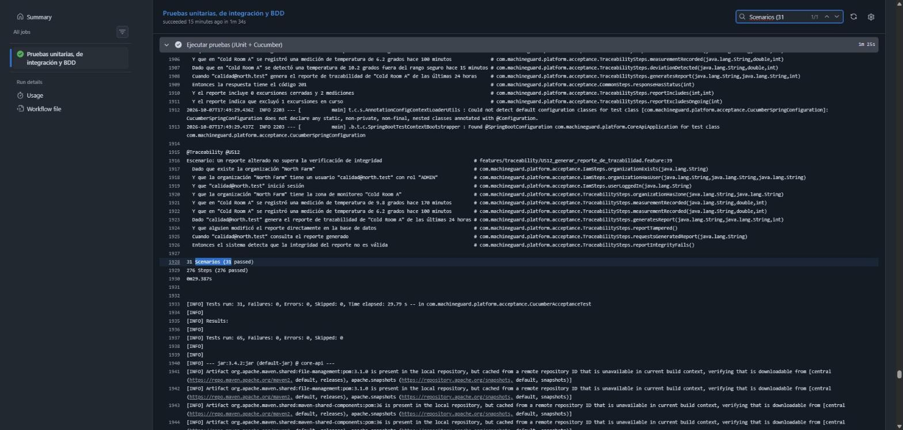

El reporte HTML de Cucumber, publicado como artefacto `cucumber-report`, muestra el resultado por historia y el detalle de cada paso:


En la rama `feature/testing-bdd-acceptance` de `machineguard-edge-api`, el workflow `CI` registró 27 pruebas satisfactorias: las 12 pruebas existentes de Edge Processing y los 15 escenarios BDD ([ejecución #2](https://github.com/MachineGuard/machineguard-edge-api/actions/runs/37661864369)).

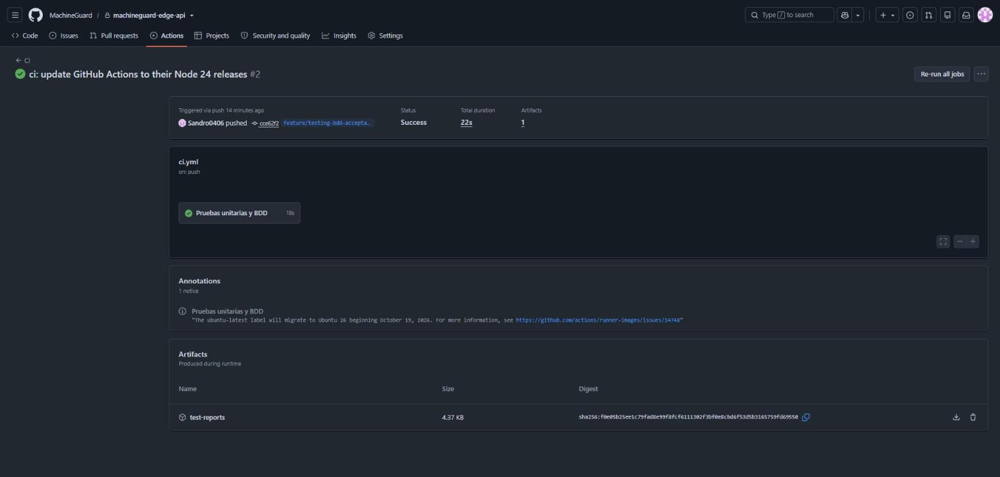

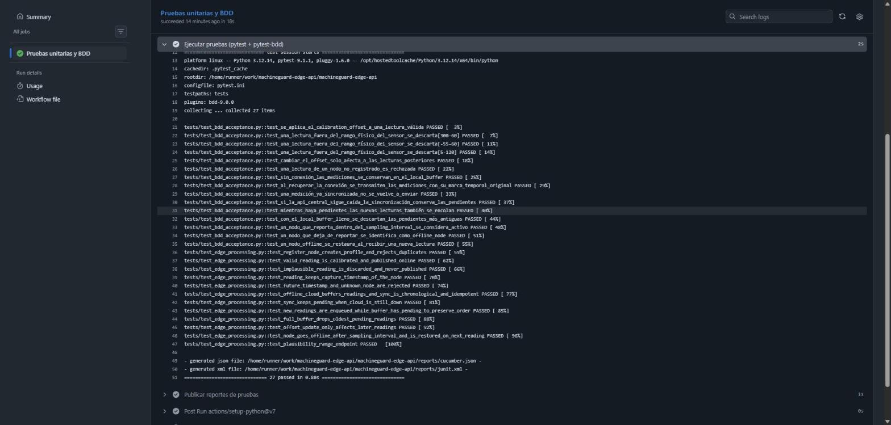

**Commits relacionados con Testing**

| Repository | Branch | Commit Id | Commit Message | Commit Message Body | Committed on |
|---|---|---|---|---|---|
| `machineguard-core-api` | `feature/testing-bdd-acceptance` | `9590b45` | `build(test): add Cucumber dependencies for BDD acceptance tests` | Import the Cucumber BOM (7.23.0, the last line built against JUnit 5.12, which Spring Boot 3.5 manages) and add cucumber-java, cucumber-spring, the Cucumber JUnit Platform engine and junit-platform-suite as test dependencies. | 2026-10-07 |
| `machineguard-core-api` | `feature/testing-bdd-acceptance` | `5f00ec9` | `test(acceptance): add BDD scenarios for IAM stories TS06, TS07 and TS08` | Gherkin scenarios (Spanish) mirror the acceptance criteria in Chapter III: tenant-scoped user management, last active admin protection, login, refresh token rotation and replay, logout, password change, 401/403 handling, identity headers ignored and OpenAPI bearer scheme. The suite runs on its own H2 database so it does not share data with the existing integration tests, and writes an HTML report to target/cucumber-reports. | 2026-10-07 |
| `machineguard-core-api` | `feature/testing-bdd-acceptance` | `c9856f5` | `test(acceptance): add BDD scenarios for Traceability stories US02, US10, US11 and US12` | Cover measurement history by period, excursion lifecycle and period filtering, corrective actions linked through IncidentResolved, non-conformity disposition rules, and sealed traceability reports with integrity verification. Events from Environmental Monitoring and Alert & Incident Management are published as Spring events, as those contexts will do once integrated. | 2026-10-07 |
| `machineguard-edge-api` | `feature/testing-bdd-acceptance` | `cb8b21e` | `build(test): add pytest-bdd and register BDD markers` | Add pytest-bdd 9.0.0, point it at tests/ as the features base directory, register the story tags as pytest markers and ignore the generated reports folder. | 2026-10-07 |
| `machineguard-edge-api` | `feature/testing-bdd-acceptance` | `45a5157` | `test(edge-processing): add BDD scenarios for TS02, TS03 and US03` | Gherkin scenarios (Spanish) mirror the acceptance criteria in Chapter III: calibration offset applied to valid readings, implausible readings discarded (scenario outline), offset changes affecting only later readings, Local Buffer while the central API is down, chronological and idempotent sync keeping the original capture timestamp, full buffer dropping the oldest readings, and Sensor Node online/offline detection. Steps reuse the FakeCloud and FakeClock fixtures from conftest.py. | 2026-10-07 |


#### 6.2.1.6. Execution Evidence for Sprint Review

##### Pedro Omar Lecca Villalobos: funcionamiento de la API

La verificación funcional de los endpoints IAM registró los siguientes resultados:

| Operación | Resultado |
|---|---|
| Inicio de sesión, validación del access token y rotación del refresh token | HTTP `200` en los tres casos. |
| Reutilización del refresh token anterior | HTTP `401`; la sesión se revoca. |
| Uso del refresh token rotado después de la revocación | HTTP `401`. |
| Swagger UI y `/v3/api-docs` | HTTP `200`; OpenAPI 3.1 con esquema `bearerAuth`. |
| `GET /api/v1/traceability/excursions` sin Bearer token | HTTP `401`. |

El 7 de octubre de 2026 se verificó el flujo completo con la API y PostgreSQL 16 en Docker Compose, sobre una base vacía, y con la Web Application conectada a esa API:

| Operación | Resultado |
|---|---|
| Arranque sobre base vacía | Flyway aplicó `V1`, `V2`, `V4` y `V5`; el bootstrap creó la organización y su administrador. |
| `scripts/demo_data.py seed` | Tres zonas configuradas y 864 mediciones registradas por la API; una segunda ejecución registró 0 mediciones nuevas. |
| Medición de 11.2 °C con Safe Range de 2 a 8 °C | La zona pasó a `OUT_OF_RANGE` y Traceability abrió una excursión con pico 11.2 y límite 8.0. |
| Medición posterior de 6.0 °C | La zona volvió a `NORMAL` y la excursión se cerró con su duración calculada. |
| Inicio de sesión en la Web Application | Credenciales incorrectas muestran el error y no crean sesión (`401`); con credenciales válidas se accede al dashboard con las zonas reales. |
| Configuración desde la pantalla Zonas | Se completó una zona sin configurar: Safe Range, Monitoring Point y Sensor Node; un rango invertido y un `deviceCode` repetido muestran su error. |
| Excursión en curso en la pantalla Reportes | La excursión aparece como en curso con su detalle y Measurement History; se registró una no conformidad (`201`). |
| Rol `VIEWER` | Consulta las mismas pantallas sin acciones de creación o edición; la API responde `403` a una escritura. |
| Cambio de idioma | El selector ES/EN cambia inicio de sesión, dashboard, Zonas y Reportes sin recargar. |

Esta verificación se realizó en el entorno local. Las capturas de la aplicación en la URL pública se incorporarán con la evidencia del despliegue.

##### Camilla Espinoza — funcionamiento de Environmental Monitoring y Environmental Dashboard

La verificación funcional del Bounded Context Environmental Monitoring y de la primera versión del Environmental Dashboard registró los siguientes resultados:

| Operación | Resultado |
|---|---|
| Carga de Swagger UI para Environmental Monitoring | Correcta; se visualizan los seis endpoints implementados bajo `/api/v1/environmental-monitoring`. |
| Documentación OpenAPI de `POST /measurements` | Correcta; Swagger muestra el request body requerido y el esquema de `MeasurementResource`. |
| Documentación OpenAPI de `GET /zones` | Correcta; se expone el contrato consolidado de Monitoring Zones, puntos de monitoreo y sensores. |
| Documentación OpenAPI de `GET /zones/{id}` | Correcta; acepta un UUID como parámetro de ruta y documenta `ZoneResource`. |
| Documentación OpenAPI de `GET /measurements/{id}` | Correcta; acepta un UUID y devuelve el contrato de una Measurement. |
| Documentación OpenAPI de `GET /measurements/latest` | Correcta; permite filtrar opcionalmente por `monitoringZoneId`. |
| Documentación OpenAPI de `GET /measurements/history` | Correcta; permite filtrar por zona, punto, variable ambiental, intervalo temporal y paginación. |
| Compilación de `machineguard-web` | Correcta; `ng build` generó el bundle de producción sin errores. |
| Carga del Environmental Dashboard | Correcta; se visualizan los componentes de resumen, Monitoring Zones, estados ambientales y últimas alertas. |
| Integración HTTP del Dashboard con Core API | Implementada mediante Repository, API Client y Mappers para consumir `/api/v1/environmental-monitoring/zones`. |
| Interceptor JWT del frontend | Implementado; preparado para añadir `Authorization: Bearer <JWT>` a las llamadas al Core API. |
| Validación end-to-end con JWT y datos reales | Pendiente de validación final junto con el flujo de autenticación IAM. Actualización del 7 de octubre de 2026: la validación se completó con el inicio de sesión de IAM y datos de la API (sección 6.2.1.6). |

##### Jhoan Janampa — funcionamiento del Landing Page

La verificación funcional se ejecutó el 2026-10-07 sobre el sitio servido localmente en `http://127.0.0.1:8080` (rama `feature/landing-improvements`), usando un navegador de escritorio con un viewport de 1280 × 900 px y un navegador sin interfaz para las capturas. Se registraron los siguientes resultados:

| Verificación | Resultado |
|---|---|
| Carga de `index.html` y de sus recursos | Correcta; sin errores en la consola del navegador. |
| Imágenes del sitio | Correcta; ninguna imagen rota. Se muestran las siete tarjetas del equipo. |
| Calculadora con campos vacíos | Muestra “Enter a value.” en ambos campos y no calcula. |
| Calculadora con inventario de 50 000, pérdida de 10 % y reducción de 20 % | Pérdida estimada de S/ 5,000.00, ahorro mensual de S/ 1,000.00 y anual de S/ 12,000.00; aparece el botón *Request a pilot with this estimate*. |
| Calculadora: mover la reducción asumida a 40 % | El resultado se actualiza al instante a S/ 2,000.00 al mes y S/ 24,000.00 al año. |
| Calculadora: botón *Request a pilot with this estimate* | Abre el formulario con la pérdida estimada precargada (5000.00). |
| Calculadora con tasa de 150 % | Muestra “Enter a rate between 0.1% and 100%.”, limpia el resultado y oculta el botón de piloto. |
| Recursos de SEO | `og-image.png`, `robots.txt`, `sitemap.xml` y `404.html` responden HTTP 200. |
| Sección Team a 1280, 1024 y 390 px | Siete tarjetas con rol y tecnologías, sin desbordamiento horizontal; las etiquetas de tecnologías caben en una sola línea en las siete tarjetas; la última fila se centra y los textos cambian entre EN y ES. |
| Sitio publicado en `https://machineguard.github.io/MachineGuard-LandingPage/` | Responde HTTP 200 y contiene los elementos de la versión `v1.1.0` (control de reducción de la calculadora e introducción del equipo); `og-image.png` y `robots.txt` responden HTTP 200. |
| Diseño responsivo a 390 px | Sin desbordamiento horizontal (`scrollWidth` igual al ancho de pantalla); las capturas generadas a 390 px muestran el contenido completo. |
| Cambio de idioma a ES | El titular pasa a “Anticípese a la merma.”, `lang` cambia a `es-419` y la preferencia queda guardada en `localStorage`. |
| Formulario de piloto: apertura | Se abre el diálogo y la pérdida estimada se precarga con 5000.00 desde la calculadora. |
| Formulario de piloto: envío vacío | Seis mensajes de error (cinco campos obligatorios y la aceptación de términos); no se envía. |
| Formulario de piloto: correo inválido | Muestra el mensaje de correo no válido. |
| Formulario de piloto: envío válido | En modo demostración muestra “Request received”, normaliza el correo a minúsculas (`ana@test.pe`) y registra en consola que la solicitud no se envió; no se realiza ninguna llamada a una API. |

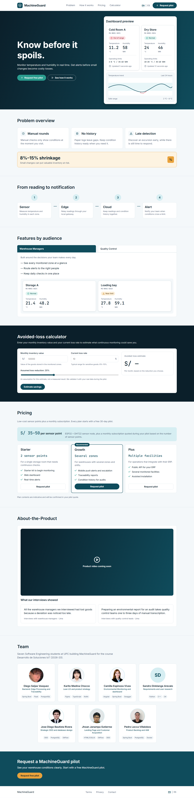

*Figura. Captura completa del Landing Page publicado en Desktop (1440 px), idioma EN.*

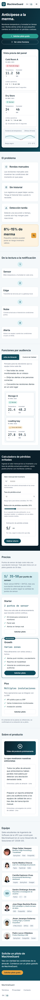

*Figura. Captura completa del Landing Page publicado en Mobile (390 px), idioma ES. Se generó incrustando la página en un marco de 390 px, porque el navegador sin interfaz no admite ventanas tan estrechas.*


#### 6.2.1.7. Services Documentation Evidence for Sprint Review

Los contratos OpenAPI se consultan en Swagger UI (`/swagger-ui/index.html`) y en formato JSON (`/v3/api-docs`). El repositorio del servicio es [MachineGuard/machineguard-core-api](https://github.com/MachineGuard/machineguard-core-api), rama `develop`. Los contratos IAM se documentaron en los commits `40a7ad9`, `2edf223` y `e32605d`.

| Método y ruta | Acceso y parámetros | Ejemplo de solicitud | Respuesta exitosa |
|---|---|---|---|
| `POST /api/v1/auth/login` | Público; cuerpo `email`, `password`. | `{"email":"user@example.com","password":"<password>"}` | `200 AuthenticationResource`; emite tokens e identidad del usuario y organización. |
| `POST /api/v1/auth/refresh` | Público con refresh token; cuerpo `refreshToken`. | `{"refreshToken":"<refresh-token>"}` | `200 AuthenticationResource`; rota el refresh token y emite nuevos tokens. |
| `POST /api/v1/auth/logout` | Bearer; cuerpo `refreshToken`. | `{"refreshToken":"<refresh-token>"}` | `204`; no devuelve cuerpo y revoca la sesión. |
| `POST /api/v1/auth/password-reset` | Bearer; cuerpo `currentPassword`, `newPassword`. | `{"currentPassword":"<current>","newPassword":"<new-password>"}` | `200 MessageResource`; confirma el cambio y requiere iniciar sesión de nuevo. |
| `POST /api/v1/auth/validate` | Bearer; sin parámetros ni cuerpo. | Sin cuerpo. | `200 TokenValidationResource`; devuelve validez, usuario, organización, rol y expiración. |
| `POST /api/v1/auth/invitations/accept` | Público con invitación; cuerpo `token`, `password`. | `{"token":"<invitation-token>","password":"<new-password>"}` | `201 InvitationAcceptedResource`; confirma la aceptación de la invitación. |
| `GET /api/v1/users/me` | Bearer; sin parámetros. | Sin cuerpo. | `200 UserResource`; devuelve el perfil autenticado. |
| `POST /api/v1/organizations/{organizationId}/users` | Bearer y `ADMIN`; parámetro de ruta `organizationId`; cuerpo `email`, `password`, `fullName`, `role`. | `{"email":"user@example.com","password":"<password>","fullName":"Usuario de ejemplo","role":"VIEWER"}` | `201 UserResource`; devuelve el usuario creado en la organización autenticada. |
| `PATCH /api/v1/users/{userId}/role` | Bearer y `ADMIN`; parámetro de ruta `userId`; cuerpo `role`. | `{"role":"VIEWER"}` | `200 UserResource`; devuelve el usuario con el rol actualizado. |
| `PATCH /api/v1/users/{userId}/status` | Bearer y `ADMIN`; parámetro de ruta `userId`; cuerpo `status`. | `{"status":"INACTIVE"}` | `200 UserResource`; devuelve el usuario con el estado actualizado. |
| `GET /api/v1/organizations/{organizationId}` | Bearer; parámetro de ruta `organizationId`. | Sin cuerpo. | `200 OrganizationResource`; devuelve los datos de la organización autenticada. |

`AuthenticationResource` incluye `tokenType`, `accessToken`, `expiresIn`, `refreshToken`, `user` y `organization`. `UserResource` incluye identificadores, correo, nombre, rol, estado y marcas de tiempo; `OrganizationResource` incluye identificador, nombre, plan, estado y marcas de tiempo. Los parámetros de ruta son UUID. Las solicitudes protegidas usan `Authorization: Bearer <accessToken>`; el acceso `ADMIN` se limita a la organización del principal autenticado.

Ejemplo de respuesta de inicio de sesión:

```json
{
  "tokenType": "Bearer",
  "accessToken": "<JWT>",
  "expiresIn": 900,
  "refreshToken": "<refresh-token>",
  "user": {
    "id": "<UUID>",
    "organizationId": "<UUID>",
    "email": "user@example.com",
    "fullName": "Usuario de ejemplo",
    "role": "VIEWER",
    "status": "ACTIVE",
    "lastLoginAt": "<ISO-8601>",
    "createdAt": "<ISO-8601>"
  },
  "organization": {
    "id": "<UUID>",
    "name": "Organización de ejemplo",
    "subscriptionPlan": "FREE",
    "status": "ACTIVE",
    "createdAt": "<ISO-8601>",
    "updatedAt": "<ISO-8601>"
  }
}
```

La interacción de ejemplo con credenciales de muestra inválidas devuelve `401` y el cuerpo `{"error":"Unauthorized","message":"Invalid email or password","status":401}`.

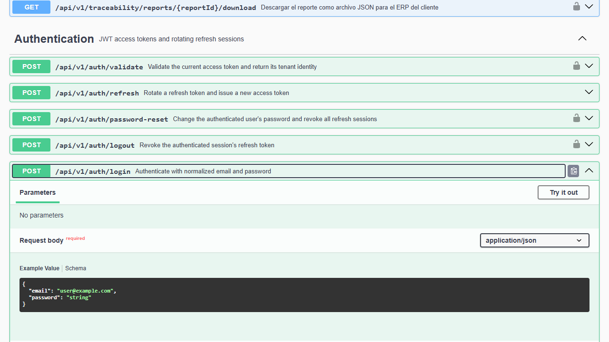

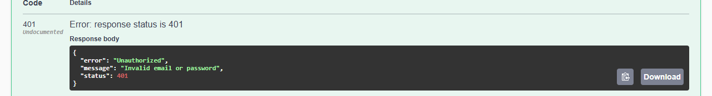

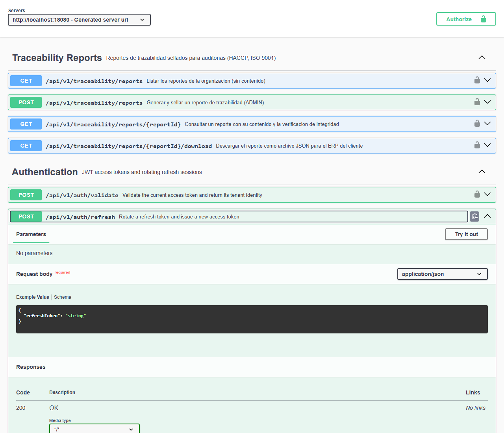

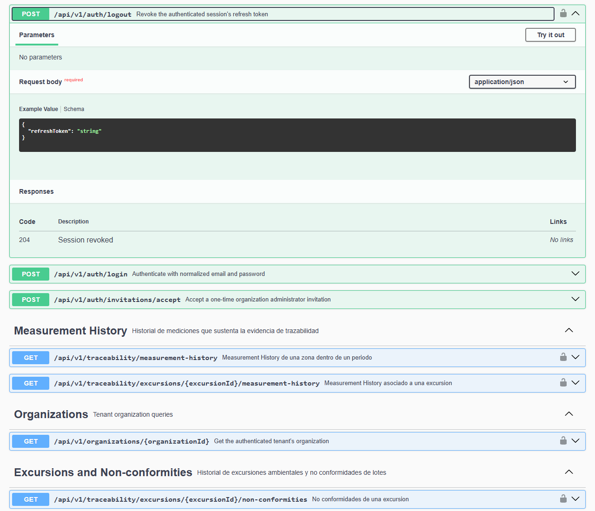

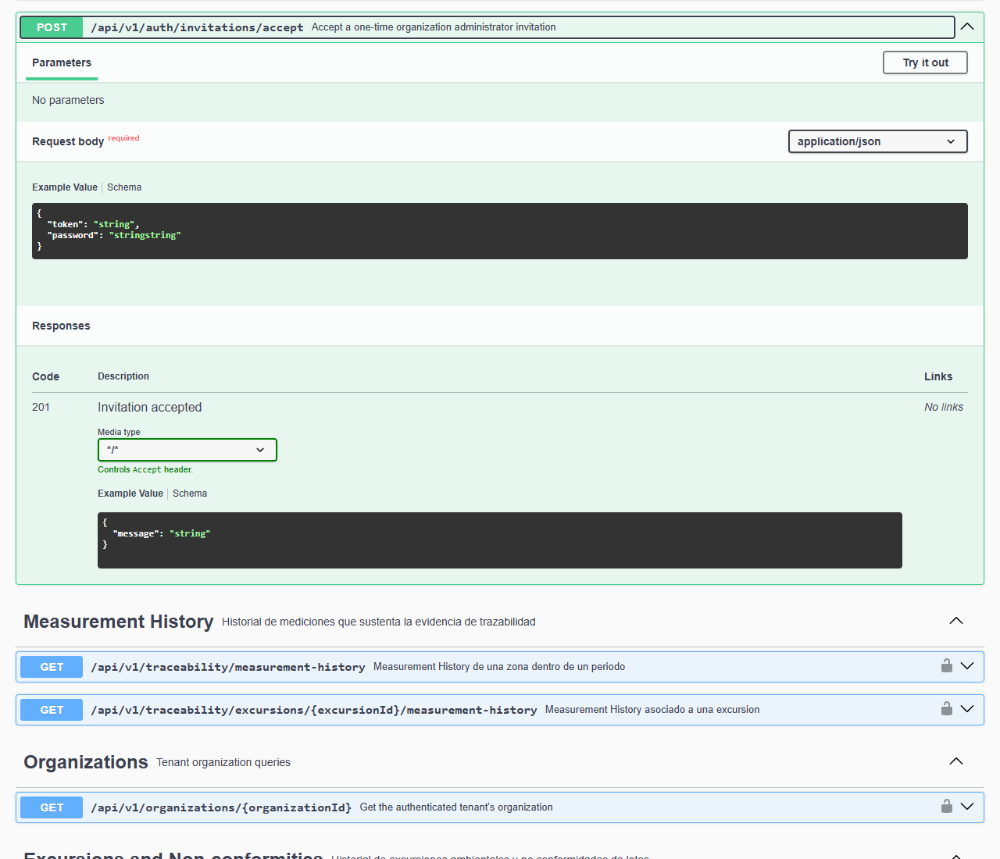

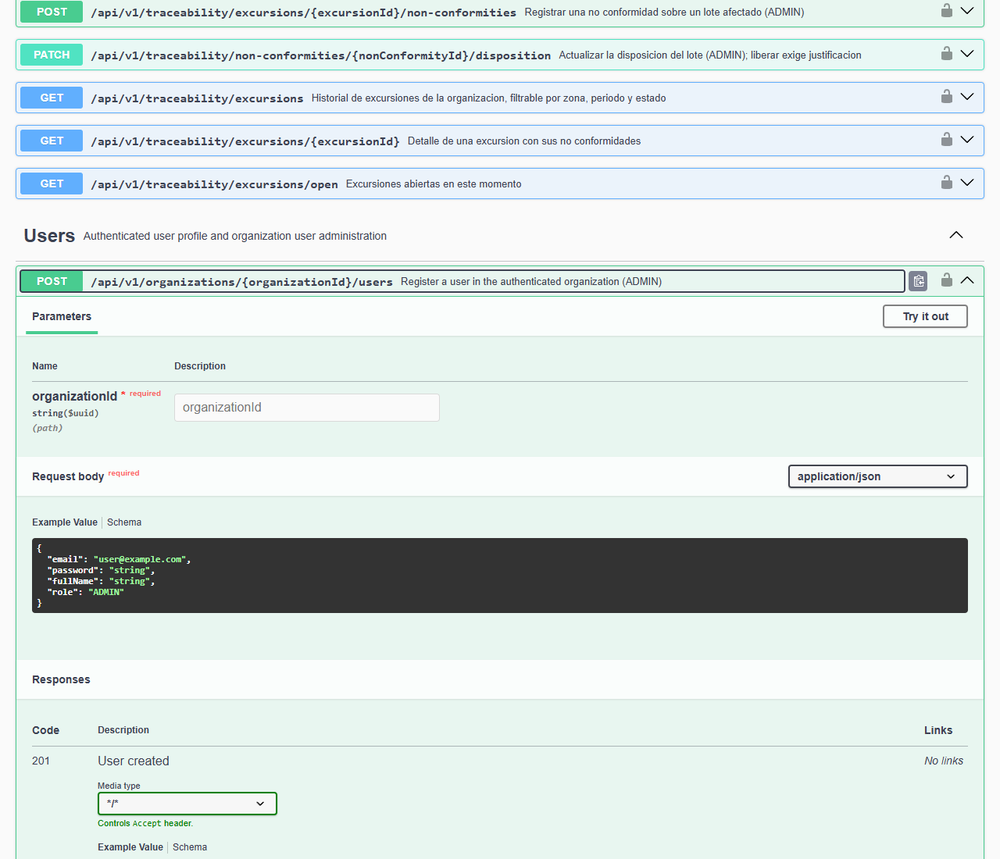

El alta inicial de organizaciones usa el evento `PilotRequestSubmitted`. La API protege las rutas de Traceability con Bearer y limita las operaciones de escritura al rol `ADMIN`.

##### Environmental Monitoring

Los contratos OpenAPI del Bounded Context Environmental Monitoring se encuentran disponibles mediante Swagger UI (`/swagger-ui/index.html`) y en formato JSON a través de `/v3/api-docs`.

El servicio se encuentra implementado en el repositorio [MachineGuard/machineguard-core-api](https://github.com/MachineGuard/machineguard-core-api), rama `feature/environmental-monitoring`. La implementación principal corresponde al commit `0ff5c86` (`feat: implement environmental monitoring measurements and domain events`).

Environmental Monitoring proporciona las operaciones necesarias para registrar mediciones ambientales, consultar las últimas lecturas, recuperar el historial de Measurements y obtener el estado consolidado de las Monitoring Zones.

Los endpoints se encuentran protegidos mediante autenticación Bearer/JWT. La organización utilizada para el aislamiento de información se obtiene a partir de la identidad autenticada, evitando utilizar `X-Organization-Id` o `X-User-Id` como fuente de identidad.

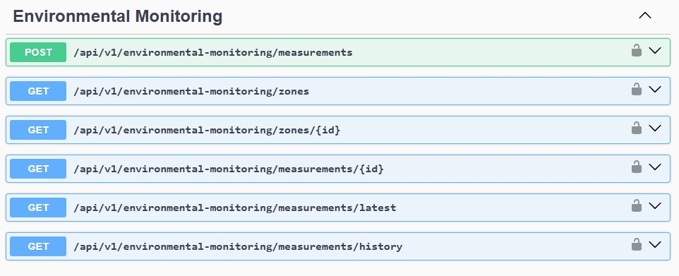

| Método y ruta | Acceso y parámetros | Ejemplo de solicitud | Respuesta documentada |
|---|---|---|---|
| `POST /api/v1/environmental-monitoring/measurements` | Bearer y rol `ADMIN`. Request body con `monitoringZoneId`, `monitoringPointId`, `sensorNodeId`, `environmentalVariable`, `measuredValue` y `recordedAt`. | JSON con la información de una nueva Measurement. | `200 MeasurementResource` según el contrato OpenAPI actual. |
| `GET /api/v1/environmental-monitoring/zones` | Bearer. No requiere parámetros. | Sin cuerpo. | `200`; colección de Monitoring Zones con información consolidada de puntos, sensores y estado ambiental. |
| `GET /api/v1/environmental-monitoring/zones/{id}` | Bearer. Path parameter `id` de tipo UUID. | Sin cuerpo. | `200 ZoneResource`; devuelve el detalle de una Monitoring Zone. |
| `GET /api/v1/environmental-monitoring/measurements/{id}` | Bearer. Path parameter `id` de tipo UUID. | Sin cuerpo. | `200 MeasurementResource`; devuelve una Measurement determinada. |
| `GET /api/v1/environmental-monitoring/measurements/latest` | Bearer. Query parameter opcional `monitoringZoneId` de tipo UUID. | Sin cuerpo. | `200`; colección con las últimas Measurements registradas. |
| `GET /api/v1/environmental-monitoring/measurements/history` | Bearer. `monitoringZoneId`, `from` y `to` obligatorios. `monitoringPointId` y `environmentalVariable` opcionales. También acepta `page` y `size`. | Sin cuerpo. | `200`; historial de Measurements de acuerdo con los filtros indicados. |

**Registro de Measurements**

El endpoint `POST /api/v1/environmental-monitoring/measurements` permite registrar una nueva lectura ambiental proveniente de un Monitoring Point. Cada registro representa una sola variable ambiental, por lo que `TEMPERATURE` y `HUMIDITY` son almacenadas como Measurements independientes.

El request body incluye:

- `monitoringZoneId`: identificador UUID de la Monitoring Zone.
- `monitoringPointId`: identificador UUID del Monitoring Point.
- `sensorNodeId`: identificador UUID del Sensor Node asociado.
- `environmentalVariable`: variable ambiental, actualmente `TEMPERATURE` o `HUMIDITY`.
- `measuredValue`: valor numérico registrado.
- `recordedAt`: fecha y hora en la que fue capturada la lectura.

```json
{
  "monitoringZoneId": "3fa85f64-5717-4562-b3fc-2c963f66afa6",
  "monitoringPointId": "3fa85f64-5717-4562-b3fc-2c963f66afa6",
  "sensorNodeId": "3fa85f64-5717-4562-b3fc-2c963f66afa6",
  "environmentalVariable": "TEMPERATURE",
  "measuredValue": 11.20,
  "recordedAt": "2026-10-06T21:30:00-05:00"
}
```

La respuesta corresponde a un `MeasurementResource` y contiene:

- `id`
- `organizationId`
- `monitoringZoneId`
- `monitoringPointId`
- `sensorNodeId`
- `environmentalVariable`
- `measuredValue`
- `recordedAt`
- `receivedAt`

`recordedAt` representa el momento de captura de la medición, mientras que `receivedAt` identifica el momento en que la Core API recibió y procesó dicha información.

```json
{
  "id": "3fa85f64-5717-4562-b3fc-2c963f66afa6",
  "organizationId": "3fa85f64-5717-4562-b3fc-2c963f66afa6",
  "monitoringZoneId": "3fa85f64-5717-4562-b3fc-2c963f66afa6",
  "monitoringPointId": "3fa85f64-5717-4562-b3fc-2c963f66afa6",
  "sensorNodeId": "3fa85f64-5717-4562-b3fc-2c963f66afa6",
  "environmentalVariable": "TEMPERATURE",
  "measuredValue": 11.20,
  "recordedAt": "2026-10-06T21:30:00-05:00",
  "receivedAt": "2026-10-06T21:30:01-05:00"
}
```

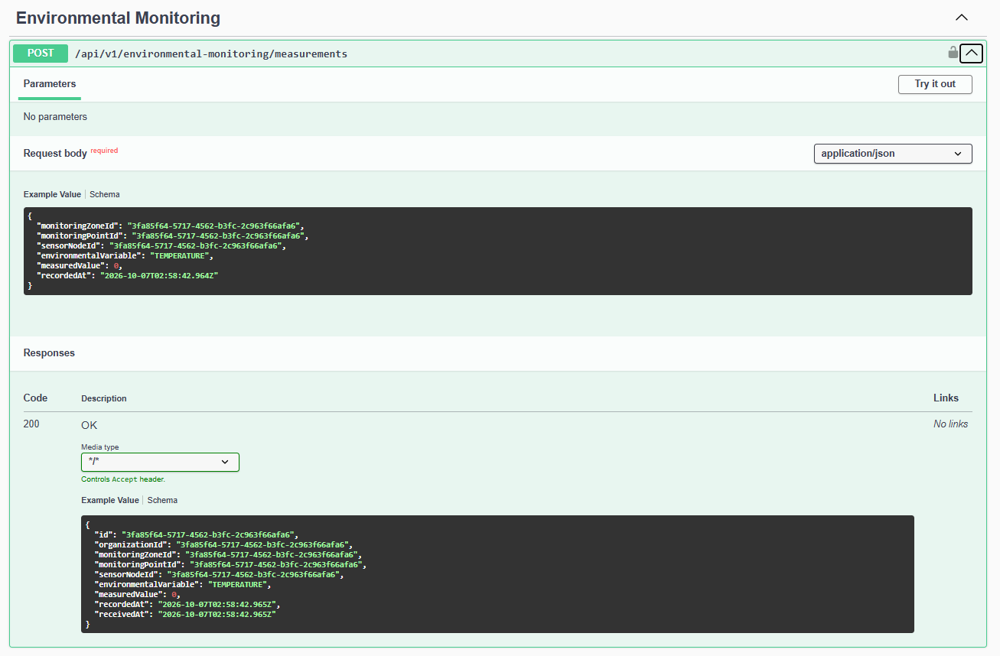

**Consulta de Monitoring Zones**

El endpoint `GET /api/v1/environmental-monitoring/zones` permite recuperar las Monitoring Zones correspondientes a la organización autenticada. La respuesta consolida información necesaria para la representación del estado ambiental en el Environmental Dashboard.

Entre los datos documentados se encuentran:

- identificador de la Monitoring Zone;
- identificador de la organización;
- identificador del Facility;
- nombre y descripción;
- estado de la zona;
- condición ambiental;
- cantidad de sensores online;
- cantidad de sensores offline;
- cantidad de sensores inactivos;
- fecha de última actualización;
- Monitoring Points asociados;
- Sensor Nodes asociados.

Este endpoint constituye uno de los principales contratos utilizados para la integración con `machineguard-web`, ya que permite obtener la información consolidada requerida para representar las zonas monitoreadas dentro del Environmental Dashboard.

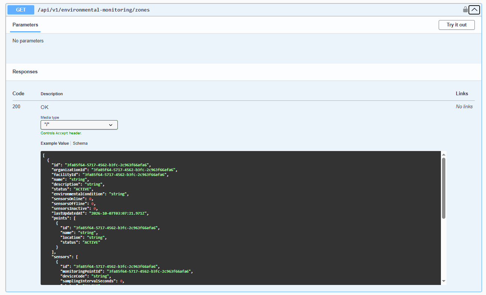

**Consulta de Monitoring Zone por identificador**

El endpoint `GET /api/v1/environmental-monitoring/zones/{id}` permite obtener el detalle de una Monitoring Zone específica.

El parámetro `id` es obligatorio, se envía como parte de la ruta y corresponde a un identificador de tipo UUID.

La respuesta utiliza el modelo consolidado de la Monitoring Zone e incluye información sobre su estado, condición ambiental, Monitoring Points y Sensor Nodes asociados.

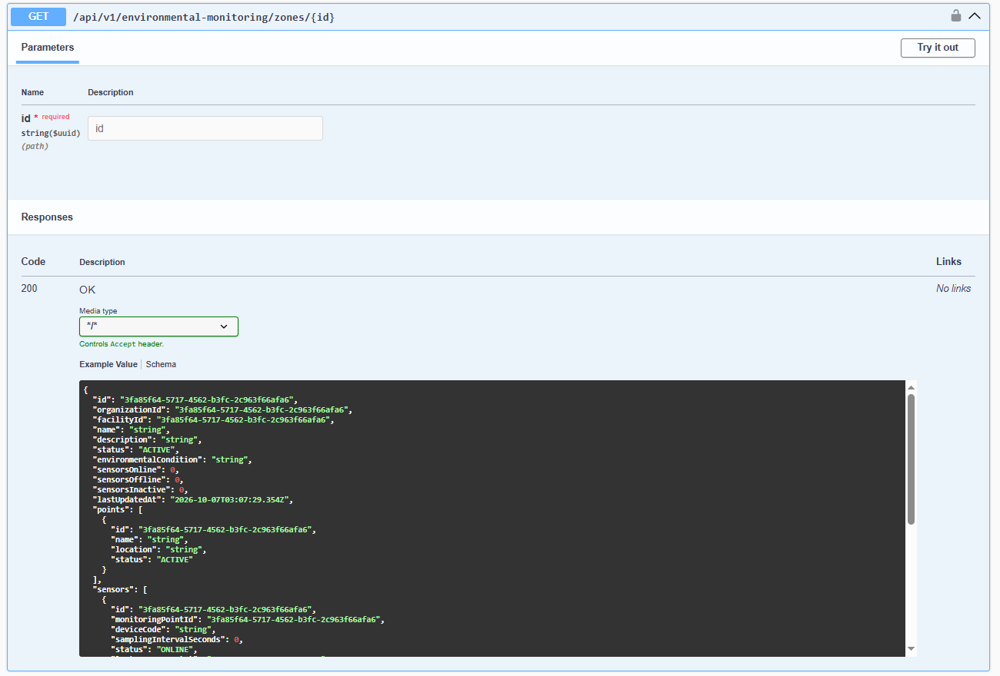

**Consulta de Measurement por identificador**

El endpoint `GET /api/v1/environmental-monitoring/measurements/{id}` permite obtener una Measurement específica utilizando su identificador UUID.

La respuesta devuelve un `MeasurementResource`, permitiendo identificar la organización, Monitoring Zone, Monitoring Point, Sensor Node, variable ambiental, valor medido y las marcas temporales relacionadas con la lectura.


**Consulta de últimas Measurements**

El endpoint `GET /api/v1/environmental-monitoring/measurements/latest` permite recuperar las últimas mediciones registradas.

De manera opcional se puede proporcionar el parámetro:

- `monitoringZoneId`: identificador UUID de la Monitoring Zone utilizada para restringir la consulta.

La respuesta consiste en una colección de Measurements y mantiene una lectura independiente para cada Monitoring Point y variable ambiental.

Este endpoint permite obtener información reciente de `TEMPERATURE` y `HUMIDITY` sin necesidad de consultar el historial completo.

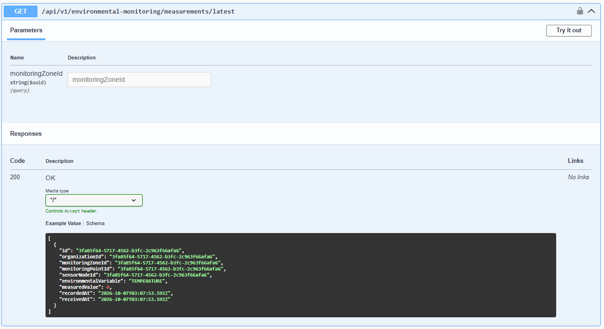

**Consulta del Measurement History**

El endpoint `GET /api/v1/environmental-monitoring/measurements/history` permite consultar el historial de Measurements correspondiente a un intervalo temporal determinado.

Los parámetros disponibles son:

- `monitoringZoneId`: UUID obligatorio de la Monitoring Zone.
- `monitoringPointId`: UUID opcional del Monitoring Point.
- `environmentalVariable`: variable opcional. Los valores disponibles son `TEMPERATURE` y `HUMIDITY`.
- `from`: fecha y hora inicial obligatoria en formato `date-time`.
- `to`: fecha y hora final obligatoria en formato `date-time`.
- `page`: número de página. El valor predeterminado es `0`.
- `size`: cantidad máxima de elementos solicitados. El valor predeterminado es `100`.

Un ejemplo de llamada es:

`GET /api/v1/environmental-monitoring/measurements/history?monitoringZoneId=<UUID>&environmentalVariable=TEMPERATURE&from=2026-10-01T00:00:00Z&to=2026-10-07T23:59:59Z&page=0&size=100`

La respuesta documentada incluye la Monitoring Zone consultada, el intervalo temporal utilizado, la cantidad de Measurements encontradas y la colección de mediciones correspondientes.

```json
{
  "monitoringZoneId": "3fa85f64-5717-4562-b3fc-2c963f66afa6",
  "from": "2026-10-01T00:00:00Z",
  "to": "2026-10-07T23:59:59Z",
  "count": 1,
  "measurements": [
    {
      "id": "3fa85f64-5717-4562-b3fc-2c963f66afa6",
      "organizationId": "3fa85f64-5717-4562-b3fc-2c963f66afa6",
      "monitoringZoneId": "3fa85f64-5717-4562-b3fc-2c963f66afa6",
      "monitoringPointId": "3fa85f64-5717-4562-b3fc-2c963f66afa6",
      "sensorNodeId": "3fa85f64-5717-4562-b3fc-2c963f66afa6",
      "environmentalVariable": "TEMPERATURE",
      "measuredValue": 11.20,
      "recordedAt": "2026-10-06T21:30:00-05:00",
      "receivedAt": "2026-10-06T21:30:01-05:00"
    }
  ]
}
```

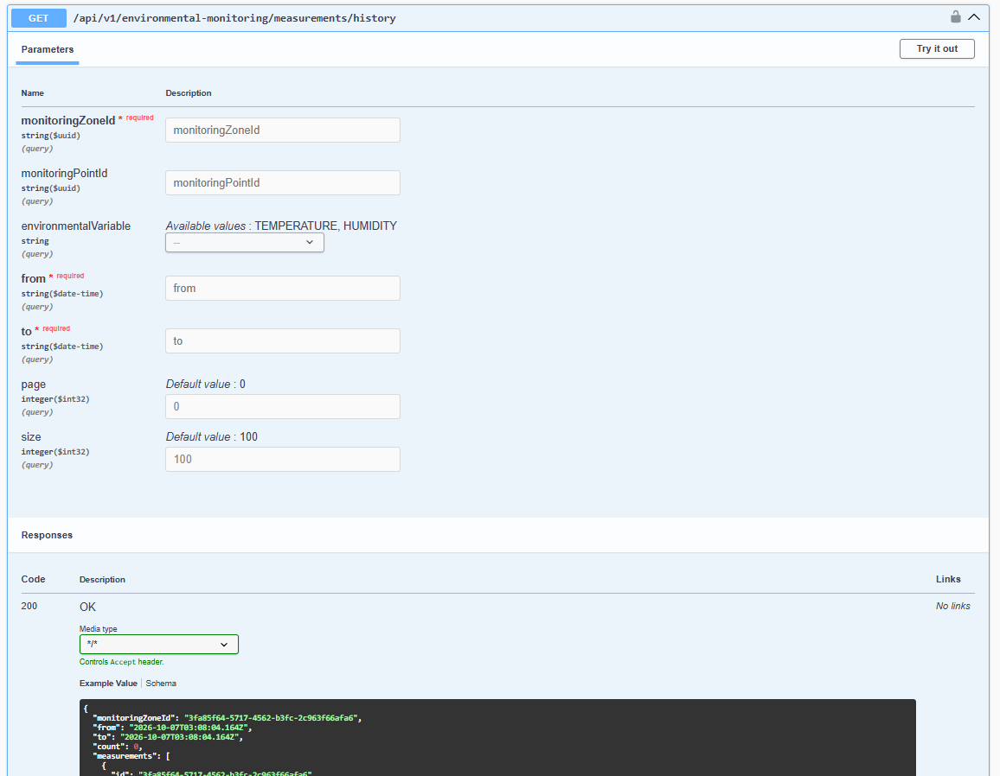

**Reglas de negocio e integración asociadas**

Cada Measurement registrada representa una única variable ambiental y es evaluada contra el `Threshold` correspondiente a la combinación de Monitoring Zone y `EnvironmentalVariable`.

Los valores mínimo y máximo del Threshold son considerados límites inclusivos para determinar si una medición se encuentra dentro del Safe Range.

Cuando una Measurement se encuentra fuera del rango permitido, Environmental Monitoring publica el evento `DeviationDetected`. Este evento permite informar a otros Bounded Contexts sobre la existencia de una condición ambiental fuera de los parámetros configurados.

Cuando las mediciones retornan nuevamente al Safe Range, Environmental Monitoring publica el evento `SafeRangeRestored`.

La publicación de estos eventos se realiza mediante el port `EnvironmentalMonitoringEventPublisher`, cuya implementación técnica se encuentra desacoplada de la capa de aplicación mediante `SpringEnvironmentalMonitoringEventPublisher`.

De esta manera, otros Bounded Contexts como Traceability & Quality y Alert & Incident Management pueden reaccionar a los cambios ambientales sin introducir dependencias directas entre sus modelos internos.

**Integración con el Environmental Dashboard**

El endpoint `GET /api/v1/environmental-monitoring/zones` constituye el principal contrato utilizado por la primera versión del Environmental Dashboard desarrollada en `machineguard-web`.

El frontend mantiene el siguiente flujo de integración:

`EnvironmentalDashboardComponent → DashboardFacade → EnvironmentalMonitoringService → MonitoringRepository → ApiMonitoringRepository → MonitoringApiClient → Core API`

Esta organización permite mantener desacoplada la capa de presentación respecto de los detalles de comunicación HTTP y de los DTO recibidos desde la API.

La comunicación con los endpoints protegidos se encuentra preparada mediante un interceptor HTTP que añade el header `Authorization: Bearer <JWT>` a las solicitudes dirigidas al Core API.

La validación final end-to-end con información real y el flujo completo de autenticación mediante IAM se encuentra pendiente de integración y ejecución. Actualización del 7 de octubre de 2026: la validación se completó con el inicio de sesión de IAM y datos de la API (sección 6.2.1.6).


**Configuración de Monitoring Zones, Monitoring Points, Sensor Nodes y Safe Ranges**

Las operaciones de configuración requieren `Authorization: Bearer <accessToken>` y rol `ADMIN`. La organización se toma del JWT; los identificadores de ruta son UUID.

| Método y ruta | Cuerpo | Ejemplo de solicitud | Respuesta exitosa |
|---|---|---|---|
| `POST /api/v1/environmental-monitoring/zones` | `name` (obligatorio), `description`, `facilityId` | `{"name":"Cámara fría A","description":"Almacén de lácteos"}` | `201 ZoneResource` con cabecera `Location`. |
| `POST /api/v1/environmental-monitoring/zones/{zoneId}/points` | `name` (obligatorio), `location` | `{"name":"Punto 1","location":"Estante B"}` | `201 PointResource`. |
| `POST /api/v1/environmental-monitoring/zones/{zoneId}/points/{pointId}/sensors` | `deviceCode`, `samplingIntervalSeconds` (entero positivo) | `{"deviceCode":"MG-ESP32-001","samplingIntervalSeconds":60}` | `201 SensorResource`. |
| `PUT /api/v1/environmental-monitoring/zones/{zoneId}/thresholds/{environmentalVariable}` | `minimumValue`, `maximumValue` (hasta dos decimales) | `{"minimumValue":2,"maximumValue":8}` | `200 ThresholdResource`; crea el Safe Range o reemplaza el existente. |

Respuestas de error: `400` ante cuerpos inválidos o una variable distinta de `TEMPERATURE` y `HUMIDITY`; `401` sin token; `403` con rol `VIEWER`; `404` cuando la zona o el punto no pertenecen a la organización; `409` cuando el mínimo no es menor que el máximo o el `deviceCode` ya existe.

Una organización nueva se prepara en este orden: zona, punto, sensor (opcional) y un Safe Range por variable. `POST /measurements` responde `409` mientras la variable medida no tenga Safe Range.


##### Customer Acquisition: contrato de la solicitud de piloto

El Landing Page no expone servicios propios; consume el contrato de Customer Acquisition definido en la sección 4.2.2 del Capítulo IV. La operación pública que alimenta al formulario es la siguiente:

| Método y ruta | Acceso y parámetros | Ejemplo de solicitud | Respuesta esperada |
|---|---|---|---|
| `POST /api/v1/pilot-requests` | Público, sin Bearer token. Cuerpo `companyName`, `contactName`, `contactEmail`, `contactPhone`, `industry` y, opcionalmente, `estimatedMonthlyLoss`. | Ver ejemplo siguiente. | `201 PilotRequestResource` con la solicitud en estado `PENDING`; `400` ante datos de formulario inválidos. |

```json
{
  "companyName": "Distribuidora Test SAC",
  "contactName": "Ana Prueba",
  "contactEmail": "ana@test.pe",
  "contactPhone": "+51 987 654 321",
  "industry": "FOOD",
  "estimatedMonthlyLoss": 5000.00
}
```

El campo `industry` toma los valores `FOOD`, `PHARMA`, `CHEMICAL`, `VETERINARY` u `OTHER`. El Landing Page envía este cuerpo cuando `apiBaseUrl` está configurado en `assets/js/config.js`. Al revisar la rama `develop` de `machineguard-core-api` el 2026-10-07, IAM ya cuenta con el evento `PilotRequestSubmitted` (campos `requestId`, `companyName`, `contactName` y `contactEmail`) y con su `PilotRequestEventHandler`, pero no existe un controller ni un paquete de Customer Acquisition que reciba la solicitud, por lo que el endpoint **no está implementado ni documentado en Swagger**. El formulario opera por ello en modo demostración. Quedan pendientes la implementación de `POST /api/v1/pilot-requests` y su conexión con el evento que IAM ya consume; `industry`, `contactPhone` y `estimatedMonthlyLoss` son datos que el evento actual no transporta.

#### 6.2.1.8. Software Deployment Evidence for Sprint Review

##### Deployment de Frontend Web Application

Durante el Sprint 1 se configuró y ejecutó el proceso de deployment de la primera versión de `machineguard-web`, correspondiente a la Frontend Web Application de MachineGuard.

El frontend fue desarrollado con Angular y su publicación se automatizó mediante GitHub Actions. El proceso parte del repositorio `MachineGuard/machineguard-web` y ejecuta las etapas necesarias para instalar dependencias, compilar la aplicación y publicar los artefactos generados.

El flujo de deployment implementado es el siguiente:

`GitHub Repository → GitHub Actions → npm ci → Angular Build → GitHub Pages Artifact → GitHub Pages`

Para la publicación se configuró el workflow:

`.github/workflows/deploy-pages.yml`

El workflow realiza las siguientes actividades:

- Obtención del código fuente desde el repositorio.
- Configuración de Node.js.
- Instalación reproducible de dependencias mediante `npm ci`.
- Compilación de producción de Angular.
- Generación de los artefactos en `dist/machineguard-web/browser`.
- Creación del artefacto de GitHub Pages.
- Publicación automática de la aplicación.

Durante la primera ejecución se identificó una inconsistencia entre `package.json` y `package-lock.json`, que impedía la ejecución de `npm ci`. El archivo de lock fue sincronizado y el cambio fue registrado mediante el commit:

`fix: synchronize npm lockfile for deployment`

Luego de la corrección, el workflow finalizó satisfactoriamente en sus dos etapas principales:

| Etapa | Resultado |
|---|---|
| Build | Success |
| Deploy | Success |
| Artifact generado | `github-pages` |
| Frontend publicado | Sí |

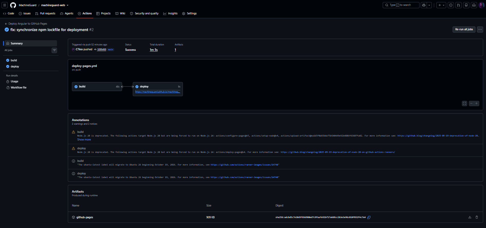

La aplicación publicada se encuentra disponible en:

[MachineGuard Web Application](https://machineguard.github.io/machineguard-web/)

La publicación permite cargar la aplicación Angular, sus componentes de layout, navegación, estilos y rutas correspondientes a la primera versión del Environmental Dashboard.

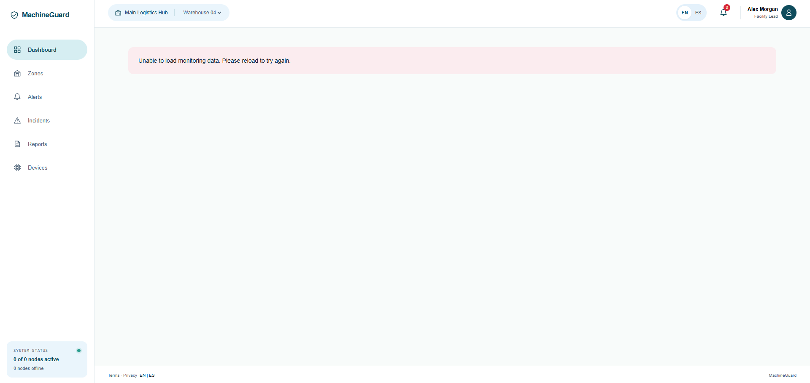 

**Estado de integración con Core API**

El deployment realizado durante este Sprint corresponde a la Frontend Web Application. El servicio `machineguard-core-api` todavía se ejecuta en el entorno local de desarrollo y no se encuentra publicado en un host accesible desde Internet.

Durante desarrollo local, `machineguard-web` utiliza `proxy.conf.json` para redirigir las solicitudes `/api/**` hacia:

`http://localhost:8080`

Esta configuración pertenece al servidor de desarrollo de Angular y no forma parte de la aplicación compilada que se publica.

Por este motivo, aunque la Frontend Web Application se encuentra desplegada correctamente, las solicitudes realizadas desde la versión publicada hacia endpoints como:

`/api/v1/environmental-monitoring/zones`

no pueden alcanzar actualmente al Core API local.

La publicación del Core API y la configuración de la URL correspondiente al ambiente desplegado constituyen el siguiente paso para completar la integración end-to-end:

`Frontend desplegado → Core API desplegado → PostgreSQL`

Por tanto, durante este Sprint se logró desplegar satisfactoriamente la primera versión de la Frontend Web Application y automatizar su proceso de publicación, mientras que la integración con los servicios backend permanece disponible en el ambiente local hasta realizar el deployment de `machineguard-core-api`.

##### Deployment de la RESTful API y la Web Application integradas

La publicación en GitHub Pages descrita arriba no dispone de la RESTful API, por lo que allí la Web Application no puede autenticar ni cargar datos. Para la demostración del Sprint se definió un despliegue conjunto de la API y la Web Application en `https://iot.fpm.it.com`, con la configuración de la sección 6.1.4: PostgreSQL, la API empaquetada como JAR, la Web Application compilada y servida por Caddy, y Cloudflare Tunnel como punto de entrada.

| Paso | Comando o acción |
|---|---|
| Código | Clonar `machineguard-core-api` y `machineguard-web` y usar la rama `develop`. |
| Base de datos | Crear la base `machineguard` vacía y su usuario. |
| API | `mvn -B -DskipTests package` y `java -jar target/core-api-0.1.0-SNAPSHOT.jar` con las variables de entorno definidas. |
| Datos | `python3 scripts/demo_data.py seed` y `python3 scripts/demo_data.py live`. |
| Web Application | `npm ci && npm run build`; Caddy sirve `dist/machineguard-web/browser` y redirige `/api/*` a la API. |
| Publicación | Ruta del túnel de `iot.fpm.it.com` hacia el puerto local de Caddy. |

> Pendiente: capturas del despliegue en ejecución (inicio de sesión, dashboard, Zonas y Reportes en la URL pública). Hasta la fecha de esta versión, el flujo se verificó en el entorno local descrito en la sección 6.2.1.6.

##### Deployment del Landing Page

El Landing Page se publica en GitHub Pages desde el repositorio `MachineGuard/MachineGuard-LandingPage`. Al ser un sitio estático, el flujo de despliegue no requiere instalar dependencias ni compilar:

`GitHub Repository (main) → GitHub Actions → Prepare site → GitHub Pages Artifact → GitHub Pages`

El workflow `.github/workflows/deploy-pages.yml` realiza las siguientes actividades:

- Obtención del código fuente desde el repositorio (`actions/checkout@v4`).
- Preparación de la carpeta `_site` con `index.html`, `404.html`, `terms.html`, `privacy.html`, `robots.txt`, `sitemap.xml` y `assets/`.
- Configuración de GitHub Pages (`actions/configure-pages@v5`).
- Creación del artefacto de Pages (`actions/upload-pages-artifact@v3`).
- Publicación automática (`actions/deploy-pages@v4`).

El flujo de ramas sigue GitFlow: la funcionalidad se desarrolla en una rama `feature/*`, se integra en `develop` y se publica al integrarse en `main`, que es la rama que dispara el workflow.

| Elemento | Registro |
|---|---|
| Repositorio | [MachineGuard/MachineGuard-LandingPage](https://github.com/MachineGuard/MachineGuard-LandingPage) |
| Rama de despliegue | `main` |
| Workflow | `.github/workflows/deploy-pages.yml` |
| URL publicada | [https://machineguard.github.io/MachineGuard-LandingPage/](https://machineguard.github.io/MachineGuard-LandingPage/) |
| Versión publicada | `v1.1.0` (commit `63efb98`) |
| Estado de la publicación | Publicado |

**Ejecuciones del workflow**

| Ejecución | Commit | Resultado | Detalle |
|---|---|---|---|
| [#1](https://github.com/MachineGuard/MachineGuard-LandingPage/actions/runs/37658680655), 2026-10-07 12:23 | `418b30e` (`v1.0.0`) | Fallida | Las etapas *Prepare site* y *checkout* finalizaron, pero `actions/configure-pages@v5` falló con “Get Pages site failed. Please verify that the repository has Pages enabled”. Las etapas de publicación se omitieron. |
| [#2](https://github.com/MachineGuard/MachineGuard-LandingPage/actions/runs/37665763803), 2026-10-07 13:18 | `63efb98` (`v1.1.0`) | Exitosa | Las etapas *Prepare site*, *configure-pages*, *upload-pages-artifact* y *deploy-pages* finalizaron correctamente; el job `deploy` tardó 16 s y la ejecución completa 23 s. Generó un artefacto. |

La primera ejecución falló porque GitHub Pages aún no estaba activado en el repositorio. El error no estaba en el workflow ni en el sitio: se corrigió activando GitHub Pages desde la configuración del repositorio. Tras activarlo, GitHub construyó y publicó el commit `418b30e` (`v1.0.0`) mediante la ejecución automática *pages build and deployment*, y la ejecución #2 del workflow publicó `v1.1.0`.

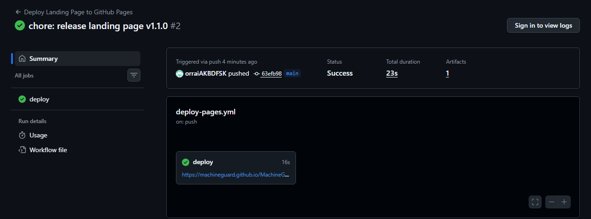

*Figura. Ejecución #2 del workflow de deployment del Landing Page, finalizada con éxito.*

La verificación posterior a la publicación, ejecutada el 2026-10-07, confirmó que el sitio responde HTTP 200 y que sirve los elementos de `v1.1.0`. La captura del sitio publicado se encuentra en la sección 6.2.1.6.

**Pendiente:** la rama por defecto del repositorio sigue siendo `feature/landing-page`; debe cambiarse a `main` desde la configuración del repositorio para que quien lo clone reciba la versión estable.

**Estado de integración con Core API**

El Landing Page publicado funcionará en modo demostración hasta que `machineguard-core-api` se despliegue en un host accesible desde Internet y exponga `POST /api/v1/pilot-requests`. Entonces bastará con configurar `apiBaseUrl` en `assets/js/config.js` con la URL del servicio. Dado que el sitio se sirve desde `https://machineguard.github.io`, la API deberá habilitar CORS para ese origen.

#### 6.2.1.9. Team Collaboration Insights during Sprint

La integración de IAM con Traceability permitió obtener la identidad y la organización desde el JWT validado. Las rutas protegidas aplican los permisos del rol y restringen el acceso a los recursos de la organización autenticada.

El esquema de base de datos de `machineguard-core-api` se coordinó entre cuatro Bounded Contexts que migraban en paralelo. Traceability & Quality necesitaba la tabla `measurements` de Environmental Monitoring, que aún no existía, y la migración de IAM ya estaba numerada como `V5`. Por ello Jose Diego Bautista Rivera completó las migraciones de Environmental Monitoring (`V1`) y de Alert & Incident Management (`V2`), renumeró la de Traceability & Quality a `V4` y reservó `V3`, de modo que Flyway aplica las cinco migraciones en un orden coherente con sus dependencias. Cada migración se integró a `develop` desde su propia rama de funcionalidad, y se avisó al equipo de que las bases de datos locales creadas antes de estos cambios debían recrearse.

La integración de las ramas pendientes en `develop` hizo visible una dependencia que ninguna rama mostraba por separado: Traceability & Quality reaccionaba a los eventos de Environmental Monitoring, pero no existía forma de preparar una zona desde la API para generar esos eventos. Resolverlo antes de la demostración requirió trabajar sobre un Bounded Context a cargo de otra integrante, por lo que el cambio se limitó a operaciones nuevas, sin modificar las existentes, y se comunicó al equipo junto con el estado de cada rama. La verificación de extremo a extremo sobre PostgreSQL detectó además un archivo de migración residual en el directorio `target` que impedía iniciar la aplicación tras el renombrado de `V4`; se indicó al equipo ejecutar `mvn clean` después de actualizar `develop`.

## 6.3. Validation Interviews

### 6.3.1. Diseño de Entrevistas
> Contenido pendiente.

### 6.3.2. Registro de Entrevistas
> Contenido pendiente.

### 6.3.3. Evaluaciones según heurísticas
> Contenido pendiente.

## 6.4. Video About-the-Product
> Contenido pendiente.
